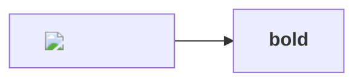
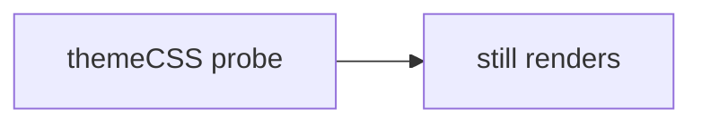

# Beacon Fixture

## Why this change

Remote image: 

Raw HTML: 

Bad link: [click](javascript:window.__PWN=1)

Executable-URL links, the two schemes BLOCKS.md promises to demote that nothing here
carried: [data](data:text/html,) and [vb](vbscript:MsgBox(1)).

UNC link: [unc](/\evil.example.invalid/share) and its protocol-relative twin [pr](//evil.example.invalid/share)

Good link: [BLOCKS](BLOCKS.md) and [fragment](#design) and [web](https://example.com/).

Directive-bypass probes. The first tries to put `htmlLabels` back and beacon through a
node label; without Task 13's `secure` list it produces a live `` and hangs the
renderer. The second needs neither, and is the one that survived the round which closed
the first: `themeCSS` is concatenated verbatim into the emitted `<style>`, so an
`@font-face` plus a rule that uses it fetches a font from a host of the payload's
choosing.

