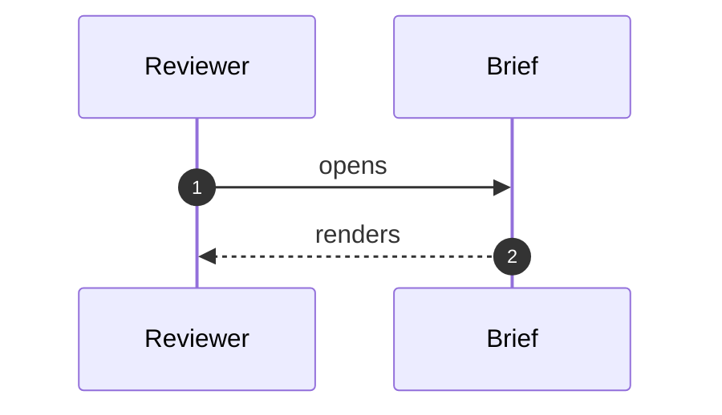

# Plan Region Collision Fixture

## Why this change

A spec that talks about plans, using the plan vocabulary in its own prose.

## Plan

This is the spec's own rollout plan, not the task list. It must not capture the
task dependency graph, and it must not become the sentinel heading.

### Task 1: Example quoted from the block catalog

Prose illustrating the task format. This heading is task-shaped but lives in the
spec, so it must not appear in the Plan index group and must not emit a graph node.

## Design

Body.

## Database

A section name that slugs onto an id the diagram library emits unnamespaced. The
sequence fence above precedes it, so with the heading-id prefix removed this
heading's index entry resolves to a <symbol> in <defs> instead of to the heading.
