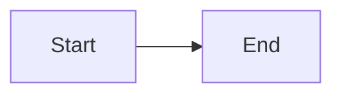
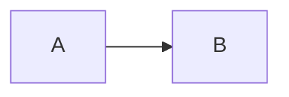
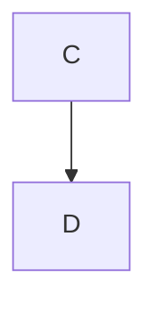

# Visual Change Briefs Implementation Plan

> **For agentic workers:** REQUIRED SUB-SKILL: Use umbrella:subagent-driven-development (recommended) or umbrella:executing-plans to implement this plan task-by-task. Steps use checkbox (`- [ ]`) syntax for tracking. During per-task and final review, ALSO apply umbrella:review-lens (composed-surface-per-persona + walk-only flagging).

**Goal:** Render every umbrella spec and plan into a self-contained, navigable, diagram-bearing HTML brief so the human review gates stop degrading into skimming.

**Architecture:** A POSIX bash assembler (`render.sh`) concatenates the spec, a sentinel-marked `## Plan` heading, and either the plan body or a pending callout; base64-encodes the result into a single HTML template that inlines vendored `marked` and `mermaid`. All markdown parsing happens in the browser with the same parser the reader sees. Truncation is proven structurally by asserting the sentinel survived parsing, not by counting headings in awk.

**Tech Stack:** bash, awk, sed, base64, shasum; marked 12.0.2 and mermaid 10.9.1 vendored as files; optional playwright-core for a headless smoke test.

**Spec:** `docs/specs/2026-07-27-visual-change-briefs-design.md`

---

## Preflight

Read the spec before starting, especially **Known open findings** — six defects are already characterised there and Task 15 fixes them. Do not rediscover them.

Two rules govern every test in this plan, both from assertions that looked green while checking nothing:

- Every assertion must feed the pass/fail counters, and the script must exit non-zero on failure.
- An assertion must fail if its fixture never got built. A check that reads a file the renderer refused to create must not fall back to `0` and print PASS.

All paths are relative to the repo root `/Users/fbac/projects/umbrella`.

---

### Task 1: Repository scaffold and gitignore — `static-verifiable`

**Depends on:** none

**Files:**
- Create: `.gitignore`
- Create: `assets/change-brief/` (directory)
- Create: `assets/change-brief/vendor/` (directory)
- Create: `assets/change-brief/tests/fixtures/` (directory)
- Create: `assets/change-brief/tests/browser/` (directory)

- [ ] **Step 1: Write the failing test**

Create `assets/change-brief/tests/render_test.sh` with just the harness and one assertion:

```bash
#!/usr/bin/env bash
# Shell-level assertions for render.sh. Coreutils, plus python3 to decode the
# base64 payload out of a rendered brief (see the payload() helper).
set -uo pipefail
S="$(cd "$(dirname "$0")/.." && pwd)"          # assets/change-brief
R="$(cd "$S/../.." && pwd)"                     # repo root
W="$(mktemp -d)"; trap 'rm -rf "$W"' EXIT
pass=0; fail=0
ok(){ printf '  PASS  %s\n' "$1"; pass=$((pass+1)); }
no(){ printf '  FAIL  %s :: %s\n' "$1" "${2:-}"; fail=$((fail+1)); }
chk(){ if [ "$2" = "$3" ]; then ok "$1"; else no "$1" "expected [$3] got [$2]"; fi }

echo "== repo scaffold =="
grep -q '^docs/briefs/$' "$R/.gitignore" && ok "gitignore excludes docs/briefs/" \
  || no "gitignore excludes docs/briefs/" "missing"

echo
echo "shell: $pass passed, $fail failed"
[ "$fail" -eq 0 ]
```

- [ ] **Step 2: Run it to verify it fails**

Run: `bash assets/change-brief/tests/render_test.sh`
Expected: `FAIL gitignore excludes docs/briefs/ :: missing`, exit 1.

- [ ] **Step 3: Create the gitignore and directories**

Create `.gitignore`:

```gitignore
docs/briefs/
```

Then:

```bash
mkdir -p assets/change-brief/vendor assets/change-brief/tests/fixtures assets/change-brief/tests/browser
```

- [ ] **Step 4: Run the test to verify it passes**

Run: `bash assets/change-brief/tests/render_test.sh`
Expected: `PASS gitignore excludes docs/briefs/`, `shell: 1 passed, 0 failed`, exit 0.

- [ ] **Step 5: Commit**

```bash
chmod +x assets/change-brief/tests/render_test.sh
git add .gitignore assets/change-brief/tests/render_test.sh
git commit -m "feat(change-brief): scaffold assets dir and gitignore derived briefs"
```

---

### Task 2: Vendor marked and mermaid at pinned versions — `static-verifiable`

**Depends on:** Task 1

The brief must issue zero network requests on load, so both libraries ship as files in the repo. They are vendored as separate files rather than inlined into `template.html` so that editing the template costs ~28KB of git history instead of 3.4MB.

**Files:**
- Create: `assets/change-brief/vendor/marked.min.js`
- Create: `assets/change-brief/vendor/mermaid.min.js`
- Create: `assets/change-brief/vendor/README.md`
- Modify: `assets/change-brief/tests/render_test.sh`

- [ ] **Step 1: Write the failing test**

Append to `assets/change-brief/tests/render_test.sh`, before the final `echo`:

```bash
echo "== vendor pinning =="
for v in marked mermaid; do
  [ -r "$S/vendor/$v.min.js" ] && ok "vendor/$v.min.js present" \
    || no "vendor/$v.min.js present" "missing"
done
chk "marked is 12.0.2" \
  "$(grep -c 'marked v12\.0\.2' "$S/vendor/marked.min.js" 2>/dev/null || echo 0)" "1"
got_sha=$(shasum -a 256 "$S/vendor/marked.min.js" 2>/dev/null | cut -d' ' -f1)
chk "marked sha256 pinned" "$got_sha" \
  "15fabce5b65898b32b03f5ed25e9f891a729ad4c0d6d877110a7744aa847a894"
got_sha=$(shasum -a 256 "$S/vendor/mermaid.min.js" 2>/dev/null | cut -d' ' -f1)
chk "mermaid sha256 pinned" "$got_sha" \
  "61b335a46df05a7ce1c98378f60e5f3e77a7fb608a1056997e8a649304a936d6"
```

- [ ] **Step 2: Run it to verify it fails**

Run: `bash assets/change-brief/tests/render_test.sh`
Expected: four FAILs for the missing vendor files, exit 1.

- [ ] **Step 3: Download the pinned versions**

This is the one step in the plan that needs network access. It runs once, at build time — `render.sh` itself never touches the network.

```bash
curl -fsSL -o assets/change-brief/vendor/marked.min.js \
  https://cdn.jsdelivr.net/npm/marked@12.0.2/marked.min.js
curl -fsSL -o assets/change-brief/vendor/mermaid.min.js \
  https://cdn.jsdelivr.net/npm/mermaid@10.9.1/dist/mermaid.min.js
```

Create `assets/change-brief/vendor/README.md`:

```markdown
# Vendored libraries

Committed so a rendered brief opens from `file://` with zero network requests.

| File | Package | Version | sha256 |
|---|---|---|---|
| `marked.min.js` | marked | 12.0.2 | `15fabce5b65898b32b03f5ed25e9f891a729ad4c0d6d877110a7744aa847a894` |
| `mermaid.min.js` | mermaid | 10.9.1 | `61b335a46df05a7ce1c98378f60e5f3e77a7fb608a1056997e8a649304a936d6` |

Both are MIT licensed.

## Why these versions are pinned

The template depends on version-specific API contracts:

- **mermaid 10 is async-only.** `parse()` returns a Promise and rejects rather than
  throwing; `render(id, text, container)` takes an `Element` third argument, not a
  callback. The mermaid 8/9 callback form produces no output and no exception —
  every diagram silently blank, valid and invalid alike.
- **marked 12** routes both block-level and inline HTML through `renderer.html`,
  which is what makes the inertness guarantee hold.

To upgrade, re-run the smoke test in `../tests/browser/verify.mjs` and the walk
cases in the plan's Browser-Walk Inventory. Update the checksums above and in
`../tests/render_test.sh`.
```

- [ ] **Step 4: Run the test to verify it passes**

Run: `bash assets/change-brief/tests/render_test.sh`
Expected: `PASS vendor/marked.min.js present`, `PASS marked sha256 pinned`, `PASS mermaid sha256 pinned`, exit 0.

- [ ] **Step 5: Commit**

```bash
git add assets/change-brief/vendor/
git commit -m "feat(change-brief): vendor marked 12.0.2 and mermaid 10.9.1 with pinned checksums"
```

---

### Task 3: `scan.awk` block scanner — `static-verifiable`

**Depends on:** Task 1

The scanner deliberately does **not** reimplement CommonMark. It does only the two things that must happen before parsing — neutralising a dangling HTML comment and flattening stray H1s — plus reporting structural defects. Everything else moved to the page.

**Files:**
- Create: `assets/change-brief/scan.awk`
- Modify: `assets/change-brief/tests/render_test.sh`

- [ ] **Step 1: Write the failing test**

Append to `assets/change-brief/tests/render_test.sh`, before the final `echo`:

```bash
echo "== scan.awk =="
SC="$S/scan.awk"

printf '# Title\n\nbody\n\n# Stray H1\n\nmore\n' > "$W/h1.md"
chk "stray ATX H1 flattened to h4" \
  "$(awk -v mode=escape -f "$SC" "$W/h1.md" | grep -c '^#### ')" "2"

printf 'Setext Heading\n==============\n\nbody\n' > "$W/setext.md"
chk "setext H1 flattened to h4" \
  "$(awk -v mode=escape -f "$SC" "$W/setext.md" | grep -c '^#### Setext Heading$')" "1"

printf 'text\n\n<!-- never closed\n\n## Later\n' > "$W/dangle.md"
chk "dangling comment detected" "$(awk -v mode=dangle -f "$SC" "$W/dangle.md")" "1"
chk "dangling comment escaped with indent intact" \
  "$(awk -v mode=escape -v unbalanced=1 -f "$SC" "$W/dangle.md" | grep -c '^&lt;!--')" "1"

printf 'text\n\n--> stray arrow in prose\n\n<!-- never closed\n' > "$W/order.md"
chk "stray --> does not balance a later opener" \
  "$(awk -v mode=dangle -f "$SC" "$W/order.md")" "1"

printf 'a\n\n```html\n<!-- balanced -->\n```\n\nb\n' > "$W/fenced.md"
chk "comment inside a fence is not escaped" \
  "$(awk -v mode=escape -v unbalanced=1 -f "$SC" "$W/fenced.md" | grep -c '^&lt;!--')" "0"

printf -- '- step:\n\n  ```html\n  <!-- keep -->\n  ```\n' > "$W/indent.md"
chk "indented fence comment keeps its indentation" \
  "$(awk -v mode=escape -v unbalanced=1 -f "$SC" "$W/indent.md" | grep -c '^  <!-- keep -->$')" "1"

printf 'a\n\n```bash\necho hi\n' > "$W/openfence.md"
chk "unterminated fence reported" \
  "$(awk -v mode=diag -f "$SC" "$W/openfence.md" | grep -c 'Unterminated code fence')" "1"
chk "clean document produces no diagnostics" \
  "$(awk -v mode=diag -f "$SC" "$W/fenced.md" | wc -l | tr -d ' ')" "0"
```

- [ ] **Step 2: Run it to verify it fails**

Run: `bash assets/change-brief/tests/render_test.sh`
Expected: every scan.awk assertion FAILs (awk cannot read `scan.awk`), exit 1.

- [ ] **Step 3: Write the scanner**

Create `assets/change-brief/scan.awk`:

```awk
# scan.awk — minimal block scanner for change-brief payloads.
#
# SCOPE DISCIPLINE: this file does NOT try to reimplement CommonMark. Four
# review rounds established that it cannot. Every attempt to make a source-side
# heading count agree with marked's parse produced a new divergence — nested
# fences, indented code, HTML blocks, backtick info strings — and each
# divergence is either a false truncation alarm or silent content loss.
#
# Truncation is now detected by the PAGE, structurally: render.sh always
# appends a sentinel Plan heading, and the page asserts it survived the parse.
# That check uses the same parser the reader sees, so it cannot drift, and it
# catches every cause of content loss rather than the ones awk can model.
#
# What remains here is only what the page cannot do, because it happens before
# parsing: neutralising a dangling HTML comment, and flattening stray H1s.
#
# Modes:
#   -v mode=escape  emit the payload: demote stray H1s, and if -v unbalanced=1
#                   escape line-start "<!--" outside code
#   -v mode=diag    emit one warning line per structural defect found
#   -v mode=dangle  print 1 if a "<!--" is left unclosed outside code, else 0

function emit(l) { if (mode == "escape") print l }

# Fence marker, if this line opens or closes a fenced block. Approximate by
# design: a misread here only affects escaping and warnings, both of which the
# page's structural check backstops.
function marker_of(line,   m) {
  if (match(line, /^ {0,3}(`{3,}|~{3,})/)) {
    m = substr(line, RSTART, RLENGTH)
    sub(/^ +/, "", m)
    return m
  }
  return ""
}

# Flush the one-line lookback buffer used for setext detection.
function flush(   p) {
  if (held != "") { p = held; held = ""; emit(p) }
}

BEGIN { fchar = ""; flen = 0; prevblank = 1; incode = 0; incomment = 0; held = "" }

{
  line = $0

  # ---- setext H1: a run of "=" under a non-blank line ----------------------
  # Demoted like ATX H1s. The ATX regex cannot see these, so a setext H1
  # reaches the DOM as a real <h1>, opening an index group the h2/h3 builder
  # never renders — leaving that whole section unreachable.
  if (fchar == "" && !incode && held != "" && line ~ /^ {0,3}=+[ \t]*$/) {
    emit("#### " held)
    held = ""
    next
  }

  m = marker_of(line)

  if (m != "") {
    flush()
    ch = substr(m, 1, 1); len = length(m)
    if (fchar == "") { fchar = ch; flen = len; prevblank = 0; incode = 0; emit(line); next }
    if (ch == fchar && len >= flen && line ~ /^ {0,3}(`+|~+)[ \t]*$/) {
      fchar = ""; flen = 0; prevblank = 0; emit(line); next
    }
    prevblank = 0; emit(line); next
  }

  if (fchar != "") { flush(); emit(line); next }

  if (line ~ /^[ \t]*$/) { flush(); prevblank = 1; incode = 0; emit(line); next }

  if ((prevblank || incode) && line ~ /^(    |\t)/) {
    flush(); incode = 1; prevblank = 0; emit(line); next
  }
  incode = 0; prevblank = 0

  # ---- dangling block-comment detection ------------------------------------
  # Only a comment that OPENS AT LINE START can form a CommonMark HTML block
  # and swallow the document. A "<!--" mid-paragraph is inline HTML and is
  # harmless, so tracking those produces false alarms on any document that
  # merely discusses comments in prose or inline code — this spec does.
  #
  # Order matters, not totals: a stray "-->" earlier in the text (prose about
  # mermaid arrows, say) would balance a count and disable escaping while a
  # real dangling opener still swallowed the tail.
  if (!incomment && line ~ /^ {0,3}<!--/) incomment = 1
  if (incomment) {
    t = line
    while (incomment && match(t, /-->/)) { incomment = 0; t = substr(t, RSTART + 3) }
  }

  flush()

  # ---- H1 flattening --------------------------------------------------------
  # To h4, not h2. A demoted H2 opens an index group and steals the following
  # H3s exactly as the H1 did — the defect renamed rather than removed. h4 is
  # below the index's h2/h3 range, so it can neither open nor capture a group.
  if (line ~ /^ {0,3}# /) sub(/#/, "####", line)

  if (unbalanced && line ~ /^ {0,3}<!--/) sub(/<!--/, "\\&lt;!--", line)

  # Hold non-blank lines one line back so the next line can turn them into a
  # setext heading. Only text lines can be setext content.
  if (mode == "escape" && line !~ /^ {0,3}(#|>|[-*+] |[0-9]+[.)] )/) { held = line; next }
  emit(line)
}

END {
  flush()
  if (mode == "dangle") print (incomment ? 1 : 0)
  if (mode == "diag") {
    if (fchar != "")
      print "Unterminated code fence: a ``` or ~~~ block was opened and never closed, so everything after it is being shown as code."
    if (incomment)
      print "Unterminated HTML comment: a <!-- was opened and never closed. It has been neutralised so the rest of the document still renders."
  }
}
```

- [ ] **Step 4: Run the test to verify it passes**

Run: `bash assets/change-brief/tests/render_test.sh`
Expected: all nine scan.awk assertions PASS, exit 0.

- [ ] **Step 5: Commit**

```bash
git add assets/change-brief/scan.awk assets/change-brief/tests/render_test.sh
git commit -m "feat(change-brief): add minimal block scanner for pre-parse transforms"
```

---

### Task 4: `render.sh` CLI, preconditions and post-conditions — `static-verifiable`

**Depends on:** Task 1

Preconditions assert every placeholder is **present exactly once**. Checking only that none *survives* passes a template with one deleted, which yields a blank brief and exit 0.

**Files:**
- Create: `assets/change-brief/render.sh`
- Modify: `assets/change-brief/tests/render_test.sh`

- [ ] **Step 1: Write the failing test**

Append to `assets/change-brief/tests/render_test.sh`, before the final `echo`:

```bash
echo "== render.sh preconditions =="
printf '# T\n\n## Design\n\nbody\n' > "$W/spec.md"

"$S/render.sh" "$W/nonexistent.md" -o "$W/x.html" >/dev/null 2>"$W/err.txt"
chk "unreadable spec exits 1" "$?" "1"
grep -q 'cannot read spec' "$W/err.txt" && ok "  names the unreadable spec" \
  || no "  names the unreadable spec" "$(cat "$W/err.txt")"

"$S/render.sh" "$W/spec.md" "$W/nonexistent.md" -o "$W/x.html" >/dev/null 2>"$W/err.txt"
chk "unreadable plan exits 1" "$?" "1"
[ -f "$W/x.html" ] && no "  leaves no output file" "file exists" || ok "  leaves no output file"

"$S/render.sh" "$W/spec.md" -o "$W/x.html" -V "$W/novendor" >/dev/null 2>"$W/err.txt"
chk "missing vendor exits 1" "$?" "1"
```

- [ ] **Step 2: Run it to verify it fails**

Run: `bash assets/change-brief/tests/render_test.sh`
Expected: FAILs because `render.sh` does not exist (exit 127, not 1), exit 1.

- [ ] **Step 3: Write the CLI and guard rails**

Create `assets/change-brief/render.sh` with the top half only. Tasks 5 and 6 append to it.

```bash
#!/usr/bin/env bash
# render.sh — assemble a change brief HTML from markdown sources.
# POSIX bash + coreutils only. No node, no npm, no network at render time.
#
#   render.sh SPEC.md [PLAN.md] -o OUT.html [-t TEMPLATE.html] [-V VENDOR_DIR]
#
# Omit PLAN.md to render the spec-gate brief: the Plan section becomes an
# explicit "not yet written — changes are free right now" callout.

set -euo pipefail

HERE="$(cd "$(dirname "$0")" && pwd)"
TPL="${BRIEF_TEMPLATE:-$HERE/template.html}"
VENDOR="${BRIEF_VENDOR:-$HERE/vendor}"
SPEC=""; PLAN=""; OUT=""

# Never leave a half-written brief on disk: a truncated file that opens blank
# is worse than no file, because it looks like a render that succeeded.
cleanup() { [ -n "${OUT:-}" ] && [ -n "${FAILED:-}" ] && rm -f "$OUT"; rm -rf "${TMP:-}"; }
die() { FAILED=1; echo "render.sh: $*" >&2; exit 1; }

while [ $# -gt 0 ]; do
  case "$1" in
    -o) OUT="${2:-}"; shift 2 ;;
    -t) TPL="${2:-}"; shift 2 ;;
    -V) VENDOR="${2:-}"; shift 2 ;;
    -*) echo "render.sh: unknown option $1" >&2; exit 1 ;;
    *)  if [ -z "$SPEC" ]; then SPEC="$1"
        elif [ -z "$PLAN" ]; then PLAN="$1"
        else echo "render.sh: unexpected argument $1" >&2; exit 1; fi
        shift ;;
  esac
done

[ -n "$SPEC" ] || { echo "usage: render.sh SPEC.md [PLAN.md] -o OUT.html" >&2; exit 1; }
[ -r "$SPEC" ] || { echo "render.sh: cannot read spec $SPEC" >&2; exit 1; }
[ -r "$TPL"  ] || { echo "render.sh: cannot read template $TPL" >&2; exit 1; }
# A supplied-but-unreadable plan must fail loudly. Falling through to the
# pending callout would tell the human "no plan exists yet" when one does.
if [ -n "$PLAN" ] && [ ! -r "$PLAN" ]; then
  echo "render.sh: cannot read plan $PLAN" >&2; exit 1
fi
[ -r "$VENDOR/marked.min.js"  ] || { echo "render.sh: missing $VENDOR/marked.min.js"  >&2; exit 1; }
[ -r "$VENDOR/mermaid.min.js" ] || { echo "render.sh: missing $VENDOR/mermaid.min.js" >&2; exit 1; }

# Assert every placeholder is PRESENT before substituting. Checking only that
# none survives passes a template with one deleted, yielding an empty brief and
# a zero exit status.
for ph in __TITLE_B64__ __SOURCES_B64__ __GENERATED__ __DIAG_B64__ __PLANSTATE__ __VENDOR_JS__ __BRIEF_B64__; do
  n=$(grep -c "$ph" "$TPL" || true)
  [ "$n" -ne 0 ] || { echo "render.sh: template $TPL is missing $ph" >&2; exit 1; }
  # Exactly once. A template comment documenting a placeholder is a second
  # occurrence; with the injection addresses anchored it would survive
  # substitution and abort late with a confusing message.
  [ "$n" -eq 1 ] || { echo "render.sh: $ph appears $n times in $TPL; it must appear exactly once (do not name it in comments)" >&2; exit 1; }
done
grep -q '^__VENDOR_JS__$' "$TPL" || { echo "render.sh: __VENDOR_JS__ must be alone on its line" >&2; exit 1; }
grep -q '^__BRIEF_B64__$'  "$TPL" || { echo "render.sh: __BRIEF_B64__ must be alone on its line"  >&2; exit 1; }

[ -n "$OUT" ] || OUT="docs/briefs/$(basename "${SPEC%.md}").html"
mkdir -p "$(dirname "$OUT")"

TMP="$(mktemp -d)"
trap cleanup EXIT

b64() { base64 < "$1" | tr -d '\n'; }              # GNU -w0 is absent on macOS
b64s(){ printf '%s' "$1" | base64 | tr -d '\n'; }
digest() {
  if   command -v shasum   >/dev/null 2>&1; then shasum -a 256 "$1" | cut -c1-8
  elif command -v sha256sum >/dev/null 2>&1; then sha256sum "$1" | cut -c1-8
  else echo "nohash"; fi
}
```

Make it executable: `chmod +x assets/change-brief/render.sh`

- [ ] **Step 4: Run the test to verify it passes**

Run: `bash assets/change-brief/tests/render_test.sh`
Expected: the five precondition assertions PASS. The script exits before producing output, which is correct at this stage — Tasks 5 and 6 complete it.

- [ ] **Step 5: Commit**

```bash
git add assets/change-brief/render.sh assets/change-brief/tests/render_test.sh
git commit -m "feat(change-brief): render.sh CLI, placeholder preconditions, failure cleanup"
```

---

### Task 5: `render.sh` payload assembly — `static-verifiable`

**Depends on:** Task 2, Task 4

Both documents' leading H1 is dropped: the spec's title is already the masthead and the plan's would be a second H1 mid-document. The strip is **first-line-only** — a "first `^# ` anywhere" rule is fence-unaware and silently deletes a `# comment` line from a bash fence in a plan that has no H1.

**Files:**
- Modify: `assets/change-brief/render.sh` (append)
- Modify: `assets/change-brief/tests/render_test.sh`

- [ ] **Step 1: Write the failing test**

Append to `assets/change-brief/tests/render_test.sh`, before the final `echo`:

```bash
echo "== payload assembly =="
# Helper: decode the base64 payload out of a rendered brief.
payload(){ python3 - "$1" <<'PY'
import sys, re, base64
h = open(sys.argv[1], encoding='utf-8').read()
m = re.search(r'data-brief="([^"]*)"', h, re.S)
sys.stdout.write(base64.b64decode(re.sub(r'\s', '', m.group(1))).decode('utf-8'))
PY
}

printf '# Spec Title\n\n## Design\n\nbody\n' > "$W/s.md"
printf '# Plan One\n\n### Task 1: A\n\n**Depends on:** none\n\n- [ ] step\n' > "$W/p.md"

"$S/render.sh" "$W/s.md" -o "$W/g1.html" >/dev/null
chk "gate1 payload has no H1" "$(payload "$W/g1.html" | grep -c '^# ')" "0"
chk "gate1 payload has the sentinel Plan heading" \
  "$(payload "$W/g1.html" | grep -c '^## Plan')" "1"
chk "gate1 payload has the pending callout" \
  "$(payload "$W/g1.html" | grep -c '^> \[!PENDING\]')" "1"

"$S/render.sh" "$W/s.md" "$W/p.md" -o "$W/g2.html" >/dev/null
chk "gate2 payload has no H1" "$(payload "$W/g2.html" | grep -c '^# ')" "0"
chk "gate2 payload has no pending callout" \
  "$(payload "$W/g2.html" | grep -c '^> \[!PENDING\]')" "0"
chk "gate2 payload keeps the task" \
  "$(payload "$W/g2.html" | grep -c '^### Task 1: A')" "1"

# A plan with no H1 whose first fence contains a hash comment.
printf '### Task 1: A\n\n```bash\n# Install deps first\nnpm ci\n```\n' > "$W/nh1.md"
"$S/render.sh" "$W/s.md" "$W/nh1.md" -o "$W/nh1.html" >/dev/null
chk "fenced hash comment survives" \
  "$(payload "$W/nh1.html" | grep -c '^# Install deps first$')" "1"

# Leading blank line, BOM, and YAML front matter must not defeat the H1 strip.
printf '\n\n# Plan Blank\n\n### Task 1: A\n' > "$W/blank.md"
"$S/render.sh" "$W/s.md" "$W/blank.md" -o "$W/blank.html" >/dev/null
chk "leading blank line: H1 still stripped" "$(payload "$W/blank.html" | grep -c '^# ')" "0"

printf '\xef\xbb\xbf# Plan Bom\n\n### Task 1: A\n' > "$W/bom.md"
"$S/render.sh" "$W/s.md" "$W/bom.md" -o "$W/bom.html" >/dev/null
chk "BOM: H1 still stripped" "$(payload "$W/bom.html" | grep -c '^# ')" "0"

printf -- '---\ntitle: X\n---\n# Plan Yaml\n\n### Task 1: A\n' > "$W/yaml.md"
"$S/render.sh" "$W/s.md" "$W/yaml.md" -o "$W/yaml.html" >/dev/null
chk "front matter dropped, H1 stripped" "$(payload "$W/yaml.html" | grep -c '^# ')" "0"
chk "front matter body retained" "$(payload "$W/yaml.html" | grep -c '^### Task 1: A')" "1"

# A leading thematic break is NOT front matter. Consuming to EOF would delete
# the document while still emitting a correct title and exit 0.
printf -- '---\n\n# Real Title\n\n## Why\n\nbody\n' > "$W/rule.md"
"$S/render.sh" "$W/rule.md" -o "$W/rule.html" >/dev/null
chk "leading thematic break passes through" \
  "$(payload "$W/rule.html" | grep -c '^## Why$')" "1"

chk "missing output dir is created" \
  "$("$S/render.sh" "$W/s.md" -o "$W/deep/nested/out.html" >/dev/null 2>&1; [ -f "$W/deep/nested/out.html" ] && echo yes || echo no)" "yes"
```

- [ ] **Step 2: Run it to verify it fails**

Run: `bash assets/change-brief/tests/render_test.sh`
Expected: every payload assertion FAILs — `render.sh` produces no output file yet.

- [ ] **Step 3: Append payload assembly to render.sh**

Append to `assets/change-brief/render.sh`:

```bash
# ---- payload ---------------------------------------------------------------
# Both documents' H1 is dropped: the spec's title is already the masthead, and
# the plan's would be a second H1 mid-document. Bodies nest under a synthesized
# "## Plan" so tasks land in the index under Plan rather than under whichever
# H2 the spec happened to end on.
#
# The strip is first-line-only. A fence-unaware "first /^# / anywhere" rule
# silently deletes a `# comment` line from a bash fence when the document has
# no H1 — verified. Both document templates put the H1 on line 1.
# Skip a UTF-8 BOM, leading blank lines, and a YAML front-matter block before
# testing for the H1. All three defeat a naive NR==1 rule, and a leading blank
# line is an ordinary editor artifact rather than a malformed document. A BOM
# also stops CommonMark seeing the line as a heading at all, so it is removed
# outright rather than just skipped.
strip_bom() { sed $'1s/^\xef\xbb\xbf//' "$1"; }
has_front_matter() {
  head -n 1 "$1" | grep -q '^---[[:space:]]*$' || return 1
  awk 'NR > 1 && NR <= 51 && /^---[ \t]*$/ { found = 1; exit }
       NR > 1 && NR <= 51 && !/^[ \t]*$/ && !/^[A-Za-z_][A-Za-z0-9_.-]*:/ { exit }
       END { exit !found }' "$1"
}
strip_h1() {
  strip_bom "$1" > "$TMP/nobom.md"
  fmflag=0
  has_front_matter "$TMP/nobom.md" && fmflag=1
  awk -v fm="$fmflag" '
    BEGIN { started = 0; infm = 0; fmdone = 0 }
    fm && !fmdone && !infm && NR == 1 && /^---[ \t]*$/ { infm = 1; next }
    infm && /^---[ \t]*$/ { infm = 0; fmdone = 1; next }
    infm { next }
    !started && /^[ \t]*$/ { print; next }
    !started { started = 1; if ($0 ~ /^ {0,3}# /) next }
    { print }
  ' "$TMP/nobom.md"
}

strip_h1 "$SPEC" > "$TMP/payload.md"
# U+2060 WORD JOINER marks the heading render.sh synthesized. The page finds
# the plan region by it and proves the parse survived. Matching a heading named
# "Plan" is guesswork: either document may contain its own Plan section, and
# both "first match" and "last match" misplaced the graph.
printf '\n\n## Plan\342\201\240\n\n' >> "$TMP/payload.md"

if [ -n "$PLAN" ]; then
  strip_h1 "$PLAN" >> "$TMP/payload.md"
  PLAN_STATE="plan attached"; PLAN_STATE_KEY="attached"
else
  cat >> "$TMP/payload.md" <<'PENDING'
> [!PENDING]
> You are reviewing the **why**, the **existing system**, and the **design** — before any
> implementation plan exists. Changing the shape of this feature costs nothing right now.
> After the plan is written, the same change costs a plan rewrite.
>
> Read the preceding sections and push back before approving.
PENDING
  PLAN_STATE="plan pending"; PLAN_STATE_KEY="pending"
fi
```

- [ ] **Step 4: Verify what is verifiable at this point**

The payload assertions stay **red** until Task 7 supplies `template.html` — `render.sh`
exits at the `[ -r "$TPL" ]` precondition before reaching payload assembly. That is
expected staging, not a defect. Re-run the full suite after Task 7.

What must pass now:

Run: `bash -n assets/change-brief/render.sh && grep -cF 'Plan\342\201\240' assets/change-brief/render.sh`
Expected: the syntax check exits 0, and the grep prints `1` — the sentinel heading is
appended ahead of both the plan-attached and plan-pending branches.

Run: `grep -c 'strip_bom\|has_front_matter\|strip_h1' assets/change-brief/render.sh`
Expected: `7` or more — all three helpers are defined and called.

- [ ] **Step 5: Commit**

```bash
git add assets/change-brief/render.sh assets/change-brief/tests/render_test.sh
git commit -m "feat(change-brief): payload assembly with BOM, front-matter and sentinel handling"
```

---

### Task 6: `render.sh` diagnostics, provenance, encoding and injection — `static-verifiable`

**Depends on:** Task 3, Task 5

`sed` addresses for the two large injections are **anchored**. An unanchored `/__VENDOR_JS__/` also matches a template comment that merely mentions the placeholder, injecting the 3.3MB bundle twice.

**Files:**
- Modify: `assets/change-brief/render.sh` (append)
- Modify: `assets/change-brief/tests/render_test.sh`

- [ ] **Step 1: Write the failing test**

Append to `assets/change-brief/tests/render_test.sh`, before the final `echo`:

```bash
echo "== diagnostics, provenance, injection =="
printf '# Hostile | Title & <redesign> "x" \\ y\n\n## Why\n\nbody\n' > "$W/host.md"
"$S/render.sh" "$W/host.md" -o "$W/host.html" >/dev/null
title=$(python3 - "$W/host.html" <<'PY'
import sys, re, base64
h = open(sys.argv[1], encoding='utf-8').read()
print(base64.b64decode(re.search(r'data-title="([^"]*)"', h).group(1)).decode('utf-8'))
PY
)
chk "hostile title round-trips" "$title" 'Hostile | Title & <redesign> "x" \ y'
chk "hostile title never appears as raw markup" \
  "$(grep -c '<redesign>' "$W/host.html")" "0"

printf '## No H1 Here\n\nbody\n' > "$W/noh1.md"
"$S/render.sh" "$W/noh1.md" -o "$W/noh1.html" >/dev/null
title=$(python3 - "$W/noh1.html" <<'PY'
import sys, re, base64
h = open(sys.argv[1], encoding='utf-8').read()
print(base64.b64decode(re.search(r'data-title="([^"]*)"', h).group(1)).decode('utf-8'))
PY
)
chk "title falls back to the basename" "$title" "noh1"

chk "no placeholder survives" \
  "$(grep -cE '__(TITLE_B64|SOURCES_B64|GENERATED|DIAG_B64|PLANSTATE|VENDOR_JS|BRIEF_B64)__' "$W/g1.html")" "0"
tb=$(wc -c < "$S/template.html"); ob=$(wc -c < "$W/g1.html")
[ "$ob" -gt "$tb" ] && ok "output larger than template" || no "output larger than template" "$ob <= $tb"

chk "vendor injected exactly once" \
  "$(grep -c 'marked v12\.0\.2' "$W/g1.html")" "1"

chk "plan-state attached" \
  "$(grep -c 'data-plan-state="attached"' "$W/g2.html")" "1"
chk "plan-state pending" \
  "$(grep -c 'data-plan-state="pending"' "$W/g1.html")" "1"

# Provenance: identical bytes give identical digests, changed bytes differ.
"$S/render.sh" "$W/s.md" -o "$W/d1.html" >/dev/null
d1=$(grep -o 'data-sources="[^"]*"' "$W/d1.html")
printf '# Spec Title\n\n## Design\n\nbody changed\n' > "$W/s2.md"
"$S/render.sh" "$W/s2.md" -o "$W/d2.html" >/dev/null
d2=$(grep -o 'data-sources="[^"]*"' "$W/d2.html")
[ "$d1" != "$d2" ] && ok "provenance changes with source bytes" \
  || no "provenance changes with source bytes" "identical"

# Idempotent apart from the generation timestamp.
"$S/render.sh" "$W/s.md" -o "$W/i1.html" >/dev/null
"$S/render.sh" "$W/s.md" -o "$W/i2.html" >/dev/null
if diff <(sed 's/data-generated="[^"]*"/X/' "$W/i1.html") \
        <(sed 's/data-generated="[^"]*"/X/' "$W/i2.html") >/dev/null; then
  ok "renders are idempotent apart from the timestamp"
else
  no "renders are idempotent apart from the timestamp" "differ"
fi

printf '# T\n\n## D\n\n```bash\necho hi\n' > "$W/openf.md"
"$S/render.sh" "$W/openf.md" -o "$W/openf.html" 2>"$W/warn.txt" >/dev/null
grep -q 'Unterminated code fence' "$W/warn.txt" && ok "unterminated fence warns on stderr" \
  || no "unterminated fence warns on stderr" "$(cat "$W/warn.txt")"
"$S/render.sh" "$W/s.md" -o "$W/clean.html" 2>"$W/warn2.txt" >/dev/null
chk "clean document warns nothing" "$(wc -c < "$W/warn2.txt" | tr -d ' ')" "0"
```

- [ ] **Step 2: Run it to verify it fails**

Run: `bash assets/change-brief/tests/render_test.sh`
Expected: FAILs — no HTML output exists yet.

- [ ] **Step 3: Append the remainder of render.sh**

Append to `assets/change-brief/render.sh`:

```bash
# Neutralise line-start "<!--" outside fences. CommonMark HTML-block type 2
# runs from such a line to the closing "-->" or, absent one, to EOF — so an
# unterminated comment in prose silently deletes every section after it,
# including the pending callout, with exit 0 and no page error. Escaping it
# costs nothing in fidelity: raw HTML is escaped at parse time anyway, so a
# terminated comment already rendered as literal text.
#
# Escaping runs ONLY when the payload actually has a dangling opener. Escaping
# unconditionally corrupts balanced comments inside indented code samples,
# which a spec about HTML templating will contain.
SCAN="$(dirname "$0")/scan.awk"
[ -r "$SCAN" ] || { echo "render.sh: missing $SCAN" >&2; exit 1; }

UNBALANCED="$(awk -v mode=dangle -f "$SCAN" "$TMP/payload.md")"
awk -v mode=diag -f "$SCAN" "$TMP/payload.md" > "$TMP/diag.txt"

awk -v mode=escape -v unbalanced="$UNBALANCED" -f "$SCAN" \
    "$TMP/payload.md" > "$TMP/payload.esc.md" && mv "$TMP/payload.esc.md" "$TMP/payload.md"

while read -r w; do [ -n "$w" ] && echo "render.sh: warning: $w" >&2; done < "$TMP/diag.txt"

# ---- provenance ------------------------------------------------------------
# Hash the working-tree bytes that were actually embedded. A git blob SHA would
# certify the committed version while the payload carries uncommitted edits.
SOURCES="$(basename "$SPEC")@$(digest "$SPEC")"
[ -n "$PLAN" ] && SOURCES="$SOURCES · $(basename "$PLAN")@$(digest "$PLAN")"
SOURCES="$SOURCES · $PLAN_STATE"

GENERATED="$(date -u '+%Y-%m-%d %H:%M UTC')"
TITLE="$(strip_bom "$SPEC" | awk '/^ {0,3}# /{ sub(/^ *# */,""); print; exit }')"
[ -n "$TITLE" ] || TITLE="$(basename "${SPEC%.md}")"

# ---- encode ----------------------------------------------------------------
# Title and sources travel as base64 too. Interpolating them into sed would
# break on '|', swallow '\', and let '&' re-inject the matched pattern.
b64 "$TMP/payload.md" > "$TMP/payload.b64"
cat "$VENDOR/marked.min.js" > "$TMP/vendor.js"
printf '\n;\n' >> "$TMP/vendor.js"
cat "$VENDOR/mermaid.min.js" >> "$TMP/vendor.js"

sed -e "s|__TITLE_B64__|$(b64s "$TITLE")|g" \
    -e "s|__SOURCES_B64__|$(b64s "$SOURCES")|g" \
    -e "s|__GENERATED__|$GENERATED|g" \
    -e "s|__DIAG_B64__|$(b64 "$TMP/diag.txt")|g" \
    -e "s|__PLANSTATE__|$PLAN_STATE_KEY|g" \
    "$TPL" > "$TMP/step1.html"

# ---- large injections ------------------------------------------------------
# Addresses are ANCHORED. An unanchored /__VENDOR_JS__/ also matches a template
# comment that merely mentions the placeholder, injecting the 3.3MB bundle
# twice — verified.
sed -e "/^__VENDOR_JS__$/{" -e "r $TMP/vendor.js" -e "d" -e "}" "$TMP/step1.html" > "$TMP/step2.html"
sed -e "/^__BRIEF_B64__$/{"  -e "r $TMP/payload.b64" -e "d" -e "}" "$TMP/step2.html" > "$OUT"

# Exact names: a generic /__[A-Z_]*__/ also matches the underscore runs inside
# the minified vendor bundle.
if grep -qE '__(TITLE_B64|SOURCES_B64|GENERATED|DIAG_B64|PLANSTATE|VENDOR_JS|BRIEF_B64)__' "$OUT"; then
  die "unsubstituted placeholder remains in $OUT"
fi
tpl_bytes=$(wc -c < "$TPL"); out_bytes=$(wc -c < "$OUT")
[ "$out_bytes" -gt "$tpl_bytes" ] || die "output ($out_bytes B) is not larger than template ($tpl_bytes B)"

echo "$OUT"
```

- [ ] **Step 4: Run the test to verify it passes**

Run: `bash assets/change-brief/tests/render_test.sh`
Expected: everything from Tasks 4, 5 and 6 PASSes once Task 7 has produced `template.html`. If Task 7 is not yet done, the suite still fails on "cannot read template" — run this task's tests again after Task 7.

- [ ] **Step 5: Commit**

```bash
git add assets/change-brief/render.sh assets/change-brief/tests/render_test.sh
git commit -m "feat(change-brief): diagnostics, sha256 provenance, anchored sed injection"
```

---

### Task 7: `template.html` shell, CSS and placeholders — `static-verifiable`

**Depends on:** Task 2, Task 5

Each placeholder appears **exactly once** and must never be named in a comment — `render.sh` rejects a template that mentions one twice.

**Files:**
- Create: `assets/change-brief/template.html`

- [ ] **Step 1: Write the failing test**

Append to `assets/change-brief/tests/render_test.sh`, before the final `echo`:

```bash
echo "== template placeholders =="
for ph in __TITLE_B64__ __SOURCES_B64__ __GENERATED__ __DIAG_B64__ __PLANSTATE__ __VENDOR_JS__ __BRIEF_B64__; do
  chk "$ph appears exactly once" "$(grep -c "$ph" "$S/template.html")" "1"
done
chk "__VENDOR_JS__ alone on its line" "$(grep -c '^__VENDOR_JS__$' "$S/template.html")" "1"
chk "__BRIEF_B64__ alone on its line"  "$(grep -c '^__BRIEF_B64__$'  "$S/template.html")" "1"

# A template with a placeholder deleted must abort, not render blank.
grep -v '^__VENDOR_JS__$' "$S/template.html" | grep -v '__VENDOR_JS__' > "$W/tpl-missing.html"
"$S/render.sh" "$W/s.md" -t "$W/tpl-missing.html" -o "$W/miss.html" >/dev/null 2>"$W/err.txt"
chk "missing placeholder aborts" "$?" "1"
grep -q 'missing __VENDOR_JS__' "$W/err.txt" && ok "  names the missing placeholder" \
  || no "  names the missing placeholder" "$(cat "$W/err.txt")"
[ -f "$W/miss.html" ] && no "  leaves no output file" "exists" || ok "  leaves no output file"
```

- [ ] **Step 2: Run it to verify it fails**

Run: `bash assets/change-brief/tests/render_test.sh`
Expected: all placeholder assertions FAIL — `template.html` does not exist.

- [ ] **Step 3: Create the template shell**

Create `assets/change-brief/template.html`:

```html
<!doctype html>
<html lang="en">
<head>
<meta charset="utf-8">
<meta name="viewport" content="width=device-width, initial-scale=1">
<title>Change Brief</title>
<style>
:root{
  --bg:#fbfbfa; --bg-alt:#f3f3f1; --bg-code:#f0f0ee;
  --fg:#1c1c1a; --fg-dim:#65655f; --fg-faint:#8f8f87;
  --line:#e2e2dd; --line-strong:#c9c9c2;
  --accent:#4f46e5; --accent-soft:#eeecfd;
  --warn:#b45309; --warn-soft:#fdf3e3;
  --danger:#b91c1c; --danger-soft:#fdeceb;
  --ok:#15803d; --ok-soft:#e9f6ed;
  --mono:ui-monospace,SFMono-Regular,"SF Mono",Menlo,Consolas,monospace;
  --sans:-apple-system,BlinkMacSystemFont,"Segoe UI",Inter,Roboto,Helvetica,Arial,sans-serif;
}
:root[data-theme="dark"]{
  --bg:#15151a; --bg-alt:#1d1d24; --bg-code:#20202a;
  --fg:#e6e6ea; --fg-dim:#a0a0ad; --fg-faint:#75757f;
  --line:#2b2b35; --line-strong:#3d3d4a;
  --accent:#8b85f5; --accent-soft:#232135;
  --warn:#f0a35e; --warn-soft:#2c2318;
  --danger:#f08a84; --danger-soft:#2e1c1c;
  --ok:#6ddc95; --ok-soft:#16281d;
}
*{box-sizing:border-box}
html,body{margin:0;padding:0}
body{
  background:var(--bg); color:var(--fg);
  font-family:var(--sans); font-size:15.5px; line-height:1.65;
  -webkit-font-smoothing:antialiased;
}
a{color:var(--accent); text-decoration:none}
a:hover{text-decoration:underline}

.shell{display:flex; min-height:100vh}
.sidebar{
  width:290px; flex:0 0 290px; border-right:1px solid var(--line);
  background:var(--bg-alt); position:sticky; top:0; height:100vh;
  overflow-y:auto; padding:20px 0 40px;
}
.main{flex:1 1 auto; min-width:0; display:flex; justify-content:center; padding:0 32px 120px}
.doc{width:100%; max-width:860px}

.masthead{border-bottom:1px solid var(--line); padding:34px 0 22px; margin-bottom:34px}
.eyebrow{font-size:11px; letter-spacing:.11em; text-transform:uppercase; color:var(--fg-faint); font-weight:600; margin-bottom:10px}
.masthead h1{font-size:33px; line-height:1.2; margin:0 0 16px; letter-spacing:-.02em}
.stamps{display:flex; flex-wrap:wrap; gap:8px; align-items:center; font-size:12px}
.stamp{
  display:inline-flex; align-items:center; gap:6px;
  border:1px solid var(--line-strong); border-radius:999px;
  padding:3px 11px; color:var(--fg-dim); font-family:var(--mono); font-size:11.5px;
}

.toc-head{display:flex; align-items:center; justify-content:space-between; padding:0 20px 14px; margin-bottom:6px; border-bottom:1px solid var(--line)}
.toc-title{font-size:11px; letter-spacing:.11em; text-transform:uppercase; color:var(--fg-faint); font-weight:600}
.theme-toggle{display:flex; gap:2px; background:var(--bg); border:1px solid var(--line-strong); border-radius:7px; padding:2px}
.theme-toggle button{background:none; border:0; cursor:pointer; padding:3px 7px; border-radius:5px; color:var(--fg-dim); font-size:12px; line-height:1; font-family:var(--sans)}
.theme-toggle button[aria-pressed="true"]{background:var(--accent-soft); color:var(--accent)}
nav.toc{padding:10px 12px}
nav.toc ul{list-style:none; margin:0; padding:0}
.toc-group{margin-bottom:2px}
.toc-l2{display:flex; align-items:flex-start; gap:4px}
.chevron{background:none; border:0; cursor:pointer; color:var(--fg-faint); padding:5px 3px; line-height:1; font-size:10px; flex:0 0 auto; transition:transform .12s ease}
.chevron[aria-expanded="false"]{transform:rotate(-90deg)}
.toc-group.no-kids .chevron{visibility:hidden}
nav.toc a{display:block; padding:5px 8px; border-radius:6px; color:var(--fg-dim); font-size:13.5px; line-height:1.4; flex:1 1 auto}
nav.toc a:hover{background:var(--bg); color:var(--fg); text-decoration:none}
nav.toc a.lvl2{font-weight:550; color:var(--fg)}
nav.toc .kids{margin:0 0 4px 22px; border-left:1px solid var(--line); padding-left:6px}
nav.toc .kids a{font-size:13px; padding:4px 8px}
nav.toc a.active{background:var(--accent-soft); color:var(--accent); font-weight:600}
nav.toc .kids[hidden]{display:none}

.doc h2{font-size:25px; letter-spacing:-.015em; margin:52px 0 4px; padding-top:14px; border-top:1px solid var(--line); scroll-margin-top:20px}
.doc h2:first-of-type{border-top:0; margin-top:0}
.doc h3{font-size:18px; letter-spacing:-.01em; margin:34px 0 2px; scroll-margin-top:20px}
.doc h4{font-size:15px; margin:24px 0 2px; color:var(--fg-dim)}
.doc p{margin:12px 0}
.doc ul,.doc ol{margin:12px 0; padding-left:24px}
.doc li{margin:5px 0}
.doc li::marker{color:var(--fg-faint)}
.doc hr{border:0; border-top:1px solid var(--line); margin:44px 0}
.doc strong{font-weight:640}

code{font-family:var(--mono); font-size:.875em; background:var(--bg-code); padding:.13em .38em; border-radius:4px}
pre{background:var(--bg-code); border:1px solid var(--line); border-radius:9px; padding:14px 16px; overflow-x:auto; margin:16px 0}
pre code{background:none; padding:0; font-size:12.8px; line-height:1.6}

table{border-collapse:collapse; width:100%; margin:18px 0; font-size:14px; display:block; overflow-x:auto}
th,td{border:1px solid var(--line); padding:8px 12px; text-align:left; vertical-align:top}
th{background:var(--bg-alt); font-weight:620; font-size:12.5px; letter-spacing:.02em}
tbody tr:nth-child(even){background:var(--bg-alt)}
blockquote{margin:16px 0; padding:2px 0 2px 16px; border-left:3px solid var(--line-strong); color:var(--fg-dim)}

.callout{border-radius:9px; padding:13px 16px; margin:18px 0; border:1px solid; font-size:14.5px}
.callout .callout-label{font-size:11px; letter-spacing:.09em; text-transform:uppercase; font-weight:700; margin-bottom:5px; display:block}
.callout p:first-of-type{margin-top:0}
.callout p:last-child{margin-bottom:0}
.callout.note{border-color:var(--accent); background:var(--accent-soft)}
.callout.note .callout-label{color:var(--accent)}
.callout.warning{border-color:var(--warn); background:var(--warn-soft)}
.callout.warning .callout-label{color:var(--warn)}
.callout.important{border-color:var(--danger); background:var(--danger-soft)}
.callout.important .callout-label{color:var(--danger)}
.callout.tip{border-color:var(--ok); background:var(--ok-soft)}
.callout.tip .callout-label{color:var(--ok)}
.callout.pending{border:1px dashed var(--accent); background:var(--accent-soft); padding:22px 24px; border-radius:11px}
.callout.pending .callout-label{color:var(--accent); font-size:12px}

.badge{display:inline-block; font-family:var(--mono); font-size:10.5px; font-weight:600; letter-spacing:.03em; padding:3px 8px; border-radius:5px; vertical-align:middle; margin-left:8px}
.badge.static{background:var(--bg-code); color:var(--fg-dim); border:1px solid var(--line-strong)}
.badge.walk{background:var(--warn-soft); color:var(--warn); border:1px solid var(--warn)}

.doc li:has(> input[type=checkbox]){list-style:none; margin-left:-20px}
input[type=checkbox]{accent-color:var(--accent); margin-right:7px; transform:translateY(1px)}
li:has(> input[type=checkbox]:checked){color:var(--fg-faint)}
li:has(> input[type=checkbox]:checked) strong{text-decoration:line-through; font-weight:500}
.progress{display:inline-flex; align-items:center; gap:7px; font-family:var(--mono); font-size:11px; color:var(--fg-dim); margin-left:8px; vertical-align:middle}
.progress .bar{width:52px; height:5px; border-radius:3px; background:var(--line); overflow:hidden}
.progress .bar span{display:block; height:100%; background:var(--ok)}

/* diagrams: both theme variants rendered up front, toggled by CSS.
   No re-render on theme change, and print can select the light one synchronously. */
.mermaid-block{margin:20px 0; padding:18px; border:1px solid var(--line); border-radius:9px; background:var(--bg-alt); overflow-x:auto; text-align:center}
.mermaid-block svg{max-width:100%; height:auto}
.d-dark{display:none}
:root[data-theme="dark"] .d-light{display:none}
:root[data-theme="dark"] .d-dark{display:block}
.mermaid-error{margin:20px 0; border:1px solid var(--danger); border-radius:9px; background:var(--danger-soft); overflow:hidden}
.mermaid-error .err-head{padding:9px 14px; font-size:12px; font-weight:700; color:var(--danger); letter-spacing:.04em; text-transform:uppercase; border-bottom:1px solid var(--danger)}
.mermaid-error .err-msg{padding:10px 14px; font-family:var(--mono); font-size:12px; color:var(--danger); white-space:pre-wrap}
.mermaid-error pre{margin:0; border:0; border-top:1px solid var(--danger); border-radius:0; background:transparent}
.dag-caption{font-size:12px; color:var(--fg-faint); text-align:center; margin-top:-8px; font-family:var(--mono)}

.integrity-banner{
  border:1px solid var(--danger); background:var(--danger-soft); color:var(--danger);
  border-radius:9px; padding:13px 16px; margin:0 0 24px; font-size:14px;
}
.integrity-banner strong{display:block; margin-bottom:4px; text-transform:uppercase; font-size:11px; letter-spacing:.09em}
.img-chip{
  display:inline-flex; align-items:baseline; gap:7px; font-family:var(--mono); font-size:12px;
  border:1px dashed var(--line-strong); border-radius:6px; padding:3px 9px;
  color:var(--fg-dim); background:var(--bg-alt); word-break:break-all;
}
.img-chip b{font-weight:600; color:var(--fg-faint); font-size:10.5px; letter-spacing:.05em; text-transform:uppercase}

.sidebar-toggle{display:none; position:fixed; left:14px; top:14px; z-index:40; background:var(--bg-alt); border:1px solid var(--line-strong); border-radius:8px; padding:8px 12px; cursor:pointer; color:var(--fg); font-size:14px; line-height:1}
@media (max-width:900px){
  .sidebar{position:fixed; z-index:30; left:0; top:0; transform:translateX(-100%); transition:transform .18s ease; box-shadow:0 0 40px rgba(0,0,0,.18)}
  .sidebar.open{transform:translateX(0)}
  .sidebar-toggle{display:block}
  .main{padding:56px 18px 100px}
}

@media print{
  /* must out-specify :root[data-theme="dark"] — media queries add no specificity */
  :root, :root[data-theme="dark"]{
    --bg:#fff; --bg-alt:#fff; --bg-code:#f5f5f5;
    --fg:#000; --fg-dim:#333; --fg-faint:#555;
    --line:#ccc; --line-strong:#999;
    --accent:#3730a3; --accent-soft:#f4f3ff;
    --warn:#8a4406; --warn-soft:#fdf6ec;
    --danger:#991b1b; --danger-soft:#fdf0ef;
    --ok:#14532d; --ok-soft:#f0f8f2;
  }
  /* SVG fills are baked at render time, so force the light variant */
  :root[data-theme="dark"] .d-light, .d-light{display:block !important}
  :root[data-theme="dark"] .d-dark, .d-dark{display:none !important}
  .sidebar,.sidebar-toggle,.theme-toggle{display:none !important}
  .main{padding:0}
  .doc{max-width:none}
  .mermaid-block,pre,table,.callout,.mermaid-error{break-inside:avoid; page-break-inside:avoid}
  .doc h2,.doc h3{break-after:avoid; page-break-after:avoid}
  a{color:#000; text-decoration:underline}
}
</style>
<script>
__VENDOR_JS__
</script>
</head>
<body
  data-title="__TITLE_B64__"
  data-sources="__SOURCES_B64__"
  data-generated="__GENERATED__"
  data-diag="__DIAG_B64__"
  data-plan-state="__PLANSTATE__"
  data-brief="
__BRIEF_B64__
">

<button class="sidebar-toggle" id="sbToggle" aria-label="Toggle index">☰</button>

<div class="shell">
  <aside class="sidebar" id="sidebar">
    <div class="toc-head">
      <span class="toc-title">Contents</span>
      <div class="theme-toggle" role="group" aria-label="Theme">
        <button data-theme-set="auto"  aria-pressed="true"  title="Follow system">A</button>
        <button data-theme-set="light" aria-pressed="false" title="Light">☀</button>
        <button data-theme-set="dark"  aria-pressed="false" title="Dark">☾</button>
      </div>
    </div>
    <nav class="toc" id="toc"></nav>
  </aside>

  <main class="main">
    <div class="doc">
      <header class="masthead">
        <div class="eyebrow">Change Brief</div>
        <h1 id="briefTitle"></h1>
        <div class="stamps" id="briefStamps"></div>
      </header>
      <div id="content"></div>
    </div>
  </main>
</div>

<script>
(function(){
  "use strict";
})();
</script>
</body>
</html>
```

- [ ] **Step 4: Run the test to verify it passes**

Run: `bash assets/change-brief/tests/render_test.sh`
Expected: all placeholder assertions PASS, and the Task 4/5/6 assertions now pass too because a template exists. Exit 0.

- [ ] **Step 5: Commit**

```bash
git add assets/change-brief/template.html assets/change-brief/tests/render_test.sh
git commit -m "feat(change-brief): template shell, themed CSS, print rules, placeholders"
```

---

### Task 8: Template JS — decode, theme control, masthead — `static-verifiable`

**Depends on:** Task 7

Title and sources arrive base64 and are written with `textContent`, so no string interpolation reaches markup.

**Files:**
- Modify: `assets/change-brief/template.html`

- [ ] **Step 1: Write the failing test**

Append to `assets/change-brief/tests/render_test.sh`, before the final `echo`:

```bash
echo "== template JS: decode and masthead =="
chk "decodeB64 helper present" "$(grep -c 'function decodeB64' "$S/template.html")" "1"
chk "title written with textContent" \
  "$(grep -c 'briefTitle").textContent = title' "$S/template.html")" "1"
chk "theme persisted to localStorage" \
  "$(grep -c "localStorage.setItem(\"brief-theme\"" "$S/template.html")" "1"
```

- [ ] **Step 2: Run it to verify it fails**

Run: `bash assets/change-brief/tests/render_test.sh`
Expected: three FAILs, exit 1.

- [ ] **Step 3: Replace the empty IIFE with the decode, theme and masthead sections**

In `assets/change-brief/template.html`, replace:

```html
<script>
(function(){
  "use strict";
})();
</script>
```

with:

```html
<script>
(function(){
  "use strict";

  function esc(s){
    return String(s).replace(/&/g,"&amp;").replace(/</g,"&lt;")
                    .replace(/>/g,"&gt;").replace(/"/g,"&quot;");
  }
  function decodeB64(b64){
    var clean = String(b64 || "").replace(/\s+/g, "");
    if (!clean) return "";
    var bin = atob(clean);
    var bytes = new Uint8Array(bin.length);
    for (var i = 0; i < bin.length; i++) bytes[i] = bin.charCodeAt(i);
    return new TextDecoder("utf-8").decode(bytes);
  }

  /* ---------- theme (pure CSS switch, no diagram re-render) ---------- */
  var root = document.documentElement;
  var mq = window.matchMedia("(prefers-color-scheme: dark)");
  var pref = localStorage.getItem("brief-theme") || "auto";
  function resolved(){ return pref === "auto" ? (mq.matches ? "dark" : "light") : pref; }
  function applyTheme(){
    root.setAttribute("data-theme", resolved());
    Array.prototype.forEach.call(document.querySelectorAll("[data-theme-set]"), function(b){
      b.setAttribute("aria-pressed", String(b.dataset.themeSet === pref));
    });
  }
  Array.prototype.forEach.call(document.querySelectorAll("[data-theme-set]"), function(b){
    b.addEventListener("click", function(){
      pref = b.dataset.themeSet;
      localStorage.setItem("brief-theme", pref);
      applyTheme();
    });
  });
  mq.addEventListener("change", function(){ if (pref === "auto") applyTheme(); });
  applyTheme();

  /* ---------- masthead (base64 in, textContent out: no injection path) ---------- */
  var title = decodeB64(document.body.dataset.title) || "Change Brief";
  document.getElementById("briefTitle").textContent = title;
  document.title = title + " — Change Brief";
  var stamps = document.getElementById("briefStamps");
  [ "generated " + (document.body.dataset.generated || "unknown"),
    decodeB64(document.body.dataset.sources) ]
    .filter(Boolean)
    .forEach(function(t){
      var s = document.createElement("span");
      s.className = "stamp";
      s.textContent = t;
      stamps.appendChild(s);
    });

  /* ---------- payload ---------- */
  var md;
  try { md = decodeB64(document.body.dataset.brief); }
  catch (e) { md = "## Payload decode failed\n\n`" + String(e) + "`"; }

  var content = document.getElementById("content");

  function banner(head, msg){
    var b = document.createElement("div");
    b.className = "integrity-banner";
    var s = document.createElement("strong"); s.textContent = head;
    b.appendChild(s);
    b.appendChild(document.createTextNode(msg));
    content.parentNode.insertBefore(b, content);
  }
})();
</script>
```

- [ ] **Step 4: Run the test to verify it passes**

Run: `bash assets/change-brief/tests/render_test.sh`
Expected: three PASSes, exit 0.

- [ ] **Step 5: Commit**

```bash
git add assets/change-brief/template.html assets/change-brief/tests/render_test.sh
git commit -m "feat(change-brief): payload decode, theme control, injection-free masthead"
```

---

### Task 9: Template JS — inertness — `static-verifiable`

**Depends on:** Task 8

The brief is opened by a persona with no repo and no context, often from an email attachment. Three independent escape hatches exist and all three must be closed. Escaping raw HTML alone is not enough: `` still beacons the reader's IP and open time.

**Files:**
- Modify: `assets/change-brief/template.html`

- [ ] **Step 1: Write the failing test**

Append to `assets/change-brief/tests/render_test.sh`, before the final `echo`:

```bash
echo "== template JS: inertness =="
chk "backslashes normalised before the // check" \
  "$(grep -c 'replace(/\\\\/g, "/")' "$S/template.html")" "1"
chk "entity decoding via detached textarea" \
  "$(grep -c 'function decodeEntities' "$S/template.html")" "1"
chk "scheme allowlist is http/https/mailto only" \
  "$(grep -cF 'https?|mailto' "$S/template.html")" "1"
chk "marked.use absence refuses to render" \
  "$(grep -c 'Renderer unavailable' "$S/template.html")" "1"
chk "remote images become chips" "$(grep -c 'img-chip' "$S/template.html")" "3"
```

- [ ] **Step 2: Run it to verify it fails**

Run: `bash assets/change-brief/tests/render_test.sh`
Expected: five FAILs, exit 1.

- [ ] **Step 3: Add the inertness section**

In `assets/change-brief/template.html`, insert immediately after the `banner` function and before the closing `})();`:

```js
  /* The document must be inert. Three separate escape hatches exist and all
     three are closed here:
       - raw HTML in the payload  -> escaped, not executed
       - markdown images          -> remote URLs fetch on load; shown as a chip
       - markdown links           -> javascript:/data: hrefs execute on click
     Raw-HTML escaping alone is not enough: an `` in a
     brief still beacons the reader's IP and open-time to that host. */
  /* Scheme-based, not prefix-based. A prefix allowlist that admits "./x" but
     not the equally common bare "BLOCKS.md" silently demotes valid links, and
     an allowlist is the wrong shape for the question anyway: what matters is
     whether a scheme is present and dangerous. Control characters and
     whitespace are stripped first — "java&#9;script:" is a live scheme. */
  function decodeEntities(s){
    /* A textarea decodes character references without executing anything.
       Needed because "java&#9;script:" is not a control character at the
       source level, but the browser decodes the entity to a tab and then
       strips it, reconstituting a live javascript: scheme. */
    var t = document.createElement("textarea");
    t.innerHTML = String(s || "");
    return t.value;
  }
  function safeHref(raw){
    // Backslashes are normalised to "/" BEFORE the check. For special schemes
    // (file: among them) the WHATWG URL parser treats "\" as "/", so "/\host"
    // is an equivalent spelling of "//host" and reaches the same remote host.
    var h = decodeEntities(raw).replace(/[\u0000-\u0020\u007f]/g, "").replace(/\\/g, "/");
    // "//host/x" has no scheme but is not document-relative: it resolves to
    // file://host/x, which on Windows is a UNC path and a click attempts an
    // SMB connection to an attacker-chosen host.
    if (/^\/\//.test(h)) return false;
    var m = h.match(/^([a-z][a-z0-9+.\-]*):/i);
    if (!m) return true;                              // no scheme: relative or fragment
    return /^(https?|mailto)$/i.test(m[1]);
  }
  if (typeof marked === "undefined" || typeof marked.use !== "function") {
    banner("Renderer unavailable",
      "marked.use is missing, so payload HTML could not be neutralised. Refusing to render.");
    return;
  }
  marked.use({ renderer: {
    html: function(token){
      var raw = (token && typeof token === "object") ? (token.raw || token.text || "") : token;
      return esc(raw);
    },
    image: function(token){
      var href = (token && typeof token === "object") ? token.href : arguments[0];
      var text = (token && typeof token === "object") ? (token.text || "") : (arguments[2] || "");
      if (/^data:image\//i.test(href || "")) {
        return '';
      }
      return '<span class="img-chip"><b>image</b>' + esc(text || "untitled") +
             ' — ' + esc(href || "") + '</span>';
    },
    link: function(token){
      var href = (token && typeof token === "object") ? token.href : arguments[0];
      var text = (token && typeof token === "object") ? (token.text || "") : (arguments[2] || "");
      if (!safeHref(href)) return esc(text) + " (" + esc(href) + ")";
      return '<a href="' + esc(href) + '" rel="noopener noreferrer">' + esc(text) + "</a>";
    }
  } });

  content.innerHTML = marked.parse(md, { gfm:true, breaks:false });
```

- [ ] **Step 4: Run the test to verify it passes**

Run: `bash assets/change-brief/tests/render_test.sh`
Expected: five PASSes, exit 0.

- [ ] **Step 5: Commit**

```bash
git add assets/change-brief/template.html assets/change-brief/tests/render_test.sh
git commit -m "feat(change-brief): inertness — escape HTML, chip remote images, scheme allowlist"
```

---

### Task 10: Template JS — structural integrity — `static-verifiable`

**Depends on:** Task 9

A source-side heading count cannot work: it requires a second CommonMark implementation, and every divergence between the two is either a false alarm or silent loss. `render.sh` always appends a sentinel-marked Plan heading, so its absence proves content was lost.

**Files:**
- Modify: `assets/change-brief/template.html`

- [ ] **Step 1: Write the failing test**

Append to `assets/change-brief/tests/render_test.sh`, before the final `echo`:

```bash
echo "== template JS: structural integrity =="
chk "sentinel constant present" "$(grep -cF 'PLAN_MARK = "\u2060"' "$S/template.html")" "1"
chk "content-lost banner present" \
  "$(grep -c 'Content lost during rendering' "$S/template.html")" "1"
chk "render.sh warnings surface as banners" \
  "$(grep -c 'Source problem' "$S/template.html")" "1"
chk "no source-side heading count remains" \
  "$(grep -c 'data-headings' "$S/template.html")" "0"
```

- [ ] **Step 2: Run it to verify it fails**

Run: `bash assets/change-brief/tests/render_test.sh`
Expected: three FAILs (the fourth already passes), exit 1.

- [ ] **Step 3: Add the structural integrity section**

Append inside the IIFE, after `content.innerHTML = marked.parse(...)`:

```js
  /* Structural integrity, asserted against the DOM the reader actually sees.
     A source-side heading count cannot work: it requires a second CommonMark
     implementation, and every divergence between the two is either a false
     alarm or silent loss. render.sh always appends a sentinel-marked Plan
     heading, so its absence proves content was lost — by an unterminated
     comment, an unterminated fence, an HTML block, a front-matter misparse, or
     any cause nobody has thought of yet. */
  var PLAN_MARK = "\u2060";
  var planH2 = Array.prototype.filter.call(content.querySelectorAll("h2"), function(h){
    return h.textContent.indexOf(PLAN_MARK) !== -1;
  })[0];

  if (planH2) {
    planH2.textContent = planH2.textContent.replace(PLAN_MARK, "");
  } else {
    banner("Content lost during rendering",
      "The Plan section this brief always ends with did not survive parsing, so " +
      "an unknown amount of content is missing. Do not review from this page — " +
      "check the markdown source.");
  }

  if (planH2 && document.body.dataset.planState === "pending" &&
      !content.querySelector("blockquote, .callout")) {
    banner("Pending notice missing",
      "This brief was rendered before the plan was written, but the notice " +
      "saying so did not render. Treat the Plan section as unwritten.");
  }

  /* Warnings render.sh detected before parsing. */
  decodeB64(document.body.dataset.diag).split("\n").forEach(function(w){
    if (w.trim()) banner("Source problem", w.trim());
  });
```

- [ ] **Step 4: Run the test to verify it passes**

Run: `bash assets/change-brief/tests/render_test.sh`
Expected: four PASSes, exit 0.

- [ ] **Step 5: Commit**

```bash
git add assets/change-brief/template.html assets/change-brief/tests/render_test.sh
git commit -m "feat(change-brief): prove truncation via sentinel survival, surface scanner warnings"
```

---

### Task 11: Template JS — callouts, badges, progress, mermaid extraction — `static-verifiable`

**Depends on:** Task 10

Clean heading text is captured into `data-toc` *before* badges and progress bars mutate the DOM, otherwise index entries read `Task 1: Render scriptstatic-verifiable`.

**Files:**
- Modify: `assets/change-brief/template.html`

- [ ] **Step 1: Write the failing test**

Append to `assets/change-brief/tests/render_test.sh`, before the final `echo`:

```bash
echo "== template JS: callouts, badges, progress =="
chk "PENDING alert mapped" "$(grep -c 'PENDING:"pending"' "$S/template.html")" "1"
chk "pending label text" "$(grep -c 'Plan not yet written' "$S/template.html")" "1"
chk "data-toc capture present" "$(grep -c 'h.dataset.toc =' "$S/template.html")" "1"
chk "mermaid fences become boxes" \
  "$(grep -c 'code.language-mermaid' "$S/template.html")" "1"
```

- [ ] **Step 2: Run it to verify it fails**

Run: `bash assets/change-brief/tests/render_test.sh`
Expected: four FAILs, exit 1.

- [ ] **Step 3: Add the DOM decoration sections**

Append inside the IIFE, after the diagnostics banner loop:

```js
  /* ---------- mermaid fences -> placeholder boxes ---------- */
  Array.prototype.forEach.call(content.querySelectorAll("pre > code.language-mermaid"), function(code){
    var box = document.createElement("div");
    box.className = "mermaid-block";
    box.dataset.src = code.textContent;
    code.parentNode.replaceWith(box);
  });

  /* ---------- GitHub-style callouts (incl. PENDING) ---------- */
  var ALERTS = { NOTE:"note", WARNING:"warning", IMPORTANT:"important",
                 TIP:"tip", CAUTION:"important", PENDING:"pending" };
  var LABELS = { PENDING:"Plan not yet written" };
  Array.prototype.forEach.call(content.querySelectorAll("blockquote"), function(bq){
    /* firstElementChild, not querySelector("p"): the latter is descendant-
       scoped, so "> > [!WARNING]" hands the OUTER blockquote the INNER one's
       paragraph -- the outer converts and the inner's marker is sliced off.
       GitHub's rule: the marker must be the blockquote's own first line. */
    var first = bq.firstElementChild;
    if (!first || first.tagName !== "P") return;
    var m = first.innerHTML.match(/^\s*\[!([A-Z]+)\]\s*(<br\s*\/?>)?\s*/);
    if (!m || !ALERTS[m[1]]) return;
    first.innerHTML = first.innerHTML.slice(m[0].length);
    var div = document.createElement("div");
    div.className = "callout " + ALERTS[m[1]];
    var label = document.createElement("span");
    label.className = "callout-label";
    label.textContent = LABELS[m[1]] || m[1].toLowerCase();
    div.appendChild(label);
    while (bq.firstChild) div.appendChild(bq.firstChild);
    bq.replaceWith(div);
  });

  /* ---------- capture clean heading text BEFORE badges/progress mutate it ---------- */
  Array.prototype.forEach.call(content.querySelectorAll("h1, h2, h3"), function(h){
    h.dataset.toc = h.textContent.replace(/\s*[—–-]\s*(static-verifiable|browser-walk-only)\s*$/, "").trim();
  });

  function sectionNodes(h){
    var out = [], n = h.nextElementSibling;
    while (n && !/^H[1-3]$/.test(n.tagName)) { out.push(n); n = n.nextElementSibling; }
    return out;
  }

  /* ---------- walk-tag badges ---------- */
  Array.prototype.forEach.call(content.querySelectorAll("h2 code, h3 code"), function(c){
    var t = c.textContent.trim();
    if (t !== "browser-walk-only" && t !== "static-verifiable") return;
    var b = document.createElement("span");
    b.className = "badge " + (t === "browser-walk-only" ? "walk" : "static");
    b.textContent = t;
    var prev = c.previousSibling;
    if (prev && prev.nodeType === 3) prev.textContent = prev.textContent.replace(/\s*[—–-]\s*$/, "");
    c.replaceWith(b);
  });

  /* ---------- per-task checkbox progress ---------- */
  Array.prototype.forEach.call(content.querySelectorAll("h3"), function(h){
    var boxes = [];
    sectionNodes(h).forEach(function(n){
      boxes = boxes.concat(Array.prototype.slice.call(n.querySelectorAll('input[type=checkbox]')));
    });
    if (!boxes.length) return;
    var done = boxes.filter(function(b){ return b.checked; }).length;
    var p = document.createElement("span");
    p.className = "progress";
    var bar = document.createElement("span"); bar.className = "bar";
    var fill = document.createElement("span");
    /* floor: rounding renders 199/200 as a visually full bar. */
    fill.style.width = Math.floor(done / boxes.length * 100) + "%";
    bar.appendChild(fill);
    p.appendChild(bar);
    p.appendChild(document.createTextNode(done + "/" + boxes.length));
    h.appendChild(p);
  });
```

- [ ] **Step 4: Run the test to verify it passes**

Run: `bash assets/change-brief/tests/render_test.sh`
Expected: four PASSes, exit 0.

- [ ] **Step 5: Commit**

```bash
git add assets/change-brief/template.html assets/change-brief/tests/render_test.sh
git commit -m "feat(change-brief): callouts, walk badges, per-task progress, mermaid extraction"
```

---

### Task 12: Template JS — task dependency graph — `static-verifiable`

**Depends on:** Task 11

The graph is scoped to the **plan region** — the siblings following the sentinel heading — not to the first task-shaped `h3` in the document. A spec that illustrates the plan format with its own `### Task 1: …` heading otherwise captures the anchor, putting the graph a document above the real tasks and emitting a duplicate node.

**Files:**
- Modify: `assets/change-brief/template.html`

- [ ] **Step 1: Write the failing test**

Append to `assets/change-brief/tests/render_test.sh`, before the final `echo`:

```bash
echo "== template JS: dependency graph =="
# Label says only what the grep can see: the anchor is present in the regex
# text. The paragraph half of the old label -- "to paragraph start" -- is
# carried by "only P elements are scanned for a declaration" further down; this
# line cannot see it, and promising it here is how an assertion outlives the
# behaviour it was meant to pin.
chk "the declaration regex is anchored in its literal text (text pin only)" \
  "$(grep -c '\^Depends on:' "$S/template.html")" "1"
# Label says only what the grep can actually see. "none suppresses edges"
# promised behaviour a presence grep cannot check; the suppression itself is
# covered by the DOM walk, not by this line.
chk "the none-suppression regex literal is present (text pin only)" \
  "$(grep -c '\^none' "$S/template.html")" "1"
# Anchored to indent 2, unlike the plan's original unanchored form and for the
# reason the sectionNodes assertion above spells out: 'function planTasks'
# still counts 1 when the declaration is wrapped in a guard(), which is the
# regression the label exists to forbid. (Task 15 replaces planTasks with
# planRegionHeadings and must retarget this line in its anchored form.)
chk "graph scoped by plan region" \
  "$(grep -c '^  function planTasks' "$S/template.html")" "1"
chk "unknown edge targets dropped" \
  "$(grep -c 'known\[e\[0\]\] && known\[e\[1\]\]' "$S/template.html")" "1"
# Same anchor, same reason: buildDag is a helper the guarded sections call, so
# a guard() wrapper scopes its declaration to that callback and the caller dies
# with "buildDag is not defined", reported under someone else's label.
chk "buildDag stays a declaration at IIFE scope, not inside a guard()" \
  "$(grep -c '^  function buildDag' "$S/template.html")" "1"
# The one binding that deliberately does NOT live inside its guard. Task 15
# adds a sibling "No tasks found" banner statement that reads `tasks`; a
# declaration hoisted into a guard callback is function-scoped to it and
# invisible there. Indent 2 IS the assertion -- moving it inside the callback
# reindents it to 4 and this fails, which is exactly the claim in the label.
chk "tasks is declared at IIFE scope, not inside a guard callback" \
  "$(grep -c '^  var tasks = \[\];' "$S/template.html")" "1"
chk "the collect guard assigns that outer binding rather than declaring a fresh local" \
  "$(grep -c '^    tasks = plan' "$S/template.html")" "1"
# The anchored regex alone does not make the scan paragraph-scoped: without
# this filter every node in the section is searched, and the string is
# harvested out of code fences and list items alike -- a plan step reading
# 'add `Depends on: Task 3` to the template' fabricated a real edge.
chk "only P elements are scanned for a declaration" \
  "$(grep -c 'if (nodes\[i\].tagName !== "P") continue;' "$S/template.html")" "1"
# Containment for the two sections this task adds, by label, per the doctrine.
for label in \
  'guard("dag: collect plan tasks"' \
  'guard("dag: build and insert graph"' \
; do
  chk "guarded: $label" "$(grep -cF "$label" "$S/template.html")" "1"
done
n=$(grep -c 'guard("' "$S/template.html")
[ "$n" -ge 15 ] && ok "at least 15 top-level sections guarded (floor raised by this task)" \
  || no "at least 15 top-level sections guarded (floor raised by this task)" "$n"
# planTasks() reads planH2, a var assigned by the structural-integrity block
# above. The declaration hoists; the CALL does not. A collect guard placed
# before that assignment sees undefined, returns [], and the graph disappears
# with no error on the page and none in the console either. Presence greps
# cannot see that; assert the source order the correctness depends on.
planh2_ln=$(grep -n '^  var planH2 = ' "$S/template.html" | head -1 | cut -d: -f1)
collect_ln=$(grep -n 'guard("dag: collect plan tasks"' "$S/template.html" | head -1 | cut -d: -f1)
if [ -n "$planh2_ln" ] && [ -n "$collect_ln" ] && [ "$planh2_ln" -lt "$collect_ln" ]; then
  ok "the plan-region scan runs after planH2 is assigned"
else
  no "the plan-region scan runs after planH2 is assigned" \
     "planH2=[${planh2_ln:-missing}] collect=[${collect_ln:-missing}]"
fi

echo "== template JS: dependency graph — derivation defects =="
# A1. dm[1].match(/\d+/g) read every number left in the declaration as a task
# id. "Depends on: Task 1 (see section 4.2 of the spec)" emitted the real edge
# plus phantom 4-> and 2->, and on a plan that HAS a task 4 the phantom reverses
# the real 3->4 and draws a cycle the source never declared. known[] only drops
# numbers larger than the task count, so it protects two-task plans and nothing
# else. Each of these four lines is one half of the replacement; all four are
# needed for the tokenised form to be the tokenised form.
chk "the loose digit harvest is gone" \
  "$(grep -cF 'dm[1].match(/\d+/g)' "$S/template.html")" "0"
chk "parentheticals are stripped before the split" \
  "$(grep -cF 'replace(/\([^)]*\)/g, " ")' "$S/template.html")" "1"
chk "the declaration is split into tokens on comma/semicolon/and/&/+/dash" \
  "$(grep -cF 'split(/\s*(?:,|;|\band\b|&|\+|[–—]|\s-\s)\s*/i)' "$S/template.html")" "1"
# The dash separators and the range pre-pass are ONE change. Dashes alone turn
# "Tasks 1-3" into ["Tasks 1", "3"] -- edges from 1 and 3 with 2 silently
# missing, which trades honest silence for a quietly incomplete graph. Assert
# the pairing rather than each half, so neither can land without the other.
dash_split=$(grep -cF '|[–—]|\s-\s' "$S/template.html")
range_call=$(grep -cF 'expandRanges(dm[1].replace' "$S/template.html")
if [ "$dash_split" = "1" ] && [ "$range_call" = "1" ]; then
  ok "dash separators and the range pre-pass landed together, never one without the other"
else
  no "dash separators and the range pre-pass landed together, never one without the other" \
     "dash-in-split=[$dash_split] expandRanges-call=[$range_call]"
fi
# The composed call is the ordering: parentheticals stripped, THEN ranges
# expanded, and .split chained on that result. Expanding after the split is
# too late -- the range is already two tokens by then.
chk "ranges are expanded after parentheticals are stripped and before the split" \
  "$(grep -cF 'expandRanges(dm[1].replace(/\([^)]*\)/g, " "))' "$S/template.html")" "1"
chk "only plain integers are treated as range endpoints, never a dotted id's tail" \
  "$(grep -cF '/(^|[^\d.])(\d+)\s*[–—-]\s*(\d+)(?![\d.])/g' "$S/template.html")" "1"
chk "an absurd or descending span is left alone rather than expanded" \
  "$(grep -cF 'if (hi < lo || hi - lo > 64) return all;' "$S/template.html")" "1"
chk "a token earns an edge only if the whole token is a task reference" \
  "$(grep -cF '/^\s*(?:Tasks?\s*)?#?(\d+(?:\.\d+)*)\.?\s*$/i' "$S/template.html")" "1"
chk "self-edges are dropped" \
  "$(grep -cF 'if (d !== id) edges.push([d, id]);' "$S/template.html")" "1"

# A2. Two headings on one id render as ONE mermaid node with the last label --
# verified against the vendored 10.9.1 -- so a real task is deleted silently and
# its edges misroute onto the survivor. Root cause is the id shape: "." reads as
# the title separator, so 2.1 and 2.2 both collapse onto T2, and "Task 03" never
# matches a "Depends on: Task 3" reference.
chk "the heading id captures a dotted sub-number" \
  "$(grep -cF '/^Task\s+(\d+(?:\.\d+)*)\s*[:.—-]?\s*(.*)$/i' "$S/template.html")" "1"
chk "every id segment is normalised through parseInt, killing zero-padding" \
  "$(grep -cF 'String(parseInt(seg, 10))' "$S/template.html")" "1"
chk "the mermaid node name is derived from the id, dots to underscores" \
  "$(grep -cF 'function nodeName(id){ return "T" + id.replace(/\./g, "_"); }' "$S/template.html")" "1"
# The rename is only real if nothing still concatenates a bare id into a node
# name; a leftover "T" + e[0] emits T2.1, which is not a legal node name.
chk "no bare T-plus-id node name is left behind" \
  "$(grep -cF '"  T" + e[0]' "$S/template.html")" "0"
chk "colliding ids suppress the graph instead of emitting a silently wrong one" \
  "$(grep -cF 'if (dup) return { src: null, dup: dup };' "$S/template.html")" "1"

# A3. The negative caption asserted a fact about the SOURCE while knowing only a
# fact about the PARSE. A plan declaring "- **Depends on:** Task 1" as a list
# item, or in a table cell, is correctly skipped by the P-only scan -- and the
# page then told the reader those tasks were independent.
chk "the old source-level claim is gone" \
  "$(grep -c 'tasks are independent' "$S/template.html")" "0"
chk "the negative caption describes what was recognised, not what the plan says" \
  "$(grep -c 'no Depends on: declarations were recognised' "$S/template.html")" "1"
# A suppressed graph is the most important thing this feature ever says. As a
# .dag-caption with no diagram above it, it rendered as a faint 12px mono line
# tucked under the Plan heading by a negative margin decorating nothing.
chk "a suppressed graph is announced as a banner, not as a caption" \
  "$(grep -cF 'banner("Dependency graph suppressed"' "$S/template.html")" "1"
# The caption is now unconditional -- the suppression path returns before it is
# built. A ternary here would mean the caption still carries that message.
chk "the caption no longer branches on whether a graph exists" \
  "$(grep -cF 'cap.textContent = dag.edges' "$S/template.html")" "1"
sup_ln=$(grep -n 'banner("Dependency graph suppressed"' "$S/template.html" | head -1 | cut -d: -f1)
cap_ln=$(grep -n 'cap.className = "dag-caption";' "$S/template.html" | head -1 | cut -d: -f1)
if [ -n "$sup_ln" ] && [ -n "$cap_ln" ] && [ "$sup_ln" -lt "$cap_ln" ]; then
  ok "the suppression path returns before any caption element is built"
else
  no "the suppression path returns before any caption element is built" \
     "banner=[${sup_ln:-missing}] caption=[${cap_ln:-missing}]"
fi

# A4. A trailing h2 terminates sectionNodes, but trailing content with no
# heading does not: the last task's section runs to EOF, so a closing paragraph
# after a "---" rule was read as that task's declaration.
chk "an HR stops the declaration scan" \
  "$(grep -cF 'if (nodes[i].tagName === "HR") break;' "$S/template.html")" "1"

# A5/A6, and the two behaviours the block never covered at all.
chk "the walk tag is matched at the end of the heading, not as a substring" \
  "$(grep -cF '/\s*[—–-]\s*browser-walk-only\s*$/.test(h.textContent)' "$S/template.html")" "1"
chk "duplicate declarations collapse to one arrow" \
  "$(grep -cF 'var k = e[0] + ">" + e[1];' "$S/template.html")" "1"
chk "walk tasks still get the amber classDef" \
  "$(grep -c 'classDef walk fill:#b45309' "$S/template.html")" "1"
chk "a single-task plan suppresses the graph" \
  "$(grep -cF 'if (tasks.length < 2) return null;' "$S/template.html")" "1"

# A9. tasks[0].parentNode is #content only while planTasks() returns siblings of
# the sentinel. Task 15's compareDocumentPosition filter also matches an h3
# marked nests inside an <li>, and the diagram would be buried in that list
# item. Anchoring to planH2 is correct now and survives Task 15 unchanged.
chk "insertion no longer anchors on the first task's parent" \
  "$(grep -cF 'tasks[0].parentNode' "$S/template.html")" "0"
chk "box and caption are both inserted at the sentinel's next sibling" \
  "$(grep -cF 'planH2.parentNode.insertBefore' "$S/template.html")" "2"
# .dag-caption pulls itself up under the diagram with margin-top:-8px, so the
# box has to be inserted first. Both calls target the same anchor, which makes
# source order the thing that decides DOM order -- a presence grep cannot see
# it, so assert the order.
dagbox_ln=$(grep -n 'insertBefore(box, anchor)' "$S/template.html" | head -1 | cut -d: -f1)
dagcap_ln=$(grep -n 'insertBefore(cap, anchor)' "$S/template.html" | head -1 | cut -d: -f1)
if [ -n "$dagbox_ln" ] && [ -n "$dagcap_ln" ] && [ "$dagbox_ln" -lt "$dagcap_ln" ]; then
  ok "the diagram is inserted before its caption, which .dag-caption's negative top margin depends on"
else
  no "the diagram is inserted before its caption, which .dag-caption's negative top margin depends on" \
     "box=[${dagbox_ln:-missing}] cap=[${dagcap_ln:-missing}]"
fi

echo "== plan/template mirror =="
# Tasks 13, 14 and 15 quote this plan's code fences verbatim. A snippet that has
# drifted from the shipped file is a stale instruction, and nothing else in this
# suite can see it: the drift stays invisible until a later task applies the
# snippet and lands code that no longer matches what is here. Verifying it by
# hand in a scratchpad is exactly the check that is not there when it is needed.
#
# Written to generalise. mirror_chk takes (label, plan-fence first line, file,
# file first line, file stop line), so Task 16 can point it at every mirrored
# task rather than reinventing the extraction.
PLAN="$R/docs/plans/2026-07-30-visual-change-briefs.md"
# Trailing blank lines are an artifact of where each slice happens to end, not
# drift, and they are the only difference the two extractions legitimately have.
notrail(){ awk '{ l[NR] = $0 }
                 END { n = NR; while (n > 0 && l[n] ~ /^[[:space:]]*$/) n--;
                       for (i = 1; i <= n; i++) print l[i] }'; }
# Body of the fenced block in $1 whose first body line is exactly $2.
fence_body(){ awk -v m="$2" '$0 == m { on = 1 } on { if ($0 == "```") exit; print }' "$1" | notrail; }
# Lines of $1 from the line matching $2 up to but excluding the line matching $3.
file_slice(){ awk -v a="$2" -v b="$3" '$0 == a { on = 1 } on { if ($0 == b) exit; print }' "$1" | notrail; }
mirror_chk(){
  fence_body "$PLAN" "$2"       > "$W/mirror.plan"
  file_slice "$3"    "$4"  "$5" > "$W/mirror.file"
  # Both sides non-empty FIRST. A renamed plan, a reworded marker or a moved
  # block would otherwise leave two empty extractions comparing equal, and this
  # check would report PASS for a mirror it never actually looked at -- the
  # silent-success failure mode the Preflight calls out by name.
  if [ ! -s "$W/mirror.plan" ] || [ ! -s "$W/mirror.file" ]; then
    no "$1" "extraction empty: plan=$(wc -l < "$W/mirror.plan" | tr -d ' ')L file=$(wc -l < "$W/mirror.file" | tr -d ' ')L -- a marker moved or a file was renamed"
  elif diff -q "$W/mirror.plan" "$W/mirror.file" >/dev/null 2>&1; then
    ok "$1"
  else
    no "$1" "drifted on $(diff "$W/mirror.plan" "$W/mirror.file" | grep -c '^[<>]') lines; first: $(diff "$W/mirror.plan" "$W/mirror.file" | sed -n '2p' | cut -c1-80)"
  fi
}
DAG_HEAD='  /* ---------- task dependency graph, built from **Depends on:** ---------- */'
mirror_chk "Task 12's plan snippet is byte-identical to the shipped template" \
  "$DAG_HEAD" "$S/template.html" "$DAG_HEAD" '  /* ---------- walk-tag badges ---------- */'
```

- [ ] **Step 2: Run it to verify it fails**

Run: `bash assets/change-brief/tests/render_test.sh`
Expected: every assertion in the three new blocks FAILs — all three blocks are new — exit 1.

- [ ] **Step 3: Add the dependency graph builder**

Insert inside the IIFE, immediately after the `sectionNodes` definition and before the walk-tag badges section:

```js
  /* ---------- task dependency graph, built from **Depends on:** ---------- */
  function buildDag(headings){
    /* Ids are normalised, not used raw. Zero-padding and sub-numbers both have
       to survive the round trip: "### Task 03:" and a "Depends on: Task 3"
       reference are otherwise different ids and the edge silently disappears,
       while "### Task 2.1:" and "### Task 2.2:" both collapse onto T2 because
       "." reads as the title separator. Driven against the vendored mermaid
       10.9.1, two node definitions sharing an id render as ONE node with the
       last label -- no error, no warning, a real task deleted and its edges
       misrouted onto the survivor. parseInt per dot-separated segment kills the
       padding; keeping the dotted number as the id keeps 2.1 and 2.2 apart. */
    function normId(raw){
      return String(raw).split(".").map(function(seg){
        return String(parseInt(seg, 10));
      }).join(".");
    }
    /* "." is not legal in a mermaid node name; the DISPLAY id keeps it. */
    function nodeName(id){ return "T" + id.replace(/\./g, "_"); }
    /* Ranges are expanded BEFORE the split, and the two changes are one change:
       adding dashes to the split alternation without this turns "Tasks 1–3"
       into ["Tasks 1", "3"], which draws edges from 1 and 3 and drops 2 without
       saying so — a quietly incomplete graph, which is strictly worse than the
       honest silence it replaces. Plain integers only: "Task 2.1-2.3" is not a
       range, and the (^|[^\d.]) guard is what keeps a dotted id's tail from
       being read as one endpoint. Bounded at 64 because a descending or absurd
       span is prose that happens to contain two numbers and a dash ("lines
       1-9999"), not a declaration, and inventing thousands of ids from it costs
       more than ignoring it; 64 is far wider than any plan this format targets. */
    function expandRanges(str){
      return str.replace(/(^|[^\d.])(\d+)\s*[–—-]\s*(\d+)(?![\d.])/g, function(all, pre, a, b){
        var lo = parseInt(a, 10), hi = parseInt(b, 10), out = [];
        if (hi < lo || hi - lo > 64) return all;
        for (var n = lo; n <= hi; n++) out.push(n);
        return pre + out.join(", ");
      });
    }
    var tasks = [], edges = [];
    headings.forEach(function(h){
      /* Task 11's toc capture is a guarded section: if it ever catches, the
         attribute is absent and h.dataset.toc.match throws. Fall back to the
         live heading text rather than losing this feature too. */
      var m = (h.dataset.toc || h.textContent).match(/^Task\s+(\d+(?:\.\d+)*)\s*[:.—-]?\s*(.*)$/i);
      if (!m) return;
      var id = normId(m[1]), label = (m[2] || "").trim() || ("Task " + id);
      /* Anchored to the end of the heading, the same shape the toc capture
         uses. A bare substring test paints "### Task 2: Document the
         browser-walk-only convention — static-verifiable" amber. */
      var walk = /\s*[—–-]\s*browser-walk-only\s*$/.test(h.textContent);
      tasks.push({ id:id, label:label, walk:walk });
      /* Anchored to the START of a paragraph, first declaration only, and
         "none" suppresses. A loose search over every node in the section
         harvests the string from prose and code fences alike — a step reading
         'add `Depends on: Task 3` to the template' fabricated a real edge.
         The HR stop closes the other end of the same leak: the last task's
         section runs to EOF, so a closing paragraph sitting after a "---" rule,
         which belongs to no task at all, was attributed to whichever task
         happened to come last. */
      var nodes = sectionNodes(h);
      for (var i = 0; i < nodes.length; i++) {
        if (nodes[i].tagName === "HR") break;
        if (nodes[i].tagName !== "P") continue;
        var dm = (nodes[i].textContent || "").trim().match(/^Depends on:\s*(.*)$/i);
        if (!dm) continue;
        if (!/^none\b/i.test(dm[1].trim())) {
          /* Tokenised, never a digit harvest. Reading every number left in the
             sentence as a task id turns "Depends on: Task 1 (see section 4.2 of
             the spec)" into the real 1->N edge PLUS phantom 4->N and 2->N; on a
             plan that has a task 4 the phantom reverses the real 3->4 and draws
             a cycle the source never declared. known[] below only rescues
             numbers larger than the task count, so its protection is strongest
             on the two-task plans that do not need it and nil on the long ones
             this feature exists for. A token earns an edge only if the whole
             token is a task reference.

             Dashes are separators too, so "Task 11 — see the note" keeps its
             one real dependency instead of dropping it for the trailing prose.
             That is why expandRanges runs first: see its comment. */
          expandRanges(dm[1].replace(/\([^)]*\)/g, " "))
            .split(/\s*(?:,|;|\band\b|&|\+|[–—]|\s-\s)\s*/i)
            .forEach(function(tok){
              var t = tok.match(/^\s*(?:Tasks?\s*)?#?(\d+(?:\.\d+)*)\.?\s*$/i);
              if (!t) return;
              var d = normId(t[1]);
              if (d !== id) edges.push([d, id]);
            });
        }
        break;
      }
    });
    if (tasks.length < 2) return null;
    var known = {}, dup = null;
    tasks.forEach(function(t){ if (known[t.id] && !dup) dup = t.id; known[t.id] = true; });
    /* Suppress rather than mislead. Two headings on the same normalised number
       cannot be drawn without deleting one of them, and a graph that quietly
       drops a task while captioning itself as the plan's dependency graph is
       the exact failure class this file exists to refuse.

       Not redundant now that ids are normalised — normId is itself a source of
       collisions the raw text does not have. "### Task 2.1" and "### Task 2.01"
       are two distinct headings that both normalise to 2.1, and this check is
       the only thing standing between that and a silently deleted task. Do not
       delete it as dead code. */
    if (dup) return { src: null, dup: dup };
    var seen = {};
    edges = edges.filter(function(e){
      var k = e[0] + ">" + e[1];
      if (seen[k]) return false;            /* two declarations, one arrow */
      seen[k] = true;
      return known[e[0]] && known[e[1]];
    });
    var lines = ["flowchart LR"];
    tasks.forEach(function(t){
      lines.push('  ' + nodeName(t.id) + '["' + t.id + ' · ' + t.label.replace(/["]/g, "'") + '"]');
    });
    edges.forEach(function(e){ lines.push("  " + nodeName(e[0]) + " --> " + nodeName(e[1])); });
    var walks = tasks.filter(function(t){ return t.walk; }).map(function(t){ return nodeName(t.id); });
    if (walks.length){
      lines.push("  classDef walk fill:#b45309,stroke:#b45309,color:#fff");
      lines.push("  class " + walks.join(",") + " walk");
    }
    return { src: lines.join("\n"), edges: edges.length };
  }
  /* Scoped to the plan region — the siblings following the sentinel heading —
     not to the first task-shaped h3 in the document. A spec that illustrates
     the plan format with its own "### Task 1: ..." heading otherwise captured
     the anchor, putting the graph a document above the real tasks and emitting
     a duplicate T1 node with a conflicting label.

     A helper, not a section: like sectionNodes above it stays unwrapped at
     IIFE scope on purpose, since a guard() would scope the declaration to that
     callback and its caller would die under the wrong label. */
  function planTasks(){
    var out = [], n = planH2 ? planH2.nextElementSibling : null;
    while (n) { if (n.tagName === "H3") out.push(n); n = n.nextElementSibling; }
    return out;
  }
  /* Declared here, at IIFE scope, and assigned inside the guard below — not
     declared inside it. Task 15 adds a sibling "No tasks found" banner that
     reads this binding; a var inside a guard callback is function-scoped to
     that callback and invisible to anything after it. Containment still holds:
     what can throw is the scan, and the scan is what the guard wraps. */
  var tasks = [];
  /* The same (h.dataset.toc || h.textContent) fallback the DAG builder uses,
     and this is where it has to be: this filter is the real gate. test()
     coerces a missing attribute to "undefined" without throwing, so a caught
     guard for the heading toc text makes every heading test false, tasks
     comes back empty, buildDag is never called, and the fallback inside it can
     never fire. */
  guard("dag: collect plan tasks", function(){
    tasks = planTasks().filter(function(h){
      return /^Task\s+\d+/i.test(h.dataset.toc || h.textContent);
    });
  });
  guard("dag: build and insert graph", function(){
    if (!tasks.length || !planH2) return;
    var dag = buildDag(tasks);
    if (!dag) return;
    /* A suppressed graph is a banner, not a caption. .dag-caption is a faint
       12px mono line with a negative top margin, shaped to tuck under a diagram;
       with no diagram above it, the most important message this feature emits
       renders as a subtitle to the Plan heading and its margin decorates
       nothing. banner() is the surface this file already has for "something
       about what you are reading is not what it appears", and a suppressed
       graph is squarely that. */
    if (!dag.src) {
      banner("Dependency graph suppressed",
        "Two task headings carry the number " + dag.dup + ", so any graph drawn " +
        "from them would silently drop one.");
      return;
    }
    var cap = document.createElement("div");
    cap.className = "dag-caption";
    /* Describes the PARSE, never the source. A caption announcing that the
       tasks have no dependencies is a claim about the DOCUMENT, and it is flatly
       false whenever a plan declares its dependencies as list items or table
       cells — shapes the P-only scan above deliberately skips so that fixture
       fences inside a plan cannot fabricate edges. Saying what was recognised
       is true in every case and costs nothing. */
    cap.textContent = dag.edges
      ? "task dependency graph — derived from declared Depends on:"
      : "no Depends on: declarations were recognised";
    /* Anchored to planH2, not to the first task heading's parent node. Those
       are the same element only while planTasks() returns siblings of the
       sentinel; Task 15 replaces it with a compareDocumentPosition filter that
       also matches an h3 the markdown renderer nested inside an <li>, and the
       diagram and its caption would then be buried inside that list item. Box
       first, caption second: .dag-caption pulls itself up under the diagram
       with a negative top margin. */
    var anchor = planH2.nextSibling;
    var box = document.createElement("div");
    box.className = "mermaid-block";
    box.dataset.src = dag.src;
    planH2.parentNode.insertBefore(box, anchor);
    planH2.parentNode.insertBefore(cap, anchor);
  });
```

- [ ] **Step 4: Run the test to verify it passes**

Run: `bash assets/change-brief/tests/render_test.sh`
Expected: all three new blocks PASS and the suite reports 195 passed, 0 failed.

- [ ] **Step 5: Commit**

```bash
git add assets/change-brief/template.html assets/change-brief/tests/render_test.sh
git commit -m "feat(change-brief): derive task graph from Depends on, scoped to the plan region"
```

---

### Task 13: Template JS — dual-theme mermaid rendering — `browser-walk-only`

**Depends on:** Task 11

Mermaid v10 is async-only: the v8/v9 callback form produces no output and no exception, leaving every diagram blank. Each fence renders twice up front so theme switching is a pure CSS toggle and print can select the light variant synchronously.

`flowchart: { htmlLabels: false }` is not cosmetic and is not optional. What follows separates what has been observed from what has only been inferred, because a later reader will take whatever this paragraph asserts as verified — and that boundary has already moved once.

**Observed**, driven against the vendored 10.9.1 bundle at `securityLevel:"strict"`:

- Mermaid v10 builds flowchart labels as *markup*, not as text. A `<b>x</b>` label comes back as a real `<b>` element inside a `<foreignObject>`.
- A heading carrying `` produces a **real `` element, attached to the live document, holding that exact URL**. It is reachable by polling the DOM mid-render: the render promise hangs afterwards, but the element is already in the document by then. Counted: two `<foreignObject>` elements, one ``.
- **DOMPurify runs, and does not remove it.** The sanitiser is not being bypassed, and its allowlist has been exercised rather than read: `<svg onload=alert(1)>` comes back as `<svg></svg>` — handler stripped, element kept — and the `` survives that same pass.
- With `flowchart: { htmlLabels: false }`, the same labels produce zero `` elements, zero `<foreignObject>` elements, and the render settles instead of hanging.

**Inferred, and still unconfirmed: only the fetch itself** — that the browser, having been handed a live `` pointing at a payload-supplied URL, then requests it. Everything up to and including that element in the document is observed; the request is not.

**Do not read the harness's silence as evidence either way.** A request interceptor recorded zero attempts — but so did the control: a plain `` inserted straight into `document.body` also produced zero. jsdom does not load images here at all, so that harness is structurally blind and proves nothing in either direction. "Zero requests observed" under it is not a safety result; it is a measurement that could not have detected the thing it was pointed at. **Walk case 10 is the arbiter**, and its result belongs back in this paragraph.

The fix does not wait on that confirmation, and stays right even if the fetch never fires: a document whose entire premise is inertness must not hand un-escaped payload text to a renderer that constructs live elements out of it. That is also a door Task 9 never covered — Task 9 escapes payload HTML at parse time so the DOM holds the literal string, and Tasks 11 and 12 are the first paths that hand that literal *back* to a renderer which un-escapes it. Setting it in `initialize` covers Task 11's fence extraction and Task 12's derived graph in one place.

One more consequence, recorded because the renderer below is a sequential `boxes.reduce(chain.then(...))`: a box whose render promise never settles stalls every later diagram and the whole second pass. The ``-bearing label above is exactly that case, and the cause is now understood rather than merely observed — the constructed image element is awaiting a load that never arrives, so the render never resolves. With `htmlLabels:false` no image element is constructed and the same render settles. If a future change re-enables HTML labels, or adds any renderer path that can hang, the chain must be made non-stallable (race each box against a timeout) before that change lands.

**Files:**
- Modify: `assets/change-brief/template.html`

- [ ] **Step 1: Write the failing test**

Append to `assets/change-brief/tests/render_test.sh`, before the final `echo`:

```bash
echo "== template JS: mermaid contract =="
chk "async parse-then-render chain" \
  "$(grep -c 'return mermaid.parse(src)' "$S/template.html")" "1"
chk "no v8/v9 callback form" \
  "$(grep -c 'mermaid.render(id, src, function' "$S/template.html")" "0"
chk "strict security level" \
  "$(grep -c 'securityLevel:"strict"' "$S/template.html")" "1"
# strict is not enough on its own: at strict, mermaid still builds flowchart
# labels with innerHTML, and DOMPurify keeps  -- so a heading carrying an
# image tag beacons the reader's IP and open-time from a file that is supposed
# to be inert. htmlLabels:false is what closes it.
chk "flowchart labels are SVG text, never innerHTML" \
  "$(grep -c 'htmlLabels:false' "$S/template.html")" "1"
chk "failing pass never clobbers a good render" \
  "$(grep -c 'box.querySelector(".d-light svg")' "$S/template.html")" "1"
```

- [ ] **Step 2: Run it to verify it fails**

Run: `bash assets/change-brief/tests/render_test.sh`
Expected: four FAILs, exit 1.

- [ ] **Step 3: Add the dual-pass renderer**

Append inside the IIFE, after the per-task progress section:

```js
  /* ---------- mermaid: v10 async contract, both themes rendered up front ---------- */
  var seq = 0;
  function renderPass(themeName, cls){
    if (typeof mermaid === "undefined") return Promise.resolve();
    mermaid.initialize({
      startOnLoad:false, securityLevel:"strict",
      /* Labels as SVG text, not innerHTML. See this task's preamble: at strict,
         v10 still inserts flowchart labels as HTML and DOMPurify keeps ,
         so an image tag in a task heading fires a real network request out of a
         file whose whole premise is inertness. */
      flowchart:{ htmlLabels:false },
      theme: themeName, fontFamily:"inherit"
    });
    var boxes = Array.prototype.slice.call(document.querySelectorAll("[data-src]"));
    return boxes.reduce(function(chain, box){
      return chain.then(function(){
        var src = box.dataset.src, id = "mmd-" + (seq++);
        return Promise.resolve()
          .then(function(){ return mermaid.parse(src); })
          .then(function(){ return mermaid.render(id, src); })
          .then(function(res){
            var slot = document.createElement("div");
            slot.className = cls;
            slot.innerHTML = res.svg;
            box.appendChild(slot);
          })
          .catch(function(err){
            if (box.classList.contains("mermaid-error")) return;
            /* Never destroy a pass that already succeeded. The two passes
               mutate one container; a dark-pass failure would otherwise
               replace three perfectly good light renders with error boxes —
               and print, which forces .d-light, would show the error. */
            if (box.querySelector(".d-light svg")) return;
            box.className = "mermaid-error";
            box.removeAttribute("data-src");
            box.innerHTML =
              '<div class="err-head">Diagram failed to render</div>' +
              '<div class="err-msg">' + esc(err && err.message ? err.message : String(err)) + '</div>' +
              '<pre><code>' + esc(src) + '</code></pre>';
          });
      });
    }, Promise.resolve());
  }
  renderPass("default", "d-light").then(function(){ return renderPass("dark", "d-dark"); });
```

- [ ] **Step 4: Run the test to verify it passes**

Run: `bash assets/change-brief/tests/render_test.sh`
Expected: five PASSes, exit 0. Visual confirmation is **walk cases 2, 4, 5 and 10** — the static test proves the API contract, not that diagrams are legible.

- [ ] **Step 5: Commit**

```bash
git add assets/change-brief/template.html assets/change-brief/tests/render_test.sh
git commit -m "feat(change-brief): dual-theme mermaid rendering on the v10 async contract"
```

---

### Task 14: Template JS — index, scrollspy, mobile sidebar — `browser-walk-only`

**Depends on:** Task 12

Task headings attach to the Plan group by **region**, not by heading adjacency. Nesting `h3`s under "whichever `h2` came last" is why the plan's tasks were stolen in five consecutive review rounds — by an unnested `h3`, a stray `h1`, a demoted `h2`, and a setext `h2` manufactured from YAML front matter. Each fix removed one trigger and left the mechanism.

**Files:**
- Modify: `assets/change-brief/template.html`

- [ ] **Step 1: Write the failing test**

Append to `assets/change-brief/tests/render_test.sh`, before the final `echo`:

```bash
echo "== template JS: index =="
chk "index built from h2/h3 only" \
  "$(grep -c 'content.querySelectorAll("h2, h3")' "$S/template.html")" "2"
chk "tasks attach by document position" \
  "$(grep -c 'DOCUMENT_POSITION_FOLLOWING' "$S/template.html")" "1"
chk "scrollspy observer present" "$(grep -c 'IntersectionObserver' "$S/template.html")" "1"
chk "mobile sidebar toggle wired" "$(grep -c 'sbToggle' "$S/template.html")" "2"
```

- [ ] **Step 2: Run it to verify it fails**

Run: `bash assets/change-brief/tests/render_test.sh`
Expected: four FAILs, exit 1.

- [ ] **Step 3: Add the index, scrollspy and mobile sidebar**

Append inside the IIFE, after the mermaid renderer:

```js
  /* ---------- build TOC ---------- */
  var used = {};
  function slug(s){
    var base = s.toLowerCase().replace(/[^\w\s-]/g,"").trim().replace(/\s+/g,"-") || "section";
    used[base] = (used[base] || 0) + 1;
    return used[base] > 1 ? base + "-" + used[base] : base;
  }
  var toc = document.getElementById("toc");
  var list = document.createElement("ul");
  var group = null, kids = null;
  /* Task headings attach to the Plan group by REGION, not by heading adjacency.
     Nesting h3s under "whichever h2 came last" is why the plan's tasks have
     been stolen in five consecutive review rounds — by an unnested h3, a stray
     h1, a demoted h2, and a setext h2 manufactured from YAML front matter.
     Each fix removed one trigger and left the mechanism. The sentinel already
     identifies the plan region exactly, so use it. */
  var planGroup = null, planKids = null;

  /* h2/h3 only. render.sh flattens every surviving H1 to h4, so there is one
     hierarchy. Treating H1 as a peer group let a stray H1 between an H2 and
     its H3s steal those children, emptying the Plan group. */
  Array.prototype.forEach.call(content.querySelectorAll("h2, h3"), function(h){
    /* Same fallback as the DAG builder: Task 11's capture is guarded, so the
       attribute is not guaranteed, and undefined here means "undefined" as an
       index label. */
    var text = h.dataset.toc || h.textContent;
    h.id = slug(text);
    var a = document.createElement("a");
    a.href = "#" + h.id;
    a.textContent = text;
    a.dataset.target = h.id;

    if (h.tagName === "H2") {
      group = document.createElement("li");
      group.className = "toc-group no-kids";
      var row = document.createElement("div"); row.className = "toc-l2";
      var chev = document.createElement("button");
      chev.className = "chevron";
      chev.setAttribute("aria-expanded", "true");
      chev.textContent = "▾";
      a.className = "lvl2";
      row.appendChild(chev); row.appendChild(a);
      kids = document.createElement("ul"); kids.className = "kids";
      group.appendChild(row); group.appendChild(kids);
      list.appendChild(group);
      if (h === planH2) { planGroup = group; planKids = kids; }
      (function(c, k){
        c.addEventListener("click", function(){
          var open = c.getAttribute("aria-expanded") === "true";
          c.setAttribute("aria-expanded", String(!open));
          k.hidden = open;
        });
      })(chev, kids);
    } else if (group) {
      var owner = group, into = kids;
      if (planKids && /^Task\s+\d+/i.test(text) && planH2 !== h &&
          (planH2.compareDocumentPosition(h) & Node.DOCUMENT_POSITION_FOLLOWING)) {
        owner = planGroup; into = planKids;
      }
      owner.classList.remove("no-kids");
      var li = document.createElement("li");
      li.appendChild(a);
      into.appendChild(li);
    }
  });
  toc.appendChild(list);

  /* ---------- scrollspy ---------- */
  var links = {};
  Array.prototype.forEach.call(toc.querySelectorAll("a[data-target]"), function(a){ links[a.dataset.target] = a; });
  var visible = {};
  var heads = Array.prototype.slice.call(content.querySelectorAll("h2, h3"));
  var obs = new IntersectionObserver(function(entries){
    entries.forEach(function(e){ visible[e.target.id] = e.isIntersecting; });
    var first = heads.filter(function(h){ return visible[h.id]; })[0];
    Object.keys(links).forEach(function(k){ links[k].classList.remove("active"); });
    if (first && links[first.id]) links[first.id].classList.add("active");
  }, { rootMargin:"0px 0px -70% 0px", threshold:0 });
  heads.forEach(function(h){ obs.observe(h); });

  /* ---------- mobile sidebar ---------- */
  var sb = document.getElementById("sidebar");
  document.getElementById("sbToggle").addEventListener("click", function(){ sb.classList.toggle("open"); });
  toc.addEventListener("click", function(e){ if (e.target.tagName === "A") sb.classList.remove("open"); });
```

- [ ] **Step 4: Run the test to verify it passes**

Run: `bash assets/change-brief/tests/render_test.sh`
Expected: four PASSes, exit 0. Visual confirmation is **walk cases 1 and 3**.

- [ ] **Step 5: Commit**

```bash
git add assets/change-brief/template.html assets/change-brief/tests/render_test.sh
git commit -m "feat(change-brief): collapsible index with region-scoped task grouping, scrollspy"
```

---

### Task 15: Close the six known open findings — `static-verifiable`

**Depends on:** Task 6, Task 14

These are recorded in the spec's **Known open findings** table. Findings 1 and 2 are one root cause and are fixed together.

**Files:**
- Modify: `assets/change-brief/render.sh`
- Modify: `assets/change-brief/template.html`
- Modify: `assets/change-brief/tests/render_test.sh`

- [ ] **Step 1: Write the failing test**

Append to `assets/change-brief/tests/render_test.sh`, before the final `echo`:

```bash
echo "== known findings =="
# F1+F2: front matter with indented values and list entries, longer than 50 lines.
{ printf -- '---\ntags:\n  - a\n  - b\n'; for i in $(seq 1 60); do printf 'k%s: v\n' "$i"; done; printf -- '---\n# Plan FM\n\n### Task 1: A\n'; } > "$W/fm.md"
"$S/render.sh" "$W/s.md" "$W/fm.md" -o "$W/fm.html" >/dev/null
chk "structured front matter dropped" "$(payload "$W/fm.html" | grep -c '^tags:$')" "0"
chk "front matter body retained" "$(payload "$W/fm.html" | grep -c '^### Task 1: A$')" "1"

# F3: a U+2060 in the spec's own heading must not satisfy the sentinel check.
printf '# T\n\n## Fake\342\201\240 Heading\n\nbody\n' > "$W/mark.md"
"$S/render.sh" "$W/mark.md" -o "$W/mark.html" >/dev/null
chk "stray U+2060 stripped from the payload" \
  "$(payload "$W/mark.html" | grep -cF "Fake$(printf '\342\201\240') Heading")" "0"
chk "exactly one sentinel in the payload" \
  "$(payload "$W/mark.html" | grep -c "Plan$(printf '\342\201\240')")" "1"

# F4: diag banners suppressed when the structural check passes.
chk "diag banners gated on the sentinel" \
  "$(grep -c 'if (planH2) return;' "$S/template.html")" "1"

# F5: tasks nested in a list still yield a graph.
chk "plan tasks scoped by document position" \
  "$(grep -c 'planRegionHeadings' "$S/template.html")" "2"

# F6: the pending predicate must be specific.
chk "pending check asserts .callout.pending" \
  "$(grep -c 'querySelector(".callout.pending")' "$S/template.html")" "1"

# The new banner is a top-level section and gets a guard like every other one;
# a bare statement here throws uncaught and kills everything after it.
chk "guarded: guard(\"dag: no tasks banner\"" \
  "$(grep -cF 'guard("dag: no tasks banner"' "$S/template.html")" "1"
# An empty `tasks` has two causes -- no task headings in the source, or a
# caught collect guard -- and only the first is a fact about the document.
# Without this gate the banner makes a confident false claim about the
# reader's source while the headings sit in view below it.
chk "the no-tasks banner is gated on the collect guard having actually run" \
  "$(grep -cF 'planH2 && collected &&' "$S/template.html")" "1"
```

- [ ] **Step 2: Run it to verify it fails**

Run: `bash assets/change-brief/tests/render_test.sh`
Expected: **seven** FAILs. Two of the nine new assertions already pass against the unfixed code — `front matter body retained` (the old `has_front_matter` leaves the block in place, so the task heading survives anyway) and `exactly one sentinel in the payload` (the spec's stray U+2060 heading is not named "Plan", so the count is 1 either way). `front matter body retained` begins exercising real behaviour after Step 3a, and `exactly one sentinel in the payload` after Step 3b, exit 1.

- [ ] **Step 3a: Fix findings 1 and 2 — front-matter detection**

In `assets/change-brief/render.sh`, replace the `has_front_matter` function with:

```bash
has_front_matter() {
  head -n 1 "$1" | grep -q '^---[[:space:]]*$' || return 1
  # Requiring a closing "---" IS the guard; a line cap is a failure threshold,
  # not a safety property. Accept indented continuations and list entries so a
  # block like "tags:\n  - a" is still recognised as front matter.
  awk 'NR == 2 && !/^[A-Za-z_][A-Za-z0-9_.-]*:/ { exit }
       NR > 1 && /^---[ \t]*$/ { found = 1; exit }
       NR > 1 && /^[ \t]/ { next }
       NR > 1 && /^- / { next }
       NR > 1 && /^[ \t]*$/ { next }
       NR > 1 && !/^[A-Za-z_][A-Za-z0-9_.-]*:/ { exit }
       END { exit !found }' "$1"
}
```

- [ ] **Step 3b: Fix finding 3 — sentinel uniqueness**

In `assets/change-brief/render.sh`, strip any pre-existing U+2060 before appending the sentinel. Replace the `strip_h1 "$SPEC" > "$TMP/payload.md"` line with:

```bash
# Strip any U+2060 already present in the sources so the sentinel is unique by
# construction. A spec containing one in its own h2 would otherwise satisfy the
# integrity assertion, letting loss after that point go unreported.
strip_h1 "$SPEC" | LC_ALL=C sed 's/\xe2\x81\xa0//g' > "$TMP/payload.md"
```

and the plan branch's `strip_h1 "$PLAN" >> "$TMP/payload.md"` with:

```bash
  strip_h1 "$PLAN" | LC_ALL=C sed 's/\xe2\x81\xa0//g' >> "$TMP/payload.md"
```

In `assets/change-brief/template.html`, assert exactly one sentinel. Replace **both** the `var PLAN_MARK = "\u2060";` line **and** the `var planH2 = ...` assignment that follows it (the block below re-declares `PLAN_MARK`; leaving the original in place yields a duplicate `var` declaration, which is legal JS but flips Task 10's `PLAN_MARK` count assertion to 2):

```js
  var PLAN_MARK = "\u2060";
  var marked_h2s = Array.prototype.filter.call(content.querySelectorAll("h2"), function(h){
    return h.textContent.indexOf(PLAN_MARK) !== -1;
  });
  var planH2 = marked_h2s.length === 1 ? marked_h2s[0] : null;
```

- [ ] **Step 3c: Fix finding 4 — suppress diag banners when the page is intact**

In `assets/change-brief/template.html`, replace the diagnostics loop with:

```js
  /* Warnings render.sh detected before parsing. Suppressed when the structural
     check passed: the scanner is approximate by design and fabricates
     "unterminated fence" on a backtick info string containing a backtick. A
     reader-facing banner that cries wolf on a correct brief disarms the
     backstop. The stderr line still reaches the author. */
  decodeB64(document.body.dataset.diag).split("\n").forEach(function(w){
    if (planH2) return;
    if (w.trim()) banner("Source problem", w.trim());
  });
```

- [ ] **Step 3d: Fix finding 5 — scope tasks by document position**

Three edits in `assets/change-brief/template.html`, in source order. They are given
separately on purpose: the code they replace is **not contiguous** — Task 12's
`var tasks = [];` declaration sits between the helper and the guard, and it must stay
there. Applying this as one block deletes that declaration, and `tasks` and `collected`
then both die with a `ReferenceError` in every section that reads them (reproduced).

**(i)** Replace the `planTasks` function together with the comment block directly above it —
the one beginning "Scoped to the plan region" — with:

```js
  /* compareDocumentPosition, not the sibling chain: tasks nested inside a list,
     a blockquote, or a <details> are not siblings of the sentinel and yielded
     no graph at all, silently.

     Note what this costs. planTasks() guaranteed every heading it returned was
     a direct child of #content, and that invariant is gone: an h3 the markdown
     renderer nested inside an <li> now qualifies. Task 12 anchors the diagram
     and its caption on planH2 precisely because of this — anchoring on the
     first task's parent would bury both inside that list item. That anchoring
     must stay.

     A helper, not a section: like sectionNodes above it stays unwrapped at
     IIFE scope on purpose, since a guard() would scope the declaration to that
     callback and its caller would die under the wrong label. */
  function planRegionHeadings(){
    if (!planH2) return [];
    return Array.prototype.filter.call(content.querySelectorAll("h3"), function(h){
      return !!(planH2.compareDocumentPosition(h) & Node.DOCUMENT_POSITION_FOLLOWING);
    });
  }
```

**(ii)** Leave `var tasks = [];` and the comment above it exactly where they are. Add one
line immediately after `var tasks = [];`, at the same IIFE scope and for the same reason —
a `var` inside a guard callback is invisible to the sibling statements that read it:

```js
  var collected = false;
```

**(iii)** Replace the body of the existing `guard("dag: collect plan tasks", …)` callback,
and append a second guarded section directly after it, before
`guard("dag: build and insert graph", …)`:

```js
  guard("dag: collect plan tasks", function(){
    tasks = planRegionHeadings().filter(function(h){
      return /^Task\s+\d+/i.test(h.dataset.toc || h.textContent);
    });
    collected = true;
  });
  /* Gated on `collected`, not on tasks.length alone. An empty `tasks` has two
     causes — the document genuinely has no task headings, or the guard above
     caught — and only the first is a fact about the source. Firing on the
     second prints a confident false claim about the reader's document with the
     task headings visible directly below the banner, which is exactly what the
     comment on that filter forbids. Guarded per the Tasks 9-14 containment
     doctrine: a bare top-level statement here throws uncaught and kills every
     section after it. */
  guard("dag: no tasks banner", function(){
    if (planH2 && collected && document.body.dataset.planState === "attached" && !tasks.length) {
      banner("No tasks found",
        "This brief was rendered with a plan attached, but no task headings were " +
        "found in the Plan section. The dependency graph is missing.");
    }
  });
```

The comment that already sits above the collect guard — the one explaining the
`(h.dataset.toc || h.textContent)` fallback — stays as it is; it still describes the filter
inside the new body, and it is the reason the banner must not fire on a caught guard.

- [ ] **Step 3e: Fix finding 6 — specific pending predicate**

In `assets/change-brief/template.html`, replace the pending-notice check with:

```js
  if (planH2 && document.body.dataset.planState === "pending" &&
      !content.querySelector(".callout.pending")) {
    banner("Pending notice missing",
      "This brief was rendered before the plan was written, but the notice " +
      "saying so did not render. Treat the Plan section as unwritten.");
  }
```

Move this check to **after** the callout conversion section, since `.callout.pending` does not exist until blockquotes are converted.

- [ ] **Step 3f: Retarget the assertions this rename invalidates**

The suite is cumulative and re-run in full, so Step 3d's rename breaks earlier
assertions. Update them in place rather than letting them fail.

In `assets/change-brief/tests/render_test.sh`, under `== template JS: dependency graph ==`,
replace:

```bash
chk "graph scoped by plan region" \
  "$(grep -c '^  function planTasks' "$S/template.html")" "1"
```

with:

```bash
chk "graph scoped by plan region" \
  "$(grep -c '^  function planRegionHeadings' "$S/template.html")" "1"
```

Keep the `^  ` anchor through the rename. It is the whole assertion: an unanchored
`grep -c 'function planRegionHeadings'` still counts 1 when the declaration is wrapped in a
`guard()` — the exact regression the label exists to forbid, and the one the `sectionNodes`
assertion above was already fixed for once.

Three assertions in that same block are expected to **survive Step 3d untouched** —
`^  var tasks = \[\];`, `^    tasks = plan`, and the `planH2`-before-collect source-order
check. They pass only because Step 3d keeps the hoisted declaration and assigns into it. If
any of the three fails, Step 3d was applied wrongly; retargeting them is the wrong fix.

Step 3d adds a sixteenth guarded section, so raise the containment floor. Replace:

```bash
n=$(grep -c 'guard("' "$S/template.html")
[ "$n" -ge 15 ] && ok "at least 15 top-level sections guarded (floor raised by this task)" \
  || no "at least 15 top-level sections guarded (floor raised by this task)" "$n"
```

with:

```bash
n=$(grep -c 'guard("' "$S/template.html")
[ "$n" -ge 16 ] && ok "at least 16 top-level sections guarded (floor raised by this task)" \
  || no "at least 16 top-level sections guarded (floor raised by this task)" "$n"
```

and under `== template JS: index ==`, replace:

```bash
chk "tasks attach by document position" \
  "$(grep -c 'DOCUMENT_POSITION_FOLLOWING' "$S/template.html")" "1"
```

with:

```bash
chk "tasks attach by document position" \
  "$(grep -c 'DOCUMENT_POSITION_FOLLOWING' "$S/template.html")" "2"
```

- [ ] **Step 4: Run the test to verify it passes**

Run: `bash assets/change-brief/tests/render_test.sh`
Expected: all seven known-finding assertions PASS and no earlier assertion regresses. Exit 0.

- [ ] **Step 5: Commit**

```bash
git add assets/change-brief/render.sh assets/change-brief/template.html assets/change-brief/tests/render_test.sh
git commit -m "fix(change-brief): close the six known findings from spec review"
```

---

### Task 16: Consolidate the shell test suite — `static-verifiable`

**Depends on:** Task 15

**Files:**
- Modify: `assets/change-brief/tests/render_test.sh`
- Create: `assets/change-brief/tests/fixtures/spec.md`
- Create: `assets/change-brief/tests/fixtures/plan.md`
- Create: `assets/change-brief/tests/fixtures/hostile-title.md`
- Create: `assets/change-brief/tests/fixtures/broken-diagram.md`
- Create: `assets/change-brief/tests/fixtures/beacon.md`
- Create: `assets/change-brief/tests/fixtures/comment-truncation.md`
- Create: `assets/change-brief/tests/fixtures/plan-region.md`

- [ ] **Step 1: Write the failing test**

Append to `assets/change-brief/tests/render_test.sh`, before the final `echo`:

```bash
echo "== fixtures =="
for f in spec plan hostile-title broken-diagram beacon comment-truncation plan-region; do
  [ -r "$S/tests/fixtures/$f.md" ] && ok "fixture $f.md present" \
    || no "fixture $f.md present" "missing"
done
```

- [ ] **Step 2: Run it to verify it fails**

Run: `bash assets/change-brief/tests/render_test.sh`
Expected: seven FAILs, exit 1.

- [ ] **Step 3: Create the fixtures**

`assets/change-brief/tests/fixtures/spec.md`:

````markdown
# Fixture Spec

## Why this change

A fixture used by render_test.sh and verify.mjs.

## Design


````

`assets/change-brief/tests/fixtures/plan.md`:

```markdown
# Fixture Implementation Plan

### Task 1: Alpha — `static-verifiable`

**Depends on:** none

- [x] **Step 1: done**
- [ ] **Step 2: pending**

### Task 2: Beta — `browser-walk-only`

**Depends on:** Task 1

- [ ] **Step 1: pending**

### Task 3: Gamma — `static-verifiable`

**Depends on:** Task 1, Task 99

Prose mentioning `Depends on: Task 2` must not create an edge.

- [ ] **Step 1: pending**

## Browser-Walk Inventory

1. Open the brief and confirm the graph shows only declared edges.
```

`assets/change-brief/tests/fixtures/hostile-title.md`:

```markdown
# Auth | Session & <redesign> "x" \ y

## Why this change

Title metacharacters must survive without becoming markup.
```

`assets/change-brief/tests/fixtures/broken-diagram.md`:

````markdown
# Broken Diagram

## Design



```mermaid
this is not valid mermaid at all {{{
```


````

`assets/change-brief/tests/fixtures/beacon.md`:

```markdown
# Beacon Fixture

## Why this change

Remote image: 

Raw HTML: 

Bad link: [click](javascript:window.__PWN=1)

UNC link: [unc](/\evil.example.invalid/share)

Good link: [BLOCKS](BLOCKS.md) and [fragment](#design) and [web](https://example.com/).
```

`assets/change-brief/tests/fixtures/comment-truncation.md`:

```markdown
# Comment Truncation

## Why this change

An arrow --> appears in prose before the dangling opener below.

<!-- this comment is never closed

## Later Section

This section must still render.
```

`assets/change-brief/tests/fixtures/plan-region.md` — a spec that deliberately collides with every heuristic the plan region has to survive: it carries its own `## Plan` section, its own `### Task 1:` heading, and (paired with `plan.md`) a foreign `##` between the sentinel and the real tasks. One fixture closes three `static-verifiable` requirements that were otherwise covered only by the browser walk.

```markdown
# Plan Region Collision Fixture

## Why this change

A spec that talks about plans, using the plan vocabulary in its own prose.

## Plan

This is the spec's own rollout plan, not the task list. It must not capture the
task dependency graph, and it must not become the sentinel heading.

### Task 1: Example quoted from the block catalog

Prose illustrating the task format. This heading is task-shaped but lives in the
spec, so it must not appear in the Plan index group and must not emit a graph node.

## Design

Body.
```

- [ ] **Step 4: Run the suite to verify it passes**

Expected: all fixtures PASS. Confirm the whole suite is green and exits 0:

```bash
bash assets/change-brief/tests/render_test.sh; echo "exit=$?"
```
Expected: `shell: N passed, 0 failed`, `exit=0`.

- [ ] **Step 5: Commit**

```bash
git add assets/change-brief/tests/
git commit -m "test(change-brief): fixtures and consolidated shell assertions"
```

---

### Task 17: Optional headless browser harness — `static-verifiable`

**Depends on:** Task 15

Optional tooling, not a dependency of the change. Where it cannot run, its assertions fall to the numbered walk cases.

**Files:**
- Create: `assets/change-brief/tests/browser/package.json`
- Create: `assets/change-brief/tests/browser/verify.mjs`
- Create: `assets/change-brief/tests/browser/.gitignore`

- [ ] **Step 1: Write the failing test**

Append to `assets/change-brief/tests/render_test.sh`, before the final `echo`:

```bash
echo "== browser harness =="
[ -r "$S/tests/browser/package.json" ] && ok "browser package.json present" \
  || no "browser package.json present" "missing"
grep -q 'playwright-core' "$S/tests/browser/package.json" 2>/dev/null \
  && ok "  declares playwright-core" || no "  declares playwright-core" "missing"
[ -r "$S/tests/browser/verify.mjs" ] && ok "verify.mjs present" \
  || no "verify.mjs present" "missing"
```

- [ ] **Step 2: Run it to verify it fails**

Run: `bash assets/change-brief/tests/render_test.sh`
Expected: three FAILs, exit 1.

- [ ] **Step 3: Create the harness**

`assets/change-brief/tests/browser/package.json`:

```json
{
  "name": "change-brief-browser-tests",
  "private": true,
  "type": "module",
  "description": "Optional headless smoke test for rendered change briefs. Without this manifest verify.mjs cannot resolve its import.",
  "dependencies": {
    "playwright-core": "^1.62.0"
  }
}
```

`assets/change-brief/tests/browser/.gitignore`:

```gitignore
node_modules/
package-lock.json
```

`assets/change-brief/tests/browser/verify.mjs`:

```javascript
// Optional headless smoke test. Requires `npm install` in this directory and a
// system Chrome. Where it cannot run, these assertions fall to the numbered
// walk cases in the plan's Browser-Walk Inventory.
//
//   cd assets/change-brief/tests/browser && npm install && node verify.mjs
import { chromium } from 'playwright-core';
import { execFileSync } from 'node:child_process';
import { mkdtempSync } from 'node:fs';
import { tmpdir } from 'node:os';
import { join, resolve } from 'node:path';

const HERE = new URL('.', import.meta.url).pathname;
const ASSETS = resolve(HERE, '../..');
const FIX = join(ASSETS, 'tests/fixtures');
const W = mkdtempSync(join(tmpdir(), 'brief-'));

let pass = 0, fail = 0;
const ok = m => { console.log('  PASS  ' + m); pass++; };
const no = (m, d) => { console.log('  FAIL  ' + m + ' :: ' + d); fail++; };
const chk = (m, got, want) =>
  JSON.stringify(got) === JSON.stringify(want) ? ok(m) : no(m, `expected ${JSON.stringify(want)} got ${JSON.stringify(got)}`);

function render(spec, plan, out) {
  const args = plan ? [spec, plan, '-o', out] : [spec, '-o', out];
  execFileSync(join(ASSETS, 'render.sh'), args, { stdio: 'pipe' });
  return out;
}

const browser = await chromium.launch({ channel: 'chrome' });

async function probe(file) {
  const ctx = await browser.newContext();
  const p = await ctx.newPage();
  const errs = [], reqs = [];
  p.on('pageerror', e => errs.push(e.message));
  p.on('request', r => { if (!r.url().startsWith('file://')) reqs.push(r.url()); });
  await p.goto('file://' + file);
  await p.waitForTimeout(5000);
  const r = await p.evaluate(() => ({
    banners: [...document.querySelectorAll('.integrity-banner')].map(b => b.textContent.slice(0, 40)),
    light: document.querySelectorAll('.mermaid-block .d-light svg').length,
    dark: document.querySelectorAll('.mermaid-block .d-dark svg').length,
    errBoxes: document.querySelectorAll('.mermaid-error').length,
    contentH1: document.querySelectorAll('#content h1').length,
    pending: document.querySelectorAll('.callout.pending').length,
    groups: [...document.querySelectorAll('.toc-group')].map(g => ({
      h2: g.querySelector('a.lvl2').textContent,
      kids: [...g.querySelectorAll('.kids a')].map(a => a.textContent)
    })),
    anchors: [...document.querySelectorAll('#content a')].map(a => ({ href: a.getAttribute('href'), host: a.host })),
    chips: document.querySelectorAll('.img-chip').length,
    pwn: window.__PWN === undefined ? null : window.__PWN,
    dagCaption: (document.querySelector('.dag-caption') || {}).textContent || null,
    dagSrc: (() => {
      const b = [...document.querySelectorAll('.mermaid-block')]
        .find(x => (x.dataset.src || '').startsWith('flowchart'));
      return b ? b.dataset.src : '';
    })()
  }));
  await ctx.close();
  return { ...r, pageerrors: errs, offsite: reqs };
}

// 1. Gate 1: spec only.
{
  const f = render(join(FIX, 'spec.md'), null, join(W, 'g1.html'));
  const r = await probe(f);
  chk('gate1: no banners', r.banners, []);
  chk('gate1: pending callout rendered', r.pending, 1);
  chk('gate1: no content h1', r.contentH1, 0);
  chk('gate1: diagram in both themes', [r.light, r.dark], [1, 1]);
  chk('gate1: no offsite requests', r.offsite, []);
  chk('gate1: no page errors', r.pageerrors, []);
}

// 2. Gate 2: spec + plan. Graph must show only declared edges.
{
  const f = render(join(FIX, 'spec.md'), join(FIX, 'plan.md'), join(W, 'g2.html'));
  const r = await probe(f);
  chk('gate2: no banners', r.banners, []);
  chk('gate2: no pending callout', r.pending, 0);
  const plan = r.groups.find(g => g.h2 === 'Plan');
  chk('gate2: all three tasks under Plan', plan ? plan.kids.length : 0, 3);
  chk('gate2: dag caption present', typeof r.dagCaption === 'string', true);
  chk('gate2: spec diagram plus dag rendered', [r.light, r.dark], [2, 2]);
  chk('gate2: no page errors', r.pageerrors, []);
}

// 3. Broken diagram: one error box, the others still render.
{
  const f = render(join(FIX, 'broken-diagram.md'), null, join(W, 'broken.html'));
  const r = await probe(f);
  chk('broken: exactly one error box', r.errBoxes, 1);
  chk('broken: other diagrams still render', [r.light, r.dark], [2, 2]);
  chk('broken: no page errors', r.pageerrors, []);
}

// A spec carrying its own "## Plan" and its own task-shaped "### Task 1:" must
// not capture the sentinel, the index group, or the dependency graph. Five
// review rounds put the plan's tasks under a foreign heading; this pins it.
{
  const f = render(join(FIX, 'plan-region.md'), join(FIX, 'plan.md'), join(W, 'plan-region.html'));
  const r = await probe(f);
  // LAST matching group: plan-region.md deliberately carries its own "## Plan"
  // section, and the sentinel marker is stripped before data-toc is captured,
  // so both index groups are literally labelled "Plan".
  const plan = r.groups.filter(g => g.h2 === 'Plan').pop();
  chk('plan-region: tasks nest under Plan', plan ? plan.kids : null,
      ['Task 1: Alpha', 'Task 2: Beta', 'Task 3: Gamma']);
  chk('plan-region: spec task heading excluded from the Plan group',
      (plan ? plan.kids : []).some(k => /Example quoted/.test(k)), false);
  chk('plan-region: graph node emitted once per real task',
      (r.dagSrc.match(/^\s*T\d+\[/gm) || []).length, 3);
  chk('plan-region: no banners', r.banners, []);
  chk('plan-region: no page errors', r.pageerrors, []);
}

// 4. Inertness.
{
  const f = render(join(FIX, 'beacon.md'), null, join(W, 'beacon.html'));
  const r = await probe(f);
  chk('beacon: zero offsite requests', r.offsite, []);
  chk('beacon: remote image is a chip', r.chips, 1);
  chk('beacon: nothing executed', r.pwn, null);
  const hosts = r.anchors.map(a => a.host).filter(Boolean);
  chk('beacon: no anchor reaches a remote host', hosts, ['example.com']);
  const hrefs = r.anchors.map(a => a.href);
  chk('beacon: javascript and UNC hrefs demoted', hrefs.includes('javascript:window.__PWN=1'), false);
  chk('beacon: bare relative link kept', hrefs.includes('BLOCKS.md'), true);
}

// 5. Dangling comment: content survives, nothing is lost.
{
  const f = render(join(FIX, 'comment-truncation.md'), null, join(W, 'ct.html'));
  const r = await probe(f);
  chk('comment: no content-lost banner', r.banners.filter(b => b.startsWith('Content lost')), []);
  chk('comment: later section survived', r.groups.some(g => g.h2 === 'Later Section'), true);
  chk('comment: pending callout survived', r.pending, 1);
}

// 6. Hostile title never becomes markup.
{
  const f = render(join(FIX, 'hostile-title.md'), null, join(W, 'ht.html'));
  const r = await probe(f);
  chk('hostile: no banners', r.banners, []);
  chk('hostile: no page errors', r.pageerrors, []);
}

await browser.close();
console.log(`\nbrowser: ${pass} passed, ${fail} failed`);
process.exit(fail === 0 ? 0 : 1);
```


- [ ] **Step 4: Run the test to verify it passes**

Run: `bash assets/change-brief/tests/render_test.sh`
Expected: three PASSes, exit 0.

Then, if `npm` and a system Chrome are available:

```bash
cd assets/change-brief/tests/browser && npm install && node verify.mjs
```
Expected: `browser: N passed, 0 failed`, exit 0. If playwright-core cannot install, skip — walk cases 1-10 cover the same ground.

- [ ] **Step 5: Commit**

```bash
git add assets/change-brief/tests/browser/
git commit -m "test(change-brief): optional headless smoke test with its own manifest"
```

---

### Task 18: `BLOCKS.md` block catalog — `static-verifiable`

**Depends on:** Task 6

The catalog is the only surface the authoring agent reads. It must be self-contained: an agent that reads `BLOCKS.md` and never opens the spec still authors a correct document.

**Files:**
- Create: `assets/change-brief/BLOCKS.md`

- [ ] **Step 1: Write the failing test**

Append to `assets/change-brief/tests/render_test.sh`, before the final `echo`:

```bash
echo "== BLOCKS.md =="
B="$S/BLOCKS.md"
[ -r "$B" ] && ok "BLOCKS.md present" || no "BLOCKS.md present" "missing"
for n in $(seq 1 27); do
  if grep -qE "^\| $n \|" "$B" 2>/dev/null; then ok "block $n catalogued"
  else no "block $n catalogued" "missing"; fi
done
chk "27 catalog rows" "$(grep -cE '^\| [0-9]+ \|' "$B" 2>/dev/null || echo 0)" "27"
grep -q 'render.sh' "$B" 2>/dev/null && ok "  documents the render command" \
  || no "  documents the render command" "missing"
grep -q 'Depends on:' "$B" 2>/dev/null && ok "  documents the Depends on syntax" \
  || no "  documents the Depends on syntax" "missing"
```

- [ ] **Step 2: Run it to verify it fails**

Run: `bash assets/change-brief/tests/render_test.sh`
Expected: FAILs for the missing catalog, exit 1.

- [ ] **Step 3: Write the catalog**

Create `assets/change-brief/BLOCKS.md`:

````markdown
# Change Brief Block Catalog

Authoring reference for `umbrella:brainstorming` (spec blocks) and
`umbrella:writing-plans` (plan blocks). Include only the blocks that apply —
**an empty section is worse than an absent one.**

## Heading convention

Section headings are **unnumbered** `##`. `render.sh` synthesizes a `## Plan`
heading, so any fixed numbering collides or misorders as soon as a document has
a different section count.

Canonical spec sections: `Why this change`, `Existing system`, `Design`,
`Requirements`, `Testing strategy`, and optionally `Out of scope`.
Canonical plan sections: the tasks as `###`, plus `## Browser-Walk Inventory`.

Write exactly one H1, on line 1. `render.sh` strips it — the spec's title
becomes the masthead. Any H1 further down is flattened to `####`.

## Spec blocks — always present

| # | Block |
|---|---|
| 1 | Motivation / trigger |
| 2 | Success criteria |
| 3 | Non-goals |
| 4 | Code inventory table — path → responsibility → change |
| 5 | Persona × surface × affordance matrix |
| 6 | Target-state architecture (`flowchart`) |
| 7 | File structure — create / modify / delete |
| 8 | Requirements, each tagged `static-verifiable` or `browser-walk-only` |
| 9 | Testing strategy |

## Spec blocks — include when applicable

| # | Block | Applies when |
|---|---|---|
| 10 | Alternatives rejected | more than one approach was seriously considered |
| 11 | Current-state diagram (`flowchart`) | change touches an existing multi-component flow |
| 12 | Current call/data-flow trace (`sequenceDiagram`) | change alters an existing runtime interaction |
| 13 | Known constraints / gotchas | existing code or platform imposes non-obvious limits |
| 14 | Runtime interaction (`sequenceDiagram`) | new behavior spans two or more actors |
| 15 | Integration delta (`flowchart` + `classDef`) | new components attach to existing ones |
| 16 | New types/classes (`classDiagram`) | change introduces types or classes |
| 17 | Data model (`erDiagram`) + migrations | change alters persisted schema |
| 18 | API / contract surface table | change adds or alters an interface others call |
| 19 | State machine (`stateDiagram-v2`) | change introduces states with transition rules |
| 20 | Infra changes — services, env vars, deploy | change touches infrastructure or configuration |
| 21 | Failure modes table | change has non-trivial failure paths |
| 22 | Rollback plan | change is not trivially revertible |
| 23 | Out of scope / deferred | adjacent work is knowingly deferred and would otherwise be assumed in scope. Distinct from block 3: Non-goals say what this change will never do; block 23 names work that is real but sequenced later. |

## Plan blocks — always present

| # | Block |
|---|---|
| 24 | Tasks with steps and `- [ ]` checkboxes |
| 25 | Walk tag per task |
| 26 | `**Depends on:**` per task (`none` when independent) |
| 27 | Browser-Walk Inventory |

The task dependency graph is **not** an agent-authored block. The renderer
derives it from block 26.

## Markdown conventions

| You write | The renderer paints |
|---|---|
| `##` / `###` headings | collapsible index, sections with nested subsections, scrollspy |
| ` ```mermaid ` fence | diagram, pre-rendered in both light and dark |
| markdown table | styled table, scrollable inside its own container |
| `- [ ]` / `- [x]` | checkbox; per-task progress bar appended to the `###` heading |
| `` `static-verifiable` `` / `` `browser-walk-only` `` in a heading | colored badge, amber for walk-only |
| `> [!NOTE]` / `[!WARNING]` / `[!IMPORTANT]` / `[!TIP]` / `[!CAUTION]` | colored callout |
| `classDef` inside a mermaid fence | new-vs-existing color coding |
| `**Depends on:** Task 3, Task 5` | edge in the renderer-built task dependency graph |

`**Depends on:**` must be the **first thing in its own paragraph**, directly
under the task heading. Write `none` when a task is independent. A mention
inside prose or a code fence is ignored, by design.

## Not available to you

- **Raw HTML** — escaped and shown as text, never executed.
- **Remote images** — rendered as an inert chip. Only `data:image/*` embeds.
- **Links** — only `http(s):`, `mailto:`, relative paths, and `#fragment`
  survive. `javascript:`, `data:`, `vbscript:` and protocol-relative `//host`
  render as plain text.

The brief is opened by people with no repo, often from an email attachment. It
must not phone home or execute anything. The guarantee is **zero network
requests on load**.

## Rendering a brief

```bash
# Spec gate — no plan argument
"$BRIEF_DIR/render.sh" docs/specs/<name>.md -o docs/briefs/<name>.html

# Plan gate — both sources
"$BRIEF_DIR/render.sh" docs/specs/<name>.md docs/plans/<name>.md -o docs/briefs/<name>.html
```

`$BRIEF_DIR` is `<announced skill base directory>/../../assets/change-brief`.
`${CLAUDE_PLUGIN_ROOT}` is **not** set in the Bash tool environment — it works
in `hooks.json` only, because the harness substitutes it before spawning the
hook process.

Check `[ -x "$BRIEF_DIR/render.sh" ]` first. **If the assets cannot be found,
report it and continue the review on the markdown. A missing renderer must
never block the review gate.**

`docs/briefs/` is derived output and belongs in the consumer project's
`.gitignore`. If it is absent, add it.

Executing subagents read `docs/plans/*.md`. They never read `docs/briefs/*.html`.
````

- [ ] **Step 4: Run the test to verify it passes**

Run: `bash assets/change-brief/tests/render_test.sh`
Expected: all BLOCKS.md assertions PASS, exit 0.

- [ ] **Step 5: Commit**

```bash
git add assets/change-brief/BLOCKS.md assets/change-brief/tests/render_test.sh
git commit -m "feat(change-brief): 27-block authoring catalog with conventions and render command"
```

---

### Task 19: Hook the brainstorming skill — `static-verifiable`

**Depends on:** Task 18

**Files:**
- Modify: `skills/brainstorming/SKILL.md`

- [ ] **Step 1: Write the failing test**

Append to `assets/change-brief/tests/render_test.sh`, before the final `echo`:

```bash
echo "== brainstorming skill hooks =="
BS="$R/skills/brainstorming/SKILL.md"
grep -q 'BLOCKS.md' "$BS" && ok "step 7 points at the block catalog" \
  || no "step 7 points at the block catalog" "missing"
grep -q '9b' "$BS" && ok "step 9b renders the brief" || no "step 9b renders the brief" "missing"
chk "render brief node in the dot graph" "$(grep -c 'Render brief' "$BS")" "3"
grep -q 'never block the review gate' "$BS" && ok "degradation rule present" \
  || no "degradation rule present" "missing"
grep -q 'never read' "$BS" && ok "executing subagents rule present" \
  || no "executing subagents rule present" "missing"
```

- [ ] **Step 2: Run it to verify it fails**

Run: `bash assets/change-brief/tests/render_test.sh`
Expected: five FAILs, exit 1.

- [ ] **Step 3a: Update the checklist**

In `skills/brainstorming/SKILL.md`, replace checklist item 7 with:

```markdown
7. **Write design doc** — save to `docs/specs/YYYY-MM-DD-<topic>-design.md` and commit. Author it with the block catalog at `$BRIEF_DIR/BLOCKS.md`, unnumbered `##` sections, including only the blocks that apply
```

Insert a new item between 9 and 10:

```markdown
9b. **Render the change brief** — `"$BRIEF_DIR/render.sh" <spec> -o docs/briefs/<name>.html` with no plan argument. If the assets cannot be found, say so and continue on the markdown — a missing renderer must never block the review gate
```

Replace checklist item 10 with:

```markdown
10. **User reviews the rendered brief** — point the user at `docs/briefs/<name>.html` and state plainly that altering the feature is free at this point
```

- [ ] **Step 3b: Update the process-flow graph**

In the `dot` graph, add the node declaration after `"Adversarial review >90?" [shape=diamond];`:

```dot
    "Render brief" [shape=box];
```

and replace the edge `"Adversarial review >90?" -> "User reviews spec?" [label="yes"];` with:

```dot
    "Adversarial review >90?" -> "Render brief" [label="yes"];
    "Render brief" -> "User reviews spec?";
```

- [ ] **Step 3c: Update the User Review Gate prose**

Replace the quoted prompt under `**User Review Gate:**` with:

```markdown
> "Spec written and committed to `<path>`, and rendered to `<brief path>`. Open the brief in your browser and review it — the index on the left navigates sections, and diagrams are rendered inline. **Changing the shape of this feature costs nothing right now**; after the plan is written the same change costs a plan rewrite. Let me know if you want changes before we start the implementation plan."
```

- [ ] **Step 3d: Add the asset resolution note**

Append a new section before `## Key Principles`:

```markdown
## Change Brief Assets

`$BRIEF_DIR` is `<the skill base directory announced when this skill loads>/../../assets/change-brief`.
`${CLAUDE_PLUGIN_ROOT}` is **not** set in the Bash tool environment — it is
substituted by the harness for `hooks.json` only.

Verify `[ -x "$BRIEF_DIR/render.sh" ]` before use. **If the assets cannot be
found, report it and proceed with markdown review. A missing renderer must
never block the review gate.**

`docs/briefs/` is derived output and belongs in the consumer project's
`.gitignore`. If it is absent, add it.

Executing subagents read `docs/plans/*.md`. They never read `docs/briefs/*.html`.
```

- [ ] **Step 4: Run the test to verify it passes**

Run: `bash assets/change-brief/tests/render_test.sh`
Expected: five PASSes, exit 0.

- [ ] **Step 5: Commit**

```bash
git add skills/brainstorming/SKILL.md assets/change-brief/tests/render_test.sh
git commit -m "feat(brainstorming): render a change brief before the user review gate"
```

---

### Task 20: Hook the writing-plans skill — `static-verifiable`

**Depends on:** Task 18

**Files:**
- Modify: `skills/writing-plans/SKILL.md`

- [ ] **Step 1: Write the failing test**

Append to `assets/change-brief/tests/render_test.sh`, before the final `echo`:

```bash
echo "== writing-plans skill hooks =="
WP="$R/skills/writing-plans/SKILL.md"
grep -q '\*\*Depends on:\*\*' "$WP" && ok "task template carries Depends on" \
  || no "task template carries Depends on" "missing"
grep -q 'render.sh' "$WP" && ok "renders the brief after the plan gate" \
  || no "renders the brief after the plan gate" "missing"
grep -q 'never read' "$WP" && ok "executing subagents rule present" \
  || no "executing subagents rule present" "missing"
grep -q 'referenced task exist' "$WP" && ok "self-review checks dangling refs" \
  || no "self-review checks dangling refs" "missing"
```

- [ ] **Step 2: Run it to verify it fails**

Run: `bash assets/change-brief/tests/render_test.sh`
Expected: four FAILs, exit 1.

- [ ] **Step 3a: Add `**Depends on:**` to the Task Structure template**

In `skills/writing-plans/SKILL.md`, in the Task Structure code block, insert directly beneath the task heading line:

```markdown
### Task N: [Component Name]  — `static-verifiable` | `browser-walk-only`

**Depends on:** Task A, Task B   <!-- or `none` -->

**Files:**
```

- [ ] **Step 3b: Note the H1 interaction**

Append to the `## Plan Document Header` section:

```markdown
Keep the `# … Implementation Plan` H1. `render.sh` strips it when building the
change brief so the merged document has exactly one H1 — this is documented so
nobody "fixes" the H1 away.
```

- [ ] **Step 3c: Add the render step and the brief path**

Replace the `## Adversarial Plan Review (Umbrella gate)` section's closing line with:

````markdown
Dispatch a fresh subagent to adversarially review the plan using `skills/writing-plans/plan-document-reviewer-prompt.md`. Iterate until it scores **>90** before execution handoff.

## Render the Change Brief

Once the plan review passes, re-render the brief with both sources:

```bash
"$BRIEF_DIR/render.sh" docs/specs/<name>.md docs/plans/<name>.md -o docs/briefs/<name>.html
```

`$BRIEF_DIR` is `<announced skill base directory>/../../assets/change-brief`.
`${CLAUDE_PLUGIN_ROOT}` is not set in the Bash tool environment. Verify
`[ -x "$BRIEF_DIR/render.sh" ]` first — **if the assets cannot be found, report
it and continue on the markdown. A missing renderer must never block the gate.**

Executing subagents read `docs/plans/*.md`. They never read `docs/briefs/*.html`.
````

Then in `## Execution Handoff`, change the first line to:

```markdown
**"Plan complete and saved to `docs/plans/<filename>.md`, rendered to `docs/briefs/<filename>.html`. Two execution options:**
```

- [ ] **Step 3d: Extend Self-Review**

Add a fifth numbered check to `## Self-Review`:

```markdown
**5. Dependency declarations (Umbrella):** Does every task carry a `**Depends on:**` line as the first paragraph under its heading? Does every referenced task exist? Is the dependency set acyclic?
```

- [ ] **Step 4: Run the test to verify it passes**

Run: `bash assets/change-brief/tests/render_test.sh`
Expected: four PASSes, exit 0.

- [ ] **Step 5: Commit**

```bash
git add skills/writing-plans/SKILL.md assets/change-brief/tests/render_test.sh
git commit -m "feat(writing-plans): Depends on declarations and brief render after the plan gate"
```

---

### Task 21: Extend both reviewer prompts — `static-verifiable`

**Depends on:** Task 18

Both SKILL.md files already gate on `>90` while neither prompt's output format defines a score — a pre-existing inconsistency that block-coverage penalties would otherwise have nothing to attach to.

**Files:**
- Modify: `skills/brainstorming/spec-document-reviewer-prompt.md`
- Modify: `skills/writing-plans/plan-document-reviewer-prompt.md`

- [ ] **Step 1: Write the failing test**

Append to `assets/change-brief/tests/render_test.sh`, before the final `echo`:

```bash
echo "== reviewer prompts =="
SP="$R/skills/brainstorming/spec-document-reviewer-prompt.md"
PP="$R/skills/writing-plans/plan-document-reviewer-prompt.md"
grep -q 'Score:' "$SP" && ok "spec prompt has a Score field" || no "spec prompt has a Score field" "missing"
grep -q 'Score:' "$PP" && ok "plan prompt has a Score field" || no "plan prompt has a Score field" "missing"
grep -q 'blocks 1-23' "$SP" && ok "spec prompt scoped to blocks 1-23" \
  || no "spec prompt scoped to blocks 1-23" "missing"
chk "spec prompt does not grade plan blocks" "$(grep -c 'must not penalize' "$SP")" "1"
grep -q 'acyclic' "$PP" && ok "plan prompt checks acyclicity" || no "plan prompt checks acyclicity" "missing"
grep -q 'Browser-Walk Inventory' "$PP" && ok "plan prompt checks the inventory" \
  || no "plan prompt checks the inventory" "missing"
```

- [ ] **Step 2: Run it to verify it fails**

Run: `bash assets/change-brief/tests/render_test.sh`
Expected: six FAILs, exit 1.

- [ ] **Step 3a: Extend the spec reviewer prompt**

In `skills/brainstorming/spec-document-reviewer-prompt.md`, add a row to the What to Check table:

```markdown
    | Block coverage | Spec blocks 1-23 from `assets/change-brief/BLOCKS.md` — see below |
```

Add before `## Calibration`:

```markdown
    ## Block Coverage

    Grade against **spec blocks 1-23 only**. Penalize a missing always-present
    block (1-9). Penalize a change that touches infrastructure with no block 20,
    introduces types with no block 16, alters persisted schema with no block 17,
    adds a called interface with no block 18, or introduces states with no
    block 19.

    You must not penalize the absence of plan blocks 24-27. A spec at the first
    gate cannot contain them.
```

Replace the Output Format block with:

```markdown
    ## Spec Review

    **Score:** <integer 0-100>

    **Status:** Approved | Issues Found

    **Issues (if any):**
    - [Section X]: [specific issue] - [why it matters for planning]

    **Recommendations (advisory, do not block approval):**
    - [suggestions for improvement]
```

- [ ] **Step 3b: Extend the plan reviewer prompt**

In `skills/writing-plans/plan-document-reviewer-prompt.md`, add a row to the What to Check table:

```markdown
    | Plan blocks | Blocks 24-27 from `assets/change-brief/BLOCKS.md` — see below |
```

Add before `## Calibration`:

```markdown
    ## Plan Block Coverage

    Grade against **plan blocks 24-27 only**:

    - **24** — every task has steps with `- [ ]` checkboxes.
    - **25** — every task carries a `static-verifiable` or `browser-walk-only` tag.
    - **26** — every task carries a `**Depends on:**` line as the first paragraph
      under its heading. Every referenced task must exist, and the dependency set
      must be acyclic. Report dangling references and cycles by task number.
    - **27** — a `## Browser-Walk Inventory` exists with at least one numbered,
      plain-prose case per `browser-walk-only` task.
```

Replace the Output Format block with:

```markdown
    ## Plan Review

    **Score:** <integer 0-100>

    **Status:** Approved | Issues Found

    **Issues (if any):**
    - [Task X, Step Y]: [specific issue] - [why it matters for implementation]

    **Recommendations (advisory, do not block approval):**
    - [suggestions for improvement]
```

- [ ] **Step 4: Run the test to verify it passes**

Run: `bash assets/change-brief/tests/render_test.sh`
Expected: six PASSes, exit 0.

- [ ] **Step 5: Commit**

```bash
git add skills/brainstorming/spec-document-reviewer-prompt.md skills/writing-plans/plan-document-reviewer-prompt.md assets/change-brief/tests/render_test.sh
git commit -m "feat(reviewers): numeric Score field and per-document block coverage"
```

---

### Task 22: Verify `$BRIEF_DIR` resolution on a real plugin install — `static-verifiable`

**Depends on:** Task 19, Task 20

This is the single highest-leverage failure point in the change: if resolution is wrong, both gates emit a command that fails. It cannot be verified from the repo working tree — only from an installed plugin, where the skill base directory is `~/.claude/plugins/cache/umbrella/umbrella/<version>/skills/<name>`.

**Files:**
- Create: `assets/change-brief/tests/resolve_test.sh`

- [ ] **Step 1: Write the failing test**

Create `assets/change-brief/tests/resolve_test.sh`:

```bash
#!/usr/bin/env bash
# Verifies $BRIEF_DIR resolution from an INSTALLED plugin, not the working tree.
# Run after the plugin has been installed or re-installed from this repo.
#
#   bash assets/change-brief/tests/resolve_test.sh
set -uo pipefail
pass=0; fail=0
ok(){ printf '  PASS  %s\n' "$1"; pass=$((pass+1)); }
no(){ printf '  FAIL  %s :: %s\n' "$1" "${2:-}"; fail=$((fail+1)); }

CACHE="${CLAUDE_CONFIG_DIR:-$HOME/.claude}/plugins/cache/umbrella/umbrella"
INSTALL="$(ls -d "$CACHE"/*/ 2>/dev/null | sort -V | tail -1)"

if [ -z "$INSTALL" ]; then
  echo "  SKIP  umbrella is not installed under $CACHE"
  echo "        install the plugin, then re-run this script"
  exit 0
fi
echo "install: $INSTALL"

for skill in brainstorming writing-plans; do
  BASE="${INSTALL}skills/$skill"
  [ -d "$BASE" ] || { no "$skill base dir exists" "$BASE"; continue; }
  BRIEF_DIR="$BASE/../../assets/change-brief"
  [ -x "$BRIEF_DIR/render.sh" ] && ok "$skill: \$BRIEF_DIR/render.sh is executable" \
    || no "$skill: \$BRIEF_DIR/render.sh is executable" "$BRIEF_DIR"
  [ -r "$BRIEF_DIR/BLOCKS.md" ] && ok "$skill: \$BRIEF_DIR/BLOCKS.md is readable" \
    || no "$skill: \$BRIEF_DIR/BLOCKS.md is readable" "$BRIEF_DIR"
  [ -r "$BRIEF_DIR/vendor/mermaid.min.js" ] && ok "$skill: vendor bundle is readable" \
    || no "$skill: vendor bundle is readable" "$BRIEF_DIR"
done

# End to end from the resolved path.
BASE="${INSTALL}skills/brainstorming"
BRIEF_DIR="$BASE/../../assets/change-brief"
W="$(mktemp -d)"; trap 'rm -rf "$W"' EXIT
printf '# Resolve Test\n\n## Why this change\n\nbody\n' > "$W/s.md"
if "$BRIEF_DIR/render.sh" "$W/s.md" -o "$W/o.html" >/dev/null 2>&1 && [ -s "$W/o.html" ]; then
  ok "render.sh runs from the resolved path"
else
  no "render.sh runs from the resolved path" "render failed"
fi

echo
echo "resolve: $pass passed, $fail failed"
[ "$fail" -eq 0 ]
```

- [ ] **Step 2: Run it to verify it fails**

Run: `bash assets/change-brief/tests/resolve_test.sh`
Expected: either `SKIP` (plugin not installed yet) or FAILs because the installed copy predates this change.

- [ ] **Step 3: Reinstall the plugin and confirm**

Reinstall umbrella from this working tree so the cache carries `assets/change-brief/`. Then confirm the assets landed:

```bash
CACHE="$HOME/.claude/plugins/cache/umbrella/umbrella"
ls -d "$CACHE"/*/assets/change-brief/render.sh
```
Expected: the path prints. If it does not, the plugin package does not ship `assets/` — add it to whatever manifest or packaging step controls the plugin payload, then reinstall.

- [ ] **Step 4: Run the test to verify it passes**

Run: `bash assets/change-brief/tests/resolve_test.sh`
Expected: `resolve: 7 passed, 0 failed`, exit 0.

- [ ] **Step 5: Commit**

```bash
chmod +x assets/change-brief/tests/resolve_test.sh
git add assets/change-brief/tests/resolve_test.sh
git commit -m "test(change-brief): verify BRIEF_DIR resolution from an installed plugin"
```

---

### Task 23: Dogfood render and full browser walk — `browser-walk-only`

**Depends on:** Task 16, Task 17, Task 21, Task 22

The first dogfood case is this change itself. Render the spec and this plan, and the brief you read to accept the work is produced by the work.

**Files:**
- Create: `docs/briefs/2026-07-27-visual-change-briefs-design.html` (gitignored)

- [ ] **Step 1: Run the full static suite**

Run:
```bash
bash assets/change-brief/tests/render_test.sh; echo "exit=$?"
bash assets/change-brief/tests/resolve_test.sh; echo "exit=$?"
```
Expected: both report `0 failed` and `exit=0`.

- [ ] **Step 2: Run the headless smoke test if available**

Run:
```bash
cd assets/change-brief/tests/browser && npm install && node verify.mjs; echo "exit=$?"
```
Expected: `browser: N passed, 0 failed`, `exit=0`. If playwright-core cannot be installed, record that it was skipped and rely on the walk cases below.

- [ ] **Step 3: Render the dogfood brief**

Run:
```bash
assets/change-brief/render.sh \
  docs/specs/2026-07-27-visual-change-briefs-design.md \
  docs/plans/2026-07-30-visual-change-briefs.md \
  -o docs/briefs/2026-07-27-visual-change-briefs-design.html
```
Expected: the output path on stdout, **nothing on stderr**. Any `warning:` line means the sources have a structural defect — fix the source, do not suppress the warning.

- [ ] **Step 4: Execute the Browser-Walk Inventory**

Work through all nine cases below in a real browser and record the result of each. **This is the mandatory gate.** A >90 plan review does not clear the `browser-walk-only` class — the walk does.

- [ ] **Step 5: Commit**

```bash
git add -A
git commit -m "chore(change-brief): dogfood render and completed browser walk"
```

---

## Browser-Walk Inventory

Ten cases. Nine are carried forward from the spec's `browser-walk-only` requirements; case 10 was added by Task 13 to settle a consequence that task states but cannot verify statically. No account or login is involved anywhere — every case opens a local file. Execute each in full sentences and record pass or fail.

1. **Index navigation.** Open `docs/briefs/2026-07-27-visual-change-briefs-design.html` from `file://` in Chrome at a 1440px-wide window. Confirm the left sidebar lists every `##` section of the document as a top-level entry, with each of that section's `###` subsections nested beneath it. Click a chevron next to one group and confirm it collapses that group's children without navigating away from the current scroll position. Confirm the Plan group lists all twenty-three tasks as children, not just the first few.

2. **Theme switching.** With the same page open, click the theme control in the sidebar header through all three states: auto, light, and dark. In each state confirm every mermaid diagram remains legible — specifically that no diagram shows dark text on a dark background or light text on a light background. Reload the page and confirm the theme you last selected is still in effect.

3. **Narrow viewport.** Resize the browser window to 480px wide. Confirm the sidebar is no longer visible as a column and a hamburger toggle appears at the top left. Click the toggle and confirm the sidebar slides over the content rather than squeezing it. Scroll the full length of the document and confirm no table, diagram, or code block forces the page body to scroll horizontally.

4. **Broken diagram isolation.** Edit `assets/change-brief/tests/fixtures/broken-diagram.md` if needed so it contains one deliberately invalid mermaid fence between two valid ones. Render it with `assets/change-brief/render.sh assets/change-brief/tests/fixtures/broken-diagram.md -o /tmp/broken.html` and open the result. Confirm a red error box appears in place of the invalid diagram, that the box shows the parse message and the offending source text, and that both valid diagrams on either side of it still render normally.

5. **Print from dark theme.** Return to the dogfood brief, switch the theme control to dark, then open the browser's print preview. Confirm the sidebar and theme control are absent from the printed output, that the page background is white with black text rather than the dark theme, that diagrams appear in their light-rendered variant rather than as dark boxes, and that no diagram is split across a page break.

6. **Inertness with the network disabled.** Render the beacon fixture with `assets/change-brief/render.sh assets/change-brief/tests/fixtures/beacon.md -o /tmp/beacon.html`. Disable the browser's network access, open the developer console and the network tab, then load `/tmp/beacon.html`. Confirm the network tab shows zero requests to any host, that no script error or `__PWN` variable appears in the console, that the remote image is displayed as a bordered inert chip showing its URL rather than as an image, that the `javascript:` link is plain text rather than a clickable link, and that the `/\evil.example.invalid/share` link is likewise plain text. Confirm the `BLOCKS.md`, `#design`, and `https://example.com/` links are still real links.

7. **Dependency graph correctness.** Render the plan fixture with `assets/change-brief/render.sh assets/change-brief/tests/fixtures/spec.md assets/change-brief/tests/fixtures/plan.md -o /tmp/dag.html` and open it. Confirm a dependency graph appears immediately above the first task heading inside the Plan section, not elsewhere in the document. Confirm the graph shows exactly two edges — Task 1 to Task 2 and Task 1 to Task 3. Confirm there is no edge from Task 2 to Task 3 despite Task 3's prose mentioning the literal string `Depends on: Task 2`, no node for the nonexistent Task 99, and no edge originating from Task 1's `none` declaration. Confirm Task 2 is colored amber as a `browser-walk-only` task.

8. **Pending notice at the spec gate.** Render the spec alone with `assets/change-brief/render.sh docs/specs/2026-07-27-visual-change-briefs-design.md -o /tmp/gate1.html` and open it. Scroll to the Plan section and confirm it reads unmistakably as "the plan does not exist yet" — a dashed, tinted callout headed "Plan not yet written" that explicitly says changing the shape of the feature costs nothing right now. Confirm it does not read as an empty or truncated section, and confirm no red banner appears anywhere on the page.

9. **Cross-browser rendering.** Open the dogfood brief from `file://` in Firefox and again in Safari. In each, confirm the page renders equivalently to Chrome: the sidebar index is populated, every diagram is visible, the theme toggle switches themes, and no red integrity banner appears. Note any rendering difference that would mislead a reviewer.

10. **HTML in a heading, through the mermaid label path.** This case exists to settle the inferred half of Task 13's `htmlLabels` reasoning, which no static test can reach. Write a two-task fixture — two tasks so a dependency graph is drawn at all — whose first heading carries an image tag: `### Task 1: probe `, with `### Task 2: second` and a `**Depends on:** Task 1` under it. Render it with `assets/change-brief/render.sh`. Open the developer console and the network tab **before** loading the file, leave the network enabled, then open the rendered brief from `file://`. The `.invalid` TLD never resolves, so a request attempt is visible in the network tab without anything leaving the machine. Confirm the network tab shows zero requests, and no attempt, to `evil.example.invalid` or any other host. Inspect the graph's first node in the elements panel and confirm its label is an SVG `<text>` element holding the tag as literal characters — no `<foreignObject>`, and no `` element anywhere inside the diagram. Then remove `flowchart: { htmlLabels: false }` from `mermaid.initialize` in `assets/change-brief/template.html`, re-render, and reload with the network tab open: record whether you now see a `<foreignObject>` label, an `` element, and a request attempt, or whether DOMPurify strips the tag after all. Restore the setting afterwards. Report which of the two you saw — the answer is what Task 13's prose is waiting on.

---

## Self-Review

**Spec coverage.** Every `static-verifiable` requirement in the spec maps to an assertion in `assets/change-brief/tests/render_test.sh` created by Tasks 1-21. Every `browser-walk-only` requirement maps to a numbered walk case above. The six Known open findings map to Task 15. Asset path resolution maps to Task 22.

**Placeholder scan.** No "TBD", no "implement later", no "add error handling". Every code step carries the complete text to write.

**Type consistency.** `planH2`, `PLAN_MARK`, `sectionNodes`, `buildDag`, `normId`, `nodeName`, `planRegionHeadings`, `safeHref`, `decodeEntities`, `banner`, `decodeB64`, and `esc` are defined once and referenced consistently. Task 15 renames `planTasks` to `planRegionHeadings`; Step 3f retargets the one earlier assertion that names it, raises the guard floor to 16, and lists the three assertions in the same block that are expected to survive the rename untouched, so no task refers to the old name afterwards.

**Walk-tag coverage.** Twenty-three tasks, each tagged. Three are `browser-walk-only` (Tasks 13, 14, 23). Ten walk cases, covering diagram legibility, index behavior, responsive layout, error isolation, print, inertness, graph correctness, the pending notice, cross-browser parity, and HTML in a heading through the mermaid label path.

**Known risk carried forward.** Task 22 cannot pass from the working tree alone — it needs a real plugin install, and if the plugin payload does not ship `assets/`, Step 3 of that task is where it surfaces. That is deliberate: the spec names this the single highest-leverage failure point in the change.
