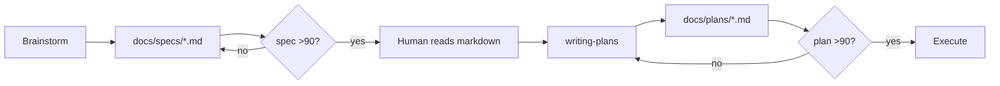
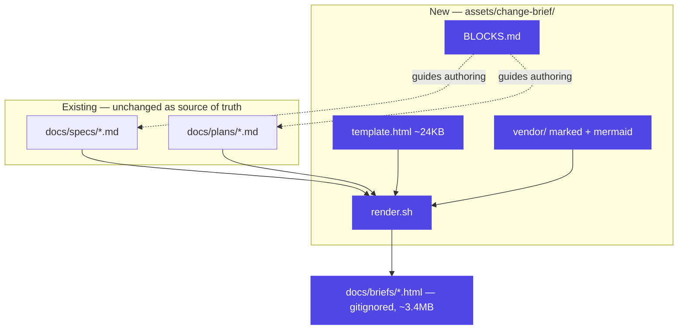
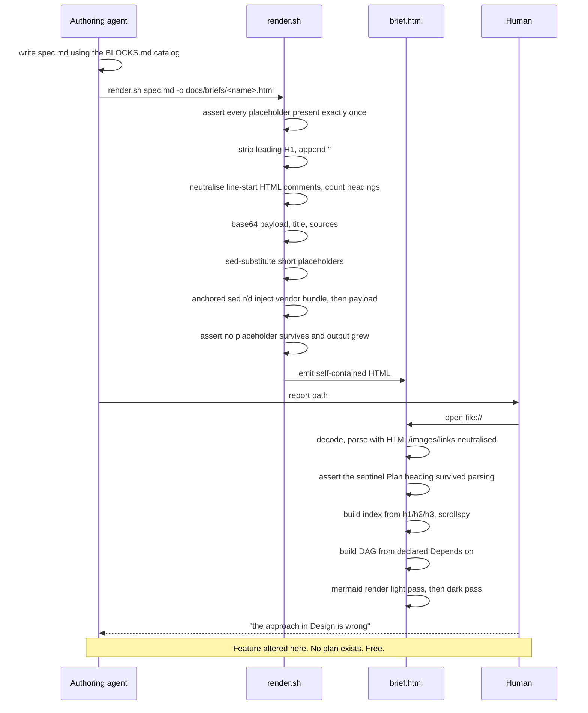

# Visual Change Briefs

Design spec. Status: awaiting user approval.

## Why this change

### Motivation

Umbrella's planning output is markdown. Agents read it fine. Humans reason about it poorly — a 600-line plan with no diagrams, no color coding, and no navigation is a wall of text, and the human-in-the-loop gate degrades into skimming.

The gate that matters most is the one *before* the plan exists, where altering the feature is free. Umbrella already has that gate (`brainstorming` checklist step 10, "User reviews written spec"). Today it hands the human a markdown file. If the human cannot reason well at that gate, the gate is decorative and the completeness pass that precedes it is wasted.

This change gives both gates an HTML artifact — navigable, themed, diagram-bearing — generated from the markdown the agent already writes.

### Success criteria

- A human can navigate a 600-line brief through a collapsible section/subsection index without scrolling the body.
- Every change carries a *why* and an *existing-system* section, not just a task list.
- Marginal token cost per brief equals the markdown an agent would write anyway, plus diagram fences and one `**Depends on:**` line per task. The HTML shell costs zero tokens because the agent never authors it.
- The page opens from `file://` with no server and no install, and **issues zero network requests on load**.
- The spec reviewer penalizes a spec that touches a domain without the corresponding block; the plan reviewer penalizes missing or dangling `**Depends on:**` declarations.

### Non-goals

- **Not a progress dashboard.** Checkboxes render and per-task progress bars appear, but the brief is a reasoning artifact. No rerender-on-task-completion.
- **Not a replacement for the markdown source.** `.md` remains the source of truth for every agent.
- **Not a mid-dialogue mockup tool.** That is the visual companion's job, untouched by this change.
- **Not a diff viewer.** The second render does not highlight what changed since the first.
- **No CI.** Umbrella has none today and this change does not add one; the test scripts run on demand.
- **Not a general-purpose markdown renderer.** Remote images and non-web link schemes are deliberately neutralized (see Inertness).

### Alternatives rejected

| Alternative | Why rejected |
|---|---|
| Agent authors HTML sections directly | 3-5x token cost per plan; breaks the `- [ ]` checkbox flow and both reviewer prompts |
| Single HTML file with markdown embedded, no sibling `.md` | Executing subagents pay for shell noise on every read; checkbox edits happen inside a script tag |
| One `brief.md` replacing spec + plan | Merges two adversarial gates into one; large surgery on the brainstorming → writing-plans handoff |
| Auto-derived task DAG from `Files:` overlap | Semantically wrong in both directions — false edges on shared files like `package.json`, missing edges when Task 3 defines a type Task 7 consumes from a different file |
| Committing `brief.html` to git | A self-contained brief is ~3.4MB. Per-change commits bloat the consumer repo. |
| Shared committed asset + thin `<script src>` briefs | `file://` subresource loading varies across Chrome/Firefox/Safari; a brief emailed alone is broken |
| Inlining the vendor bundle into `template.html` in git | Every template edit would add another uncompressible 3.4MB copy to umbrella's history. Vendoring the libraries as separate files keeps template edits at ~20KB. |
| Server-rendered brief | Install friction, port management, unusable offline |
| New invocable skill `umbrella:change-briefs` | Extra skill load per gate and a 15th skill in a 14-skill library, for discoverability the reference-file pattern already provides |
| Inlining the catalog into both SKILL.md files | Shared mermaid/markdown conventions duplicate across two files and drift |
| Resolving assets via `${CLAUDE_PLUGIN_ROOT}` in a shell command | **Verified unset in the Bash tool environment.** The variable works in `hooks/hooks.json` only because the harness substitutes it before spawning the hook process. A SKILL.md instructing an agent to run `render.sh` gets no such substitution. |
| Numbered section headings (`## 1. Why…`) | `render.sh` synthesizes a `## Plan` heading; any fixed number collides or misorders as soon as a spec has a different section count. Reproduced on this spec's own first render: two sections numbered 4, out of order. |

## Existing system

### Code inventory

| Path | Current responsibility | Change |
|---|---|---|
| `skills/brainstorming/SKILL.md` | 11-step design flow, completeness pass, spec gate at >90 | modify |
| `skills/writing-plans/SKILL.md` | Task decomposition, walk-tagging, Browser-Walk Inventory, plan gate at >90 | modify |
| `skills/brainstorming/spec-document-reviewer-prompt.md` | Adversarial spec reviewer | modify |
| `skills/writing-plans/plan-document-reviewer-prompt.md` | Adversarial plan reviewer | modify |
| `skills/brainstorming/visual-companion.md` | Mid-dialogue browser mockups | untouched (see Out of scope) |
| `.gitignore` | absent from the repo | create |
| `assets/change-brief/BLOCKS.md` | — | create |
| `assets/change-brief/template.html` | — | create |
| `assets/change-brief/render.sh` | — | create |
| `assets/change-brief/vendor/{marked,mermaid}.min.js` | — | create |
| `assets/change-brief/tests/` | — | create |

### Current flow



### Persona × surface × affordance matrix

| Persona | Surface | Affordances required | Provided by |
|---|---|---|---|
| Human reviewer (spec gate) | `brief.html`, plan pending | index nav, collapse, theme toggle, legible diagrams, knowing no plan exists yet, knowing which bytes were rendered | index + theme control + `[!PENDING]` callout + per-source content digest |
| Human reviewer (plan gate) | `brief.html`, complete | all of the above, plus per-task walk tags, checkbox progress, task dependency graph | walk badges, progress bars, renderer-built DAG |
| Human reviewer (offline / narrow / paper) | `brief.html` | no network on load, sidebar collapses below 900px, clean print to PDF from either theme | vendored libs, neutralized images, responsive sidebar, print rules that out-specify the dark theme, pre-rendered light diagram variant |
| Authoring agent (brainstorming) | `assets/change-brief/BLOCKS.md` | spec block catalog, omit rule, heading convention, render command | `BLOCKS.md` + SKILL.md hooks |
| Authoring agent (writing-plans) | `assets/change-brief/BLOCKS.md` | plan block catalog, `**Depends on:**` syntax, render command | `BLOCKS.md` + SKILL.md hooks |
| Executing subagent | `docs/plans/*.md` | unchanged checkbox flow; must never read `.html` | explicit rule in both SKILL.md hooks |
| Reviewing subagent (spec) | `docs/specs/*.md` | grade spec-block coverage against change domains; emit a numeric score | spec reviewer prompt extension |
| Reviewing subagent (plan) | `docs/plans/*.md` | grade `**Depends on:**` presence and validity, walk-tag coverage, task and inventory presence; emit a numeric score | plan reviewer prompt extension |
| External collaborator | `brief.html` alone, no repo | opens offline, no install, no sibling files, no beacon back to anyone | self-contained file; raw HTML escaped, remote images neutralized, unsafe link schemes stripped |

No persona is admitted to a surface it could not previously reach except the external collaborator, whose only surface is a read-only static file. No logout, home, or account affordances apply — this change introduces no auth, no navigation shell, and no account state.

**Composed-surface check:** the only shared surface is `brief.html`. Assembled, its controls are the theme toggle, the index chevrons, and the mobile sidebar toggle. No prior umbrella work places elements on this surface, so there is no cross-feature adjacency risk.

### Known constraints

Every item below was verified against the running prototype except where marked otherwise.

- `file://` blocks `fetch()` of sibling files. Content must be embedded, not loaded.
- `file://` subresource loading is permitted in Chrome but restricted in Firefox and Safari under some configurations. Self-contained is the only reliable option.
- Plans about web code contain the literal string `</script>`. Naive `<script type="text/markdown">` embedding breaks on the first such plan.
- macOS `base64` does not accept GNU's `-w0`.
- Interpolating a title into a `sed` replacement breaks on `|` (delimiter), swallows `\`, and lets `&` re-inject the matched pattern. A title `Auth | Session redesign` aborts the render.
- **Mermaid v10 is async-only.** `parse()` returns `Promise<boolean|void>` and rejects rather than throwing; `render(id, text, container)` takes an `Element` third argument, not a callback, and returns a `Promise<RenderResult>`. The v8/v9 callback form produces no output and no exception — every diagram blank, valid and invalid alike.
- Media queries contribute zero specificity, so `@media print { :root { … } }` loses to `:root[data-theme="dark"]`.
- Mermaid bakes theme colors into the emitted SVG. CSS alone cannot re-theme a rendered diagram, and `beforeprint` cannot await an async re-render.
- Escaping raw HTML does **not** make a markdown document inert. `` fetches on load, and `[x](javascript:…)` executes on click — both are markdown-native constructs that never pass through an HTML renderer hook.
- **CommonMark HTML-block type 2**: a line beginning with `<!--` runs to the closing `-->` or, absent one, to EOF. An unterminated comment in prose silently deletes every following section — including the pending callout — with exit 0 and no page error.
- `sed`'s address matching is unanchored. `/__VENDOR_JS__/` also matches a template comment that merely names the placeholder, injecting the 3.3MB bundle twice.
- `git rev-parse HEAD:<path>` resolves only repo-root-relative paths and certifies the *committed* blob, not the working tree that was actually embedded.
- `${CLAUDE_PLUGIN_ROOT}` is **not** present in the Bash tool environment; it is substituted by the harness for `hooks.json` only.
- Umbrella has no `.gitignore` and no CI.
- *Unverified, retained as rationale only:* the one-true-awk shipped on macOS through Monterey is reported to honour only the first character of a multi-character `RS`. This could not be tested (the local build is `awk 20200816`, which handles it correctly). The design no longer depends on `awk`'s `RS` either way.

## Design

### Target architecture



### Render pipeline



### Heading convention

Section headings in both spec and plan are **unnumbered** `##`. Canonical spec sections: `Why this change`, `Existing system`, `Design`, `Requirements`, `Testing strategy`, and optionally `Out of scope`. Canonical plan sections: the tasks as `###`, plus `## Browser-Walk Inventory`.

### Block catalog

`BLOCKS.md` defines 27 blocks partitioned by document. The agent includes only those that apply — an empty section is worse than an absent one.

**Spec, always present:**

| # | Block |
|---|---|
| 1 | Motivation / trigger |
| 2 | Success criteria |
| 3 | Non-goals |
| 4 | Code inventory table — path → responsibility → change |
| 5 | Persona × surface × affordance matrix |
| 6 | Target-state architecture (`flowchart`) |
| 7 | File structure — create / modify / delete |
| 8 | Requirements, each tagged `static-verifiable` or `browser-walk-only` |
| 9 | Testing strategy |

**Spec, include when applicable:**

| # | Block | Applies when |
|---|---|---|
| 10 | Alternatives rejected | more than one approach was seriously considered |
| 11 | Current-state diagram (`flowchart`) | change touches an existing multi-component flow |
| 12 | Current call/data-flow trace (`sequenceDiagram`) | change alters an existing runtime interaction |
| 13 | Known constraints / gotchas | existing code or platform imposes non-obvious limits |
| 14 | Runtime interaction (`sequenceDiagram`) | new behavior spans two or more actors |
| 15 | Integration delta (`flowchart` + `classDef`) | new components attach to existing ones |
| 16 | New types/classes (`classDiagram`) | change introduces types or classes |
| 17 | Data model (`erDiagram`) + migrations | change alters persisted schema |
| 18 | API / contract surface table | change adds or alters an interface others call |
| 19 | State machine (`stateDiagram-v2`) | change introduces states with transition rules |
| 20 | Infra changes — services, env vars, deploy | change touches infrastructure or configuration |
| 21 | Failure modes table | change has non-trivial failure paths |
| 22 | Rollback plan | change is not trivially revertible |
| 23 | Out of scope / deferred | adjacent work is knowingly deferred and would otherwise be assumed in scope. Distinct from block 3: Non-goals say what this change will never do; block 23 names work that is real but sequenced later. |

**Plan, always present:**

| # | Block |
|---|---|
| 24 | Tasks with steps and `- [ ]` checkboxes |
| 25 | Walk tag per task |
| 26 | `**Depends on:**` per task (`none` when independent) |
| 27 | Browser-Walk Inventory |

The task dependency graph is **not** an agent-authored block. The renderer derives it from block 26.

### Markdown conventions

| Agent writes | Renderer paints |
|---|---|
| `##` / `###` headings | collapsible index, sections with nested subsections, scrollspy |
| ` ```mermaid ` fence | diagram, pre-rendered in both themes |
| markdown table | styled table, scrollable inside its own container |
| `- [ ]` / `- [x]` | checkbox; per-task progress bar appended to the `###` heading |
| `` `static-verifiable` `` / `` `browser-walk-only` `` in a heading | colored badge, amber for walk-only |
| `> [!NOTE]` / `[!WARNING]` / `[!IMPORTANT]` / `[!TIP]` / `[!CAUTION]` | colored callout |
| `classDef` inside a mermaid fence | new-vs-existing color coding |
| `**Depends on:** Task 3, Task 5` | edge in the renderer-built task dependency graph |

Not available to the agent: raw HTML (escaped), remote images (shown as an inert chip), and links with schemes other than `http(s)`, `mailto:`, `#`, or relative (rendered as plain text).

### Inertness

The brief is opened by a persona with no repo and no context — often from an email attachment. It must not phone home or execute anything. Three independent escape hatches exist and all three are closed:

1. **Raw HTML** — `marked.use({renderer:{html}})` escapes it. If `marked.use` is unavailable the page renders a visible banner and refuses to insert the payload at all; there is no silent fallback.
2. **Markdown images** — `renderer.image` passes `data:image/*` through and converts every other URL to an inert text chip. Escaping HTML alone leaves `` fetching on load, leaking the reader's IP and open time.
3. **Markdown links** — `renderer.link` is **scheme-based, not prefix-based**. The href is entity-decoded, control characters and whitespace are stripped, then a leading `scheme:` is extracted. No scheme means a relative path or fragment and is permitted; a scheme is permitted only if it is `http`, `https`, or `mailto`. Everything else — `javascript:`, `data:`, `vbscript:` — renders as plain text.

   Both steps are load-bearing. A prefix allowlist admitting `./BLOCKS.md` but not the equally common bare `BLOCKS.md` silently demotes valid links. And entity decoding must happen *before* the scheme test: `java&#9;script:` contains no control character at source level, but the browser decodes the entity to a tab and then strips it, reconstituting a live `javascript:` scheme. Decoding via a detached `<textarea>` executes nothing.

   Permitted relative forms, exhaustively: bare (`BLOCKS.md`), dot-relative (`./x`, `../x`), root-relative (`/x`), and bare fragments (`#section`). **Protocol-relative `//host/x` is rejected** despite having no scheme — it is not document-relative, it resolves to `file://host/x`, and on Windows that is a UNC path, so a click attempts an SMB connection to an attacker-chosen host. Classic NTLM-leak vector.

   **Backslashes are normalised to `/` before that check.** For special schemes, and `file:` is one, the WHATWG URL parser treats `\` as `/`, so `/\host/x` is an equivalent spelling of `//host/x` and reaches the same remote host. Checking only the literal `//` spelling leaves the bypass open — verified: `[g](/\evil.example.com/share)` produced an anchor with `host === "evil.example.com"`.

`mermaid.initialize({ securityLevel: "strict" })` remains set. The honest guarantee is **zero network requests on load** — an `http(s)` link the reader deliberately clicks will still navigate, which is the intended behavior.

### File structure

```
assets/change-brief/
  BLOCKS.md              # 27-block catalog, conventions, render command
  template.html          # ~24KB shell: CSS themes, index, theme control, page JS
  render.sh              # POSIX bash assembler
  vendor/
    marked.min.js        # pinned 12.0.2, 35KB
    mermaid.min.js       # pinned 10.9.1, 3.34MB
  tests/
    render_test.sh       # shell assertions, no dependencies
    fixtures/            # spec, plan, hostile title, broken diagram, beacon, comment-truncation
    browser/
      package.json       # declares playwright-core; without it verify.mjs cannot resolve its import
      verify.mjs         # optional headless smoke test
docs/briefs/             # in the CONSUMER project, gitignored, derived
```

### `render.sh` contract

```
render.sh SPEC.md [PLAN.md] -o OUT.html [-t TEMPLATE.html] [-V VENDOR_DIR]
```

- **Pre-conditions.** Every placeholder must be present in the template **exactly once**, and `__VENDOR_JS__` / `__BRIEF_B64__` must each be alone on their line. Checking only that no placeholder *survives* passes a template with one deleted, yielding a blank brief and exit 0 — in one case with nothing in the browser console to diagnose it.
- **Payload assembly.** `SPEC.md`, then a synthesized `## Plan`, then either the plan body or the pending callout. Synthesizing in *both* paths keeps the gates structurally identical; otherwise plan tasks nest under whichever `##` the spec ended on and the Plan group vanishes at the second gate.
- **H1 handling.** The first line of each document is dropped if it is an H1 — the spec's title is already the masthead and the plan's would be a second H1 mid-document. The strip is **first-line-only**: a "first `^# ` anywhere" rule is fence-unaware and silently deletes a `# comment` line from a bash fence in a plan that has no H1. Any surviving H1 further down is flattened to `####` (see below), deliberately placing it outside the index's h2/h3 range.
- **Block scanner (`scan.awk`), deliberately minimal.** It does **not** re-implement CommonMark. Four review rounds established that it cannot: every attempt to make a source-side heading count agree with `marked`'s parse produced a new divergence — nested fences, indented code, HTML blocks, backtick info strings — and each divergence is either a false truncation alarm or silent content loss. The scanner now does only what must happen *before* parsing: neutralising a dangling comment, flattening stray H1s, and reporting structural defects. Truncation detection moved to the page (see Structural integrity).
- **Dangling-comment detection is line-start-only and order-aware.** Only a comment opening at the start of a line can form a CommonMark HTML block and swallow the document; a `<!--` mid-paragraph is inline HTML and harmless. Tracking inline occurrences false-alarms on any document that merely discusses comments — this spec does. And order matters, not totals: a stray `-->` earlier in the text (prose about mermaid arrows) balances a count and disables escaping while a real dangling opener still swallows the tail.
- **Escaping preserves indentation.** awk's `sub()` replaces the whole match and has no backreferences, so a `^([ \t]*)<!--` pattern *deletes* the captured indent, dropping a comment out of a list-item fence and breaking it. Match the line, substitute only `<!--`.
- **Stray H1s are flattened to `####`, not `##`.** After each document's leading H1 is stripped, any H1 further down becomes an h4 — below the index's h2/h3 range, so it can neither open an index group nor capture the following h3s. Demoting to h2 renames the defect rather than removing it: the demoted heading steals the plan's tasks exactly as the H1 did. Setext H1s (a `=` underline) are flattened too; the ATX regex cannot see them, and one reaching the DOM leaves its whole section unreachable from the index.
- **Front matter is bounded.** A leading `---` is front matter only if a closing `---` appears within ~50 lines *and* the enclosed lines look like `key: value`. Otherwise it is an ordinary thematic break — umbrella's own Plan Document Header uses one — and consuming to EOF deletes the entire document while still emitting a correct title, a correct provenance digest, and exit 0. When it is front matter it is **dropped**, because `title: X` followed by the closing `---` is a setext H2 that opens an index group and steals the tasks.
- **Sentinel Plan heading.** The synthesized heading is `## Plan` followed by U+2060 WORD JOINER. The page locates the plan region by that marker and strips it for display. Matching a heading by the *name* "Plan" is guesswork: either document may legitimately contain its own Plan section, and both "first match" and "last match" misplaced the task graph by a whole document.
- **Diagnostics.** Unterminated fences and unterminated comments are reported on stderr and carried into the page as banners. An unterminated fence swallows the tail exactly as a dangling comment does, and no heading arithmetic can see it — the scanner is the only place that knows.
- **Unreadable plan is fatal.** A supplied but unreadable `PLAN.md` exits 1. Falling through to the pending panel would tell the human "no plan exists yet" when one does — the highest-consequence silent failure available to this pipeline.
- Default `OUT` is `docs/briefs/<spec-basename>.html`; `mkdir -p` its directory.
- Title from the first `# ` heading of `SPEC.md`, falling back to the basename.
- **Provenance** is `basename@<first 8 hex of sha256>` per source, via `shasum -a 256` falling back to `sha256sum`. This hashes the working-tree bytes actually embedded. A git blob SHA was rejected: it resolves only repo-root-relative paths, and it certifies the committed version while the payload carries uncommitted edits — a freshness affordance that reports "fresh" while lying.
- **Encoding.** Payload, title, and sources are all base64. The alphabet contains no `|`, `&`, `\`, `"`, or `<`, making both `sed` substitution and HTML attribute embedding safe by construction.
- **Injection.** Short placeholders via `sed s|…|…|`. `__VENDOR_JS__` and `__BRIEF_B64__` are swapped for a file with `sed -e '/^__X__$/{' -e 'r file' -e 'd' -e '}'` — **anchored**, portable across BSD and GNU sed, no argument-size limit, no dependency on `awk`'s non-POSIX multi-character `RS`.
- **Post-conditions.** No placeholder survives, and the output is larger than the template. On any failure the partially written output is removed — a truncated file that opens blank is worse than no file, because it looks like success.
- Writes the output path to stdout and nothing else. Errors to stderr, non-zero exit.
- Idempotent apart from the generation timestamp.

### `template.html` responsibilities

- **Decode** — `atob` → `Uint8Array` → `TextDecoder("utf-8")` after stripping whitespace.
- **Masthead** — title and sources arrive base64 and are written with `textContent`.
- **Inertness** — as above.
- **Structural integrity** — the page asserts, against its own DOM, that the sentinel Plan heading survived parsing. If it did not, an unknown amount of content was lost and a red banner says so and tells the reader to check the source. This check uses the same parser the reader sees, so it cannot drift from it, and it catches every cause of loss — dangling comment, unterminated fence, HTML block, front-matter misparse, or anything not yet imagined — rather than the subset awk can model. A second check confirms the pending notice rendered when `data-plan-state` is `pending`. Warnings from `render.sh` render as additional banners.

  This replaced a source-side heading count that compared `render.sh`'s tally against the rendered total. That mechanism was removed, not fixed: making it correct required a second CommonMark implementation, and it produced false alarms on intact documents (nested fences, backtick info strings, HTML blocks) while staying blind to unterminated fences, where both implementations agreed.
- **Themes** — CSS custom properties on `:root` and `:root[data-theme="dark"]`; three-state control persisted to `localStorage`.
- **Diagrams rendered twice, up front.** Each fence renders once with mermaid's `default` theme into `.d-light` and once with `dark` into `.d-dark`; CSS shows the matching one. Theme switching becomes a pure CSS toggle, and print selects the light variant synchronously. **A failing pass must never clobber a pass that already succeeded** — the two passes mutate one container, and an unguarded catch replaced three good light renders with error boxes when the dark pass failed.
- **Mermaid v10 async contract**, which the plan must implement as written:

  ```js
  Promise.resolve()
    .then(function(){ return mermaid.parse(src); })
    .then(function(){ return mermaid.render(id, src); })
    .then(function(res){ /* attach res.svg to the theme slot */ })
    .catch(function(err){ /* red error box, unless a prior pass succeeded */ });
  ```

- **Index** — built from `h2`/`h3` only, since `render.sh` guarantees a single hierarchy. **Task headings attach to the Plan group by region, not by heading adjacency.** Nesting h3s under "whichever h2 came last" is a latent defect that surfaced in five consecutive review rounds through four different triggers — an unnested h3, a stray h1, a demoted h2, and a setext h2 manufactured from YAML front matter. Each round removed one trigger and left the mechanism, so the next round found another. The sentinel already identifies the plan region exactly; any `### Task N` positioned after it joins the Plan group regardless of what headings intervene. Clean heading text is captured into `data-toc` *before* badges and progress bars mutate the DOM, otherwise entries read `Task 1: Render scriptstatic-verifiable`. `h2` opens a collapsible group; `h3` nests beneath. `IntersectionObserver` scrollspy.
- **Mermaid extraction** — post-processes `pre > code.language-mermaid` in the DOM rather than overriding `marked`'s code renderer, which keeps the template working across `marked` major versions.
- **Task dependency graph** — parses `### Task N: Title` headings and inserts a `flowchart LR` **immediately before the first task heading**, with `browser-walk-only` tasks class-colored. Anchoring by heading *name* is positional guesswork that relocates rather than fixes: "first `## Plan`" put the graph a document above the tasks when the spec had its own Plan section, and "last `## Plan`" then put it a document below them when the plan had one. The tasks are what the graph describes, so it attaches to them directly. The `**Depends on:**` match is anchored to the start of a paragraph, takes the first declaration per task, and honours `none`. A loose search over every node in the section harvests the string from prose and code fences alike — a step reading ``add `Depends on: Task 3` to the template`` fabricated a real edge. Edges referencing unknown tasks are dropped; fewer than two tasks renders nothing. Cycle detection is delegated to the plan reviewer.
- **Print** — `@media print { :root, :root[data-theme="dark"] { … } }`. Matching the dark selector is mandatory.
- **Responsive** — below 900px the sidebar becomes an off-canvas panel behind a toggle; tables and diagrams scroll inside their own containers.

### Asset path resolution

`${CLAUDE_PLUGIN_ROOT}` is unavailable in shell commands. Skills instead resolve assets from **the skill base directory announced when the skill loads**, which is an absolute path:

```
BRIEF_DIR="<announced skill base directory>/../../assets/change-brief"
```

Both SKILL.md hooks must verify `[ -x "$BRIEF_DIR/render.sh" ]` before use. **If the assets cannot be found, the agent reports it and proceeds with markdown review — a missing renderer must never block the review gate.** This is the single highest-leverage failure point in the change: if resolution is wrong, both gates emit a command that fails. It carries a `static-verifiable` requirement and a failure-mode row for that reason.

### Skill integration points

**`skills/brainstorming/SKILL.md`:**

1. Checklist step 7 gains: author the spec using the block catalog at `$BRIEF_DIR/BLOCKS.md`, unnumbered `##` sections, including only blocks that apply.
2. New checklist step 9b, after the adversarial spec review passes and before the user review gate: `render.sh <spec> -o docs/briefs/<name>.html` with no plan argument.
3. Two places carry the user-review prompt and **both** must change: the checklist item ("User reviews written spec") and the quoted prompt under **User Review Gate:**. Both point at the rendered brief and state that altering the feature is free at this point.
4. The process-flow `dot` graph gains a "Render brief" node between the adversarial-review diamond and the user-review diamond.
5. A note: `docs/briefs/` belongs in the **consumer project's** `.gitignore`. If absent, add it.

**`skills/writing-plans/SKILL.md`:**

1. The Task Structure template gains a `**Depends on:** Task N, Task M` line (or `none`) directly beneath the task heading.
2. The Plan Document Header keeps its `# … Implementation Plan` H1; `render.sh` strips it. Documented so nobody "fixes" the H1 away.
3. A new step after the adversarial plan review passes: `render.sh <spec> <plan> -o docs/briefs/<name>.html`.
4. The Execution Handoff prompt reports the brief path alongside the plan path.
5. Self-Review gains: does every task carry a `**Depends on:**` line, and does every referenced task exist?
6. An explicit rule: executing subagents read `docs/plans/*.md`. They never read `docs/briefs/*.html`.

### Reviewer prompt extensions

Both prompts gain an explicit `**Score:** <integer 0-100>` field. Both SKILL.md files already gate on `>90` while neither prompt's output format defines a score — a pre-existing inconsistency that block-coverage penalties would otherwise have nothing to attach to.

**`spec-document-reviewer-prompt.md`** gains block coverage scoped to **spec blocks 1-23 only**. Penalize a missing always-present block, and penalize a change that touches infrastructure with no block 20, introduces types with no block 16, alters persisted schema with no block 17, adds a called interface with no block 18, or introduces states with no block 19. It must not penalize the absence of plan blocks 24-27; a spec at the first gate cannot contain them.

**`plan-document-reviewer-prompt.md`** gains coverage of **plan blocks 24-27**: every task has steps with `- [ ]` checkboxes (24); every task carries a walk tag (25); every task carries a `**Depends on:**` line whose references exist and whose graph is acyclic (26); a `## Browser-Walk Inventory` exists with at least one numbered case per `browser-walk-only` task (27).

### Failure modes

| Failure | Detection | Handling |
|---|---|---|
| Malformed mermaid fence | `parse()` promise rejects | Red error box with the parse message and offending source; other diagrams unaffected |
| Dark pass fails after light succeeded | guard on existing `.d-light svg` | Keep the light render; do not convert to an error box |
| Supplied plan unreadable | `[ -r ]` on a non-empty `$PLAN` | stderr message, exit 1 |
| Assets not resolvable from the skill base directory | `[ -x "$BRIEF_DIR/render.sh" ]` | Report to the user, skip rendering, continue the gate on markdown. Never block the gate. |
| Template missing a placeholder | presence check before substitution | stderr naming the placeholder, exit 1, no output file |
| Template names a placeholder twice | occurrence count must be 1 | stderr message, exit 1 |
| Output not larger than template | byte comparison | stderr message, exit 1, output removed |
| Unterminated `<!--` at line start | prevented by escaping; sentinel check as backstop | Comment renders as literal text; stderr warning and a page banner |
| Remote image in payload | `renderer.image` | Inert chip; zero network requests on load |
| `javascript:` / `data:` / `vbscript:` link | `renderer.link` scheme allowlist | Rendered as plain text |
| Entity-obfuscated scheme (`java&#9;script:`) | href entity-decoded before the scheme test | Rendered as plain text |
| Comment indented inside a list-item fence | substitution leaves indentation intact; fence tracker accepts indented fences | Fence unbroken, no truncation |
| Content lost for any reason during parsing | sentinel Plan heading missing from the rendered DOM | Red banner naming the loss and directing the reader to the source |
| Unterminated code fence | scanner reports it; sentinel also disappears | stderr warning plus two banners |
| Heading form no source-side scanner can see (setext, blockquoted, nested fences, HTML blocks) | not applicable — the count mechanism was removed | No false alarms by construction |
| Balanced comment inside an indented code sample | escaping gated on an order-aware dangling-opener check, not marker totals | Sample renders verbatim |
| Protocol-relative `//host` link | explicit rejection alongside the scheme check | Rendered as plain text |
| Document starting with a blank line, BOM, or front matter | skipped before the H1 test; genuine front matter dropped | Leading H1 still stripped; no setext H2 from `title:` |
| Leading `---` thematic break, no closing `---` | bounded front-matter detection | Passes through whole rather than being consumed to EOF |
| H1 surviving mid-document (ATX or setext) | flattened to `####` | Below the index range, so it can neither open nor steal a group |
| Either document containing its own `## Plan` | sentinel marks the synthesized heading | Task graph attaches to the real tasks |
| Mid-document fence mispairing (an inner ` ``` ` closing an outer one early) | not detected — the sentinel still renders and fence markers pair up | Loud rather than silent: the following prose appears as one visibly enormous code block |
| `marked.use` unavailable | explicit check | Visible banner; payload not inserted |
| Plan not yet written | no second positional argument | `[!PENDING]` callout with explicit "changes are free now" copy |
| `</script>` in plan content | not possible | Payload is base64 |
| Title containing `\|`, `&`, `\`, `<` | not possible | base64 into a data attribute, out via `textContent` |
| `docs/briefs/` missing | unconditional `mkdir -p` | Directory created |
| Vendor bundle missing | `[ -r ]` before work | stderr message, exit 1 |

Deliberately **not** handled: detecting that a rendered `.html` has gone stale relative to its `.md`. A static `file://` page cannot read sibling files or mtimes, so an in-page stale badge is unimplementable. The mitigation is procedural — the brief is re-rendered at every gate — plus the per-source content digest, which visibly changes when the source does.

### Rollback

Delete `assets/change-brief/`, revert two `SKILL.md` hunks and two reviewer-prompt hunks, drop the `.gitignore` entry. `docs/briefs/` is gitignored in consumer projects. No data migration, no runtime dependency, no consumer-visible API.

## Requirements

### `static-verifiable`

Confirmable by `tests/render_test.sh` and static inspection:

- Every placeholder must be present exactly once in the template; a missing or duplicated one aborts with a message naming it and leaves no output file.
- The output is larger than the template, and no placeholder survives.
- The payload decodes to `SPEC.md` + a `## Plan` heading + the plan body when a plan is supplied, and + the pending callout when not.
- The leading H1 of each document is absent from the payload.
- A `# comment` line inside a fenced block in a plan with no H1 survives into the payload.
- A document whose first line is not an H1 (after BOM, blank lines, and front matter are skipped) is passed through whole.
- A plan starting with a blank line, a BOM, or YAML front matter still has its H1 removed, leaves no H1 in the payload, and nests its tasks under Plan.
- A document whose first line is a `---` thematic break with no closing `---` passes through whole; a genuine front-matter block is dropped and its body retained.
- Any H1 after the first is flattened to `####`, never to `##`. Setext H1s are flattened too, and no `h1` reaches the rendered DOM.
- A dangling `<!--` is escaped **with its leading indentation intact**; a comment inside a fenced or indented code block is never escaped; a *balanced* comment in an indented code sample survives verbatim; a stray `-->` earlier in the prose does not disable escaping.
- The payload carries the sentinel-marked `## Plan` heading, and `data-plan-state` is `pending` or `attached` to match.
- An unterminated fence and an unterminated comment each produce a warning on stderr; a clean document produces none.
- The link renderer keeps bare, dot-relative, root-relative, and fragment hrefs, and demotes `javascript:`, `data:`, `vbscript:`, protocol-relative `//host`, its backslash-equivalent spellings (`/\host`, `\\host`), and entity-obfuscated variants — asserted on the resolved `a.host` and `a.protocol`, not on the raw attribute. (`a.protocol` alone cannot discriminate: it is `file:` for both a safe relative link and a `//host` UNC bypass.)
- The task dependency graph is inserted immediately before the first task heading **inside the plan region**, including when either document contains its own `## Plan` section or a task-shaped `### Task N` heading outside the plan. No task node is emitted twice.
- The page raises a banner when the sentinel Plan heading is absent from the rendered DOM, and none when the document is intact.
- Every `### Task N` in the plan region appears under the Plan group in the index, including when a foreign `##` (a setext heading manufactured from front matter, or a stray section) sits between the Plan heading and the tasks.
- A supplied but unreadable plan exits 1 and produces no output file.
- An unreadable spec, template, or vendor file exits 1.
- `render.sh` creates a missing output directory.
- A title containing `|`, `&`, `\`, `"`, and `<` renders intact and appears nowhere as raw markup.
- Title falls back to the spec basename when the file has no `# ` heading.
- Provenance stamps change when source bytes change and are identical for identical bytes.
- Two renders of identical inputs differ only in the generation timestamp.
- Every task in a plan carries a `**Depends on:**` line naming only tasks that exist.
- Both reviewer prompts contain a `Score` field; the spec prompt's block criteria reference only blocks 1-23 and the plan prompt's only 24-27.
- `.gitignore` in umbrella excludes `docs/briefs/`.
- **`$BRIEF_DIR` resolves to a directory containing an executable `render.sh` from a real plugin install**, exercised from both SKILL.md hooks.

Confirmable by `tests/browser/verify.mjs` where `playwright-core` and a system Chrome are available; otherwise these fall to the numbered walk cases below:

- Each valid fence produces one `.d-light svg` and one `.d-dark svg`; an invalid fence produces exactly one `.mermaid-error` and leaves the others rendered (walk case 4).
- The page issues zero non-`file://` requests on load, including for markdown images (walk case 6).
- Raw HTML, remote images, and `javascript:`/`data:` links are all inert (walk case 6).
- The DAG contains only declared edges — no edge from a prose or code-fence mention, none from a task declaring `none`, none referencing a nonexistent task (walk case 7).

### `browser-walk-only`

1. Open the rendered brief from `file://` in Chrome at 1440px. The index lists every `##` with its `###` nested beneath, and a chevron collapses that group without navigating away.
2. Toggle the theme through auto, light, and dark. Every diagram stays legible in both — no dark-on-dark text — and the choice survives a reload.
3. Narrow to 480px. The sidebar collapses to a toggle rather than overlapping content, and no table or diagram forces horizontal scrolling of the body.
4. Break one mermaid fence, re-render, reload. A red error box appears in its place showing the offending source, and every other diagram still renders.
5. Print preview **from dark theme**. The sidebar is absent, the page is light, diagrams are the light-rendered variant, and no diagram is clipped across a page break.
6. With the browser's network disabled and the developer console open, load a brief containing a remote image, a raw `` tag, and a `javascript:` link. Nothing is requested, no script runs, the image appears as an inert chip, and the link is plain text.
7. Render a plan whose tasks declare dependencies, including one `none` and one prose mention of the literal string `Depends on:`. The graph shows exactly the declared edges.
8. At the spec gate, confirm the Plan section reads unmistakably as "the plan does not exist yet" rather than as an empty section.
9. Open a brief from `file://` in Firefox and Safari. It renders equivalently to Chrome.

## Testing strategy

`assets/change-brief/tests/render_test.sh` drives `render.sh` against fixtures and asserts the shell-level list above. Plain bash, no dependencies, run on demand — umbrella has no CI and adding one is out of scope.

Two rules for these tests, both from assertions that looked green while checking nothing:

- **Every assertion must feed the pass/fail counters and the script must exit non-zero on failure.** Helper checks that print their own verdict without incrementing a counter let a regression report "0 failed".
- **An assertion must fail if its fixture never got built.** A check that read a file `render.sh` had refused to create fell back to `0` bytes and printed PASS, verifying nothing.

`assets/change-brief/tests/browser/verify.mjs` is an optional headless smoke test using `playwright-core` against a system Chrome, with its own `package.json` so the import resolves. It covers diagram render counts, error-box behavior, request isolation, inertness, DAG correctness, print theming, and 480px overflow. Where it cannot run, its assertions fall to the numbered walk cases.

Everything visual remains in the plan's `## Browser-Walk Inventory`. Per umbrella's meta rule, a >90 plan review does not clear the `browser-walk-only` class — the walk does.

This spec is its own evidence for that rule. An earlier revision scored 79 with a prototype in which **no diagram rendered at all**, because every diagram assertion had been classified walk-only and no walk had been run. A later revision fixed that and scored 88 — and adversarial testing then found that five of the eleven fixes had introduced new defects, including a markdown image that beaconed to a remote host and an unterminated HTML comment that silently deleted the pending callout. Both rounds were caught by executing the artifact, not by reading it.

The first dogfood case is this spec. Render it, and the brief you read to approve the change is produced by the change.

## Known open findings

Five review rounds surfaced 42 defects. These remain open at freeze, all found by adversarial review and reproduced against the prototype. They are recorded here so the implementation plan can carry them as tasks rather than rediscovering them.

| Finding | Effect | Suggested fix |
|---|---|---|
| `has_front_matter` requires every line to match `key:`, so indented values and list items (`tags:\n  - a`) abort detection | The block passes through and its closing `---` becomes a setext H2. Now harmless to the index (tasks nest by region), but the heading still appears as a grotesque index entry. Silent. | Accept indented continuations and `- ` entries; require only that the first enclosed line looks like `key:` |
| The front-matter search gives up after ~50 lines | A longer block is not detected, with the same effect as above. The cap is a failure threshold, not a safety property. | Drop the cap — requiring a closing `---` is the real guard |
| The sentinel check takes the **first** marked `h2` | A spec containing U+2060 in one of its own h2s satisfies the integrity assertion, so loss after that point would go unreported. Also leaks the marker into the visible heading and index. | Strip U+2060 from the payload before appending the sentinel, making it unique by construction; assert exactly one |
| `scan.awk` fabricates "unterminated fence" warnings on intact documents (a backtick info string containing a backtick is a paragraph to `marked`, a fence to the scanner) | A reader-facing banner cries wolf on a correct brief, which round four established disarms the backstop | Suppress diag banners when the sentinel check passes; keep the stderr line for the author |
| `planTasks()` walks `nextElementSibling` | Tasks nested inside a list, blockquote, or `<details>` yield no dependency graph, silently | Scope by `compareDocumentPosition` instead of the sibling chain; banner when the plan region yields zero tasks while `data-plan-state` is `attached` |
| The pending-notice check tests `blockquote, .callout` | Every realistic spec contains one, so the predicate is always satisfied and the check can never fire | Assert `.callout.pending` specifically |

## Out of scope

- **Visual companion server.** `skills/brainstorming/visual-companion.md` documents a server (`scripts/start-server.sh`, `frame-template.html`, `helper.js`) never forked from superpowers into this repo, leaving the companion non-functional. Those scripts will be extracted from upstream separately. This change neither removes nor repairs it.
- An invocable `/change-brief` slash command, trivially addable later over the same `render.sh`.
