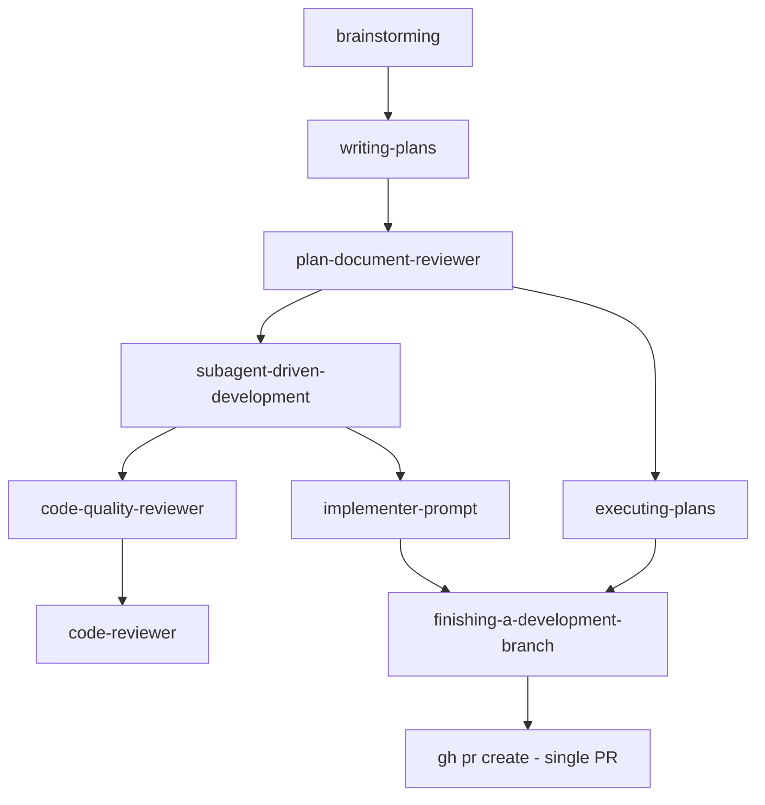
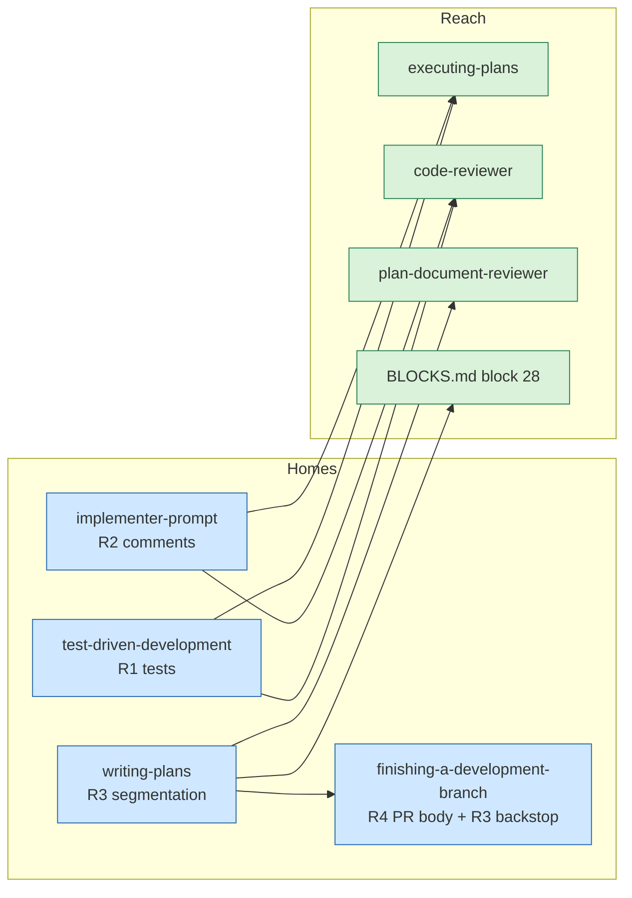

# Agent Discipline Rules

Four rules that change how umbrella's coding agents write tests, write comments,
size pull requests, and describe them.

## Why this change

Umbrella's skills currently push agents toward four bad outcomes, each traceable
to specific text in the skill files:

**Test bloat.** `test-driven-development/SKILL.md` requires "Every new
function/method has a test" and "Edge cases and errors covered". Both are
unbounded. An agent satisfying them literally writes a test per accessor and
invents inputs no caller can produce. `requesting-code-review/code-reviewer.md`
reinforces it: its worked example praises *"Comprehensive test coverage (18
tests, all edge cases)"*, teaching by demonstration that more tests is better.
The result is a suite that is expensive to run, expensive to change, and whose
failures carry no signal about whether the feature works.

**Code narration.** No skill says anything about comments. Agents default to
restating each line in prose above it. These comments go stale on the first
edit, and a stale comment is worse than none — a reader trusts it and is wrong.

**Unreviewable pull requests.** Nothing in umbrella bounds the size of a branch.
A plan with 30 tasks produces one branch and one pull request. Neither a human
nor an agent reviewer holds 5,000 lines in working memory, so review degrades to
a rubber stamp exactly when the change is largest and the stakes are highest.

**Pull request walls of text.** `finishing-a-development-branch/SKILL.md:128` is
the only place in umbrella that opens a pull request. Its body template is
`## Summary` plus `## Test Plan`, which invites an agent to dump everything it
did. A reader who needs to decide *should this merge* cannot find the reason the
change exists.

Each fix has to land in the file the relevant agent actually reads. A rule
written once in a central place is a rule most agents never see.

## Success criteria

The change succeeds when all four hold:

1. A coding agent given a one-behavior bugfix writes one test for that behavior
   and none for the trivial accessors around it.
2. Code produced by an agent contains no comment that paraphrases the line
   beneath it, and public API docstrings survive untouched.
3. A plan whose implementation exceeds the hard threshold cannot pass the plan
   review gate while declaring a single pull request.
4. A pull request opened by umbrella answers *why does this exist* in its first
   screen, with no Test Plan checklist.

## Existing system

Umbrella is a skills repository: markdown files loaded into an agent's context
by the `Skill` tool. There is no application code. Behavior changes only by
changing skill text, and the text competes for the agent's attention with
everything else in its context — so a contradicting sentence left in place
defeats a new rule added elsewhere.

Two execution paths exist and they do not share text:

- **Subagent path** — `subagent-driven-development` dispatches a fresh agent per
  task using `implementer-prompt.md`, then two reviewers.
- **Inline path** — `executing-plans` runs tasks in the current session and
  reads no prompt templates at all.

Branch and pull request creation are narrower than they appear. `gh pr create`
occurs exactly once, at `finishing-a-development-branch/SKILL.md:128`. No skill
creates a feature branch except `using-git-worktrees`, which creates one branch
for an entire worktree. Plan tasks only ever `git add` and `git commit`. So
nothing today can produce a second branch for a second pull request.



### Known constraints

- **Skill text is the only lever.** There is no hook, linter, or CI step that
  can enforce these rules mechanically. Every rule must survive as instruction
  text an agent chooses to follow, which makes removing contradicting text as
  important as adding the rule.
- **Estimates precede measurement.** Segment sizing happens at plan time, before
  any code exists. Line counts there are estimates and will be wrong. The design
  must tolerate that rather than assume precision.
- **`docs/briefs/` is gitignored** derived output and is excluded from every
  line count in this design.

## Design

Each rule gets one **home** — the file that states it in full and owns its
wording — and a set of **reach points** in the other files whose agents must
obey it.

**Reach points restate the rule, they do not link to it.** This duplicates text
on purpose. An agent acts on what is in its context window, and the two
execution paths never load each other's files, so a pointer from
`executing-plans` to `implementer-prompt.md` reaches nothing. The home is where
the rule is maintained; the reach point is a short restatement of the operative
sentences, not the full rationale. This is the same reasoning that rejects a
central `RULES.md`.



### R1 — Minimum test subset

The unit of testing changes from **the function** to **the behavior in the
contract**. A contract is what the feature promises, what the bug report says is
broken, or what the issue asks for.

Write one test per behavior in that contract, plus one test per corner case that
a real caller can produce in production. Nothing else.

A corner case qualifies only if you can name the caller and the input that
reaches it. If you cannot, it is not reachable, and a test for it asserts
something no user will ever observe while still failing whenever the code is
refactored.

**Trivial-code exemption.** Production code may ship with no test when it is a
pure passthrough, a constant or configuration declaration, or an accessor with
no branching and no computation. This requires no partner permission. The Iron
Law — no production code without a failing test first — continues to apply to
everything else, retargeted at behaviors.

**Anti-goals, stated explicitly** so an agent cannot rationalize back into them:
no coverage percentage is a goal; a test per function is not a requirement;
tests that exist to raise a number are deleted, not kept.

### R2 — Comments explain WHY

Code says what it does. Comments say why it does it that way. A comment that
paraphrases the code beneath it is forbidden.

Write a comment when a reader who understands the language would still ask *why
like this?* — a non-obvious constraint, a workaround for external behavior, a
deliberately rejected alternative, an ordering requirement that looks arbitrary,
or a business rule not derivable from the code.

Do not write section-divider narration, changelog comments, or commented-out
code.

**Exempt:** public API docstrings. They are interface contracts for callers who
will never read the body, not narration of the body.

**Scope:** new code, plus any comment sitting on a line the agent is already
editing — rewrite it to a WHY or delete it. No repository-wide comment purge.

### R3 — PR segmentation

**Budget.** Lines *added or modified* — the added column of `git diff
--numstat`, not added minus deleted. A pure-deletion change is easy to review
and must not be penalized; a rewrite that nets zero is not easy to review and
must not be waved through. Counts production and test code together. Excludes
generated files, lockfiles, vendored dependencies, and `docs/briefs/`.

| Size | Rule |
|---|---|
| Under 400 | Single segment. Nothing changes from today. |
| 400 to 800 | Plan states in one sentence why it stays single, or it segments. |
| Over 800 | Plan MUST segment. Blocking. |

**Plan block 28.** Every plan carries a `## PR Segmentation` section, whether it
declares one segment or six:

| Segment | Title | Branch | Base | Tasks | Est. lines added |
|---|---|---|---|---|---|
| 1 | Parser | `feat/x-parser` | `master` | 1-4 | 320 |
| 2 | Wiring | `feat/x-wiring` | `feat/x-parser` | 5-7 | 280 |

The estimate column uses the same metric as the budget — lines added or
modified. The word "net" never appears in it.

**Base chain, and where segment 1 comes from.** Execution normally starts inside
a worktree already checked out on a feature branch created by
`using-git-worktrees`. **That existing branch is segment 1's branch.** The plan
records its actual name in the table; it does not create a second branch beside
it and does not orphan the branch the worktree exists for. Segment N bases on
segment N-1's branch. If no worktree branch exists — execution started on a
plain checkout — segment 1's step zero creates it from the repository base
branch.

**Each segment must be independently shippable.** At the end of a segment the
repository is green and nothing is half-wired. If a natural boundary would leave
broken state, the boundary is in the wrong place — move it, do not ship it.

**Branch creation moves into the plan.** Each segment's first task gets a step
zero: `git checkout -b <segment-branch> <base>`. Segment 1's step zero is
`git checkout <existing-worktree-branch>` when that branch already exists.
Because the step lives in the plan, both execution paths get it without either
needing to know about segmentation as a concept, and an implementer subagent
following steps literally ends up on the right branch.

**Finish-time backstop.** Before opening a pull request,
`finishing-a-development-branch` measures the actual diff against the base
branch with the same exclusions. If it exceeds 800 lines and the work is a
single segment, it reports the number and offers to split — it does not open the
pull request silently, and it does not rewrite history on its own. When no plan
exists (a user simply finishing a branch by hand), the work is treated as a
single segment and the same report-and-offer applies; the backstop never needs
to read a plan to decide whether to warn.

**Blocking, not advisory, at the plan gate.** A plan whose total estimate
exceeds 800 lines while declaring one segment is a **blocking** finding for the
plan document reviewer: status `Issues Found` and a score below the 90 gate.
Reporting it as a note would leave the >90 gate passable, which would make the
hard threshold soft in practice.

### R4 — PR body

Four sections, in this order, in simplified technical English:

```markdown
## TL;DR
<One or two sentences: what this PR does.>

## Why
<What is broken, missing, or painful today, and what it costs to leave it.>

## What
<What was done to fix it. Bullets at file or component granularity.>

## Follow-ups
<Actions the reader must take outside this PR. Omit the section entirely when empty.>
```

Budgets that keep it from becoming a wall: TL;DR at most 2 sentences, Why at
most 4 sentences or bullets, What at most 8 bullets. Omit `Follow-ups` rather
than writing "None".

This **replaces** the current `## Summary` + `## Test Plan` template. Test Plan
is deliberately removed: verification already gates this step through
`verification-before-completion`, and a checklist of steps the author already
ran is the padding this rule exists to eliminate.

### Stacked pull requests — mechanics

`finishing-a-development-branch` today reads only the current branch. For a
stack it needs four things the current skill has no answer for.

**How it discovers the segments.** It reads the `## PR Segmentation` table from
the plan referenced by the branch's work. If no plan is available, or the table
declares one segment, the skill's branch and pull-request handling is exactly
what it is today — one branch, one pull request. Segmentation is opt-in by the
presence of a multi-row table. **The finish-time backstop still applies in that
case**; only stacking is opt-in, never the size warning.

**When the pull requests open.** All of them in one pass, at the end, after the
full test suite passes on the tip segment. Opening a segment's pull request as
soon as its tasks finish would put a reviewer in front of code whose later
segments can still change it.

**Order.** Push and open strictly in segment order, 1 to M. Each `gh pr create`
uses `--base <previous segment branch>`, and segment 1 uses the repository base
branch. Creating segment N's pull request before segment N-1's branch exists on
the remote fails, so order is a correctness requirement, not a preference.

**Body.** Each pull request carries the same four sections scoped to its own
segment, a `[N/M]` title prefix, and a one-line stack map under the TL;DR
naming every segment in order with its pull request link once known.

**Other options.** The four-option menu is unchanged in shape, and options 1, 3,
and 4 operate on **the whole stack**, not one branch:

| Option | Stack behavior |
|---|---|
| 1. Merge locally | Merge segments in order 1 to M, running tests after each. Stop at the first failure and report which segment broke. |
| 2. Create PR | The loop above. Worktree preserved. |
| 3. Keep as-is | Report every segment branch by name, so none is forgotten. |
| 4. Discard | Typed confirmation lists **all** segment branches; deletes them in reverse order, M to 1. |

### Failure modes

A stack is several remote operations that can fail halfway, leaving state a
single-branch skill never had to describe.

| Failure | Behavior |
|---|---|
| `gh pr create` fails on segment K of M | Stop. Do not attempt K+1 — its `--base` branch has no pull request and the stack would read out of order. Report which segments have open pull requests, which do not, and the exact command to resume at K. |
| `git push` fails on segment K | Same: stop, report, resume at K. Segment K+1's base does not exist on the remote, so continuing cannot succeed. |
| Merge fails on segment K (Option 1) | Stop and report which segment broke, leaving segments 1..K-1 merged. Already specified in the options table. |
| No plan file found | Treat as single-segment. One branch, one pull request, backstop still measured. |
| Plan table names a branch that does not exist | Report the mismatch and stop before pushing anything. A missing segment branch means execution diverged from the plan, and guessing which branch was meant is worse than asking. |

The stack is never rolled back automatically. Partial progress is reported, not
undone — deleting remote branches or closing pull requests to "clean up" is the
destructive path this design avoids everywhere else.

## Alternatives rejected

**Where the segmentation rule lives.** Four placements were considered.
*Execution-time cut* — track the cumulative diff during
`subagent-driven-development` and cut a pull request when it crosses the budget
— measures accurately but decides too late: a stack needs its base branches
known before the first commit, so cutting mid-execution means retro-branching
across mixed commits. *Finish-time only* is the same problem in its worst form,
splitting a branch that is already fat. *Plan-time only* decides at the right
moment but has no recourse when the estimate was wrong. Plan-time with a
finish-time backstop was chosen: the branch strategy is fixed while changing it
is free, and the one thing plan-time cannot do — measure reality — is exactly
what the backstop adds.

**The budget shape.** A single hard line at 500 was rejected because a
510-line cohesive change would be split for no benefit and agents would
litigate the boundary. A multi-signal heuristic — files touched, subsystems
crossed, schema mixed with application code — catches cases lines miss, but
every added signal is another judgment call in text that cannot be enforced
mechanically; it is a candidate for a later revision once the simple rule has
been observed working. Advisory-only was rejected because an agent under
momentum always chooses the single large pull request.

**A central rules file.** One `RULES.md` that every skill points at would be
less text to maintain. It was rejected because agents act on what is in their
context window, and a pointer is not content. The same reason makes deleting
contradicting text as important as adding new text.

## Code inventory

| Path | Responsibility | Change |
|---|---|---|
| `skills/test-driven-development/SKILL.md` | TDD discipline for all coding agents | Home of R1. Retarget Iron Law to behaviors, add trivial-code exemption, rewrite the verification checklist, add anti-goals |
| `skills/writing-plans/SKILL.md` | Turns a spec into an executable plan | Home of R3. Add segmentation section, budget table, block 28 authoring rules, step-zero branch contract. Add R2 as an authoring constraint: code shown in plan steps carries no what-comments, since implementers copy it verbatim. Update "plan blocks 24-27" at line 23 to 24-28 |
| `skills/finishing-a-development-branch/SKILL.md` | Only place that opens a PR | Home of R4. Replace body template (`:132` is the only `## Test Plan`), add stacked-PR loop with `--base`, add R3 finish-time backstop and the failure-modes behavior. **Also update the three sections that restate per-option behavior and would otherwise contradict the new stack rules:** Quick Reference table (`:196`), Common Mistakes (`:203`), Red Flags (`:233`) |
| `skills/subagent-driven-development/implementer-prompt.md` | Dispatches implementer subagents | Home of R2. Add comment rule; replace "Are tests comprehensive?" self-review line with the R1 test |
| `skills/executing-plans/SKILL.md` | Inline execution path, reads no prompt templates | Reach point for R1, R2, and the segment-branch steps |
| `skills/requesting-code-review/code-reviewer.md` | Used by code-quality and final reviewers | Rewrite contradicting text ("Edge cases covered?", the "18 tests, all edge cases" example). Add R1 and R2 review checks |
| `skills/writing-plans/plan-document-reviewer-prompt.md` | The >90 gate before execution | Grade block 28; change "blocks 24-27" at lines 34 and 38 to 24-28. An over-budget single-segment plan is a blocking finding |
| `assets/change-brief/BLOCKS.md` | Block catalog for spec and plan authoring | Define block 28 as an always-present plan block |
| `skills/brainstorming/spec-document-reviewer-prompt.md` | The >90 spec gate | Line 44 tells the spec reviewer not to penalize missing "plan blocks 24-27". Update to 24-28 so block 28 is not demanded of a spec |
| `assets/change-brief/tests/render_test.sh` | Pins the block catalog | Lines 1585 and 1589 hardcode 27 (`seq 1 27`, `"27 catalog rows"`). Both become 28, or the suite goes red the moment block 28 lands |

## Persona × surface × affordance

Personas are the agent roles that read these skills.

| Persona | Surface it reads | R1 tests | R2 comments | R3 segmentation | R4 PR body |
|---|---|---|---|---|---|
| Orchestrator (main session) | `writing-plans`, `subagent-driven-development`, `finishing-a-development-branch` | n/a — does not write code | n/a | **Owns**: authors block 28 | **Owns**: writes the body |
| Implementer subagent | `implementer-prompt.md` | Reach point → TDD skill | **Home** | Follows step zero; needs no concept of segments | n/a |
| Inline executor | `executing-plans/SKILL.md` | Rule restated in full | Rule restated in full — it never loads `implementer-prompt.md` | Follows step zero | n/a |
| Spec compliance reviewer | `spec-reviewer-prompt.md` | Already checks "extra/unneeded work", which covers surplus tests | n/a — reviews scope, not style | n/a | n/a |
| Code quality reviewer | `code-quality-reviewer-prompt.md` → `code-reviewer.md` | Reach point; contradicting text removed | Reach point | n/a | n/a |
| Final branch reviewer | `code-reviewer.md` | Same file, same fix | Same file, same fix | n/a | n/a |
| Plan document reviewer | `plan-document-reviewer-prompt.md` | n/a | n/a | Grades block 28 | n/a |
| Human reviewer | Rendered brief, PR body | n/a | n/a | Sees segments in the brief | Reads the 4 sections |

Two cells drove design decisions. The **inline executor** reads no prompt
template, so rules placed only in `implementer-prompt.md` would never reach it —
that persona is why `executing-plans` gains reach points. The **plan document
reviewer** is the only gate between a plan and execution, so leaving block 28
ungraded would let an unsegmented 3,000-line plan score 100 and proceed.

## File structure

**Modify (10):** the ten files in the code inventory above.

Two of those ten exist only because block 28 is a numbered addition to a
catalog that four other places count or bound:
`skills/brainstorming/spec-document-reviewer-prompt.md` and
`assets/change-brief/tests/render_test.sh`. Renumbering ripple is cheap to fix
and expensive to miss — missing the test one ships a red suite.

**Create:** none. Every rule lands in an existing file, because the agents that
need each rule already read a specific file and adding a new one means adding a
pointer nobody follows.

**Delete:** none.

## Requirements

### `static-verifiable`

**R1 — tests**

1. `test-driven-development/SKILL.md` states the unit of testing as the behavior
   in the contract, not the function.
2. It carries the trivial-code exemption naming pure passthroughs, constant and
   configuration declarations, and branchless accessors, and states that the
   exemption needs no partner permission.
3. Its verification checklist no longer contains "Every new function/method has
   a test" or an unbounded "Edge cases and errors covered".
4. It states the reachability test for corner cases: name the caller and the
   input, or do not write the test.
5. It states the anti-goals: no coverage percentage target, no test-per-function
   requirement, delete tests that exist only to raise a number.

**R2 — comments**

6. `implementer-prompt.md` states that comments explain why, that comments
   paraphrasing the code are forbidden, and lists the qualifying cases.
7. It names public API docstrings as exempt.
8. It scopes the rule to new code plus comments on lines already being edited,
   and explicitly rules out a repository-wide purge.

**R3 — segmentation**

9. `writing-plans/SKILL.md` carries the budget table with the 400 soft and 800
   hard thresholds and the exclusion list, measuring lines added or modified.
10. It requires a `## PR Segmentation` section in every plan, with segment
    number, title, branch, base, task range, and estimated lines added —
    labelled with the budget metric, never the word "net".
11. It states the base chain rule: segment N bases on segment N-1's branch.
    Segment 1 bases on the repository base branch **only when no feature branch
    already exists**; when execution runs in a worktree created by
    `using-git-worktrees`, that existing branch *is* segment 1's branch and the
    plan records its real name.
12. It requires each segment to leave the repository green and independently
    shippable.
13. It requires each segment's first task to carry a step zero that puts the
    agent on the segment branch: `git checkout -b <branch> <base>` for a branch
    that does not yet exist, and a plain `git checkout <branch>` for segment 1
    when the worktree branch already exists. A plan must never create a second
    branch beside the worktree branch. All three workspace states
    `using-git-worktrees` can leave are covered, so a plan author never infers
    which arm applies: **on a branch** — plain checkout, that branch is segment
    1's; **normal checkout with no feature branch** — segment 1 creates one from
    the base branch; **detached HEAD, externally managed**
    (`using-git-worktrees/SKILL.md:37`) — segment 1 creates its branch from the
    current commit, and the existing detached-HEAD menu in
    `finishing-a-development-branch` still applies.
14. `BLOCKS.md` defines block 28 under "Plan blocks — always present".
15. `plan-document-reviewer-prompt.md` grades block 28, and treats a plan whose
    estimate exceeds 800 lines while declaring one segment as a **blocking**
    finding — status `Issues Found` with a score not above 90, matching the
    `>90` gate at `writing-plans/SKILL.md:169`. Not an advisory note.
16. `finishing-a-development-branch/SKILL.md` measures the actual diff against
    the base branch with the stated exclusions, and when it exceeds 800 lines on
    single-segment work, reports the number and offers to split before opening
    any pull request. Work with no plan counts as single-segment, so the
    backstop applies to hand-finished branches too.
17. Every place that bounds the plan-block range is updated from 24-27 to 24-28:
    `writing-plans/SKILL.md:23`, `plan-document-reviewer-prompt.md:34` and
    `:38`, and `brainstorming/spec-document-reviewer-prompt.md:44`.
18. `assets/change-brief/tests/render_test.sh` expects 28 catalogued blocks at
    lines 1585 (`seq 1 27`) and 1589 (`"27 catalog rows"`), and the suite passes.

**R4 — PR body**

19. `finishing-a-development-branch/SKILL.md` Option 2 emits the four-section
    body with the stated budgets, and omits `Follow-ups` when empty.
20. `## Test Plan` no longer appears in that skill.
21. For a multi-segment plan, Option 2 opens one pull request per segment, in
    segment order, all in one pass after tests pass on the tip segment, each
    with an `[N/M]` title prefix, `--base` pointing at the previous segment
    branch, and a stack map line. The loop implements the failure-modes table:
    a push or `gh pr create` failure at segment K stops the loop, reports which
    segments landed and which did not, and names the resume command. Nothing is
    rolled back automatically.
22. Options 1, 3, and 4 operate on the whole stack per the mechanics table:
    merge in order with tests between, report all branches, and discard all
    branches in reverse order behind one typed confirmation.
23. Stacking behavior is opt-in by a multi-row `## PR Segmentation` table. With
    no plan, or a single-row table, the skill's branch and pull-request handling
    is exactly what it is today — one branch, one pull request. This scopes only
    stacking; the requirement 16 backstop still applies.

**Reach and consistency**

24. `executing-plans/SKILL.md` **restates** the operative sentences of the R1
    test rule and the R2 comment rule in its own text — not a pointer to another
    file — and tells its agent to follow segment-branch steps as written.
25. `code-reviewer.md` no longer contains "Edge cases covered?" (line 55) as an
    unbounded testing check, and its worked example (line 137) no longer praises
    test count or blanket coverage.
26. The neighbouring checks that concern **code handling** edge cases rather
    than test count are deliberately kept: `code-reviewer.md:45` "Edge cases
    handled?" and `implementer-prompt.md:81` "Are there edge cases I didn't
    handle?". Handling an edge case in code and writing a test for it are
    different questions, and R1 constrains only the second. The plan must not
    delete these while deleting their neighbours.
27. `code-reviewer.md` checks that tests map to contract behaviors and that
    comments explain why.

### `browser-walk-only`

28. A plan containing a `## PR Segmentation` table renders in the change brief
    with the section in the left index and the table inside its own horizontal
    scroll container, legible in both light and dark themes.

## Testing strategy

This repository has no application code, so the minimum subset that covers these
four rules is **five behavioral scenarios plus one existing suite**, not a
matrix of every skill against every rule.

**Existing suite — one file must change.** `render.sh` does not parse
`BLOCKS.md`, so block 28 requires no renderer change. But `render_test.sh` pins
the catalog: line 1585 loops `seq 1 27` asserting each block is catalogued, and
line 1589 asserts exactly `27` catalog rows. Adding block 28 makes both fail.
The plan updates those two constants to 28; `resolve_test.sh` is untouched. The
whole suite must be green at the end.

**Behavioral scenarios** — dispatch a fresh subagent per scenario following
`skills/writing-skills/testing-skills-with-subagents.md`. Each scenario is one
that fails against the current skill text, which is what makes it worth running:

1. **R1** — give a subagent a one-behavior bugfix in a file containing several
   trivial accessors. Pass: one test for the bug's behavior, no test per
   accessor, no invented unreachable input.
2. **R2** — give a subagent an implementation task. Pass: produced code contains
   no comment that paraphrases the line below it.
3. **R3** — give the orchestrator a spec implying roughly 1,500 lines. Pass: the
   plan emits two or more segments with a correct base chain and a step zero on
   each segment's first task.
4. **R4 single** — run `finishing-a-development-branch` Option 2 on a finished
   single-segment branch. Pass: the body has exactly the four sections within
   budget, and no Test Plan.
5. **R4 stack** — run Option 2 against a two-segment table. Pass: two pull
   requests in segment order, segment 2 based on segment 1's branch, `[1/2]` and
   `[2/2]` prefixes, stack map on both. This is a separate scenario from 4
   because requirement 21 is the least-specified behavior in the design and the
   one a single-branch run cannot exercise.

No scenario is written for a rule that merely removes or renumbers text.
Requirements 25 and 17 are verified by reading the files, which is cheaper than
a scenario and equally conclusive. Requirement 18 is verified by running the
existing suite, which already exists — no new test is written for it.

## Out of scope

- **Mechanical enforcement.** No hook, linter, or CI check counts lines or
  greps for comments. Every rule here is instruction text. Adding enforcement is
  real work, sequenced later.
- **Automatic branch splitting.** The finish-time backstop reports and offers.
  Rewriting history across mixed commits to retrofit a stack is the expensive
  path this design exists to avoid, and doing it automatically is worse than
  doing it never.
- **Retro-cleaning existing comments.** The rule reaches lines being edited and
  stops there.
- **Changing the worktree model.** A stack is several branches in one worktree.
  `using-git-worktrees` is untouched.

## Non-goals

- Coverage tooling, coverage thresholds, or any numeric coverage target — the
  rule explicitly rejects these, so shipping them would contradict it.
- Weakening the Iron Law into "tests optional". It is retargeted at behaviors
  and carries one narrow exemption; everything else still needs a failing test
  first.
- A central rules file that every skill points at. Agents follow text in their
  own context, not text behind a pointer.
