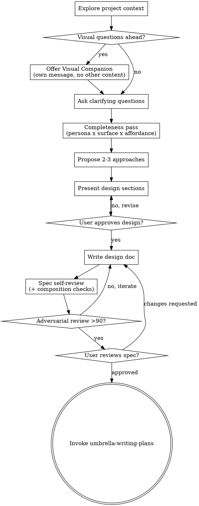

# Brainstorming Ideas Into Designs (Umbrella flavor)

Help turn ideas into fully formed designs and specs through natural collaborative dialogue.

Start by understanding the current project context, then ask questions one at a time to refine the idea. Once you understand what you're building, present the design and get user approval.

> **Umbrella standalone skill** (originally forked from superpowers:brainstorming). Beyond the base flow it adds a mandatory **Completeness Pass** (persona × surface × affordance), an **adversarial spec-review gate** (iterate to >90 before plan), and pins spec output to `docs/specs/`.

<HARD-GATE>
Do NOT invoke any implementation skill, write any code, scaffold any project, or take any implementation action until you have presented a design and the user has approved it. This applies to EVERY project regardless of perceived simplicity.
</HARD-GATE>

## Anti-Pattern: "This Is Too Simple To Need A Design"

Every project goes through this process. A todo list, a single-function utility, a config change — all of them. "Simple" projects are where unexamined assumptions cause the most wasted work. The design can be short (a few sentences for truly simple projects), but you MUST present it and get approval.

## Checklist

You MUST create a task for each of these items and complete them in order:

1. **Explore project context** — check files, docs, recent commits
2. **Offer visual companion** (if topic will involve visual questions) — this is its own message, not combined with a clarifying question. See the Visual Companion section below.
3. **Ask clarifying questions** — one at a time, understand purpose/constraints/success criteria
4. **Completeness pass** — build the persona × surface × affordance matrix (see below). This is where you ask "did we even ask the right questions?" — BEFORE proposing approaches.
5. **Propose 2-3 approaches** — with trade-offs and your recommendation
6. **Present design** — in sections scaled to their complexity, get user approval after each section
7. **Write design doc** — save to `docs/specs/YYYY-MM-DD-<topic>-design.md` and commit
8. **Spec self-review** — inline check for placeholders, contradictions, ambiguity, scope, AND the completeness/composition checks (see below)
9. **Adversarial spec review** — dispatch a fresh subagent reviewer (see `skills/brainstorming/spec-document-reviewer-prompt.md`); iterate the spec until it scores **>90** before proceeding
10. **User reviews written spec** — ask user to review the spec file before proceeding
11. **Transition to implementation** — invoke `umbrella:writing-plans` to create the implementation plan

## Process Flow

**The terminal state is invoking `umbrella:writing-plans`.** Do NOT invoke frontend-design, mcp-builder, or any other implementation skill.

## The Process

**Understanding the idea:**

- Check out the current project state first (files, docs, recent commits)
- Before asking detailed questions, assess scope: if the request describes multiple independent subsystems (e.g., "build a platform with chat, file storage, billing, and analytics"), flag this immediately. Don't spend questions refining details of a project that needs to be decomposed first.
- If the project is too large for a single spec, help the user decompose into sub-projects: what are the independent pieces, how do they relate, what order should they be built? Then brainstorm the first sub-project through the normal design flow. Each sub-project gets its own spec → plan → implementation cycle.
- For appropriately-scoped projects, ask questions one at a time to refine the idea
- Prefer multiple choice questions when possible, but open-ended is fine too
- Only one question per message - if a topic needs more exploration, break it into multiple questions
- Focus on understanding: purpose, constraints, success criteria

**Exploring approaches:**

- Propose 2-3 different approaches with trade-offs
- Present options conversationally with your recommendation and reasoning
- Lead with your recommended option and explain why

**Presenting the design:**

- Once you believe you understand what you're building, present the design
- Scale each section to its complexity: a few sentences if straightforward, up to 200-300 words if nuanced
- Ask after each section whether it looks right so far
- Cover: architecture, components, data flow, error handling, testing
- Be ready to go back and clarify if something doesn't make sense

**Design for isolation and clarity:**

- Break the system into smaller units that each have one clear purpose, communicate through well-defined interfaces, and can be understood and tested independently
- For each unit, you should be able to answer: what does it do, how do you use it, and what does it depend on?
- Can someone understand what a unit does without reading its internals? Can you change the internals without breaking consumers? If not, the boundaries need work.
- Smaller, well-bounded units are also easier for you to work with - you reason better about code you can hold in context at once, and your edits are more reliable when files are focused. When a file grows large, that's often a signal that it's doing too much.

**Working in existing codebases:**

- Explore the current structure before proposing changes. Follow existing patterns.
- Where existing code has problems that affect the work (e.g., a file that's grown too large, unclear boundaries, tangled responsibilities), include targeted improvements as part of the design - the way a good developer improves code they're working in.
- Don't propose unrelated refactoring. Stay focused on what serves the current goal.

## Completeness Pass (persona × surface × affordance)

**Why this exists:** A high adversarial-review score grades *internal quality*, not whether the spec asked every necessary question. A real incident (W1-D-DASHBOARD) shipped with spec 91 / plan 95 / branch 96 yet left an authed persona with no logout path and two redundant adjacent CTAs — because the spec never enumerated each persona's full surface. Review conforms to the spec's scope; it cannot catch a question the spec never asked. This pass asks them.

Before proposing approaches, build an explicit matrix and fill every cell:

- **Personas:** every distinct user state the change touches — including authed *and* anon, and any persona newly *admitted* to a surface by this change (the dangerous one: a state that previously couldn't reach a surface but now can).
- **Surfaces:** every page/shell/route each persona can now reach.
- **Affordances:** for each (persona, surface) cell, confirm the essential affordances exist — at minimum **log out**, **get home**, **navigate**, and **access their own account/data**. A newly-admitted persona on a surface with no logout (or no way back) is a gap.

Then run two composition checks the diff-level review will miss:

1. **Composed-surface-per-persona:** mentally render each *shared* surface (headers, nav, shells) fully assembled for each persona — not just the element you're changing. Two locally-correct CTAs can be globally redundant.
2. **Cross-feature adjacency:** for any element you add or repoint, list the adjacent elements added by *prior* shipped work on the same surface. New + pre-existing can collide or duplicate.

Surface any gap as a design question before approaches. Record the matrix (even a compact table) in the spec.

## After the Design

**Documentation:**

- Write the validated design (spec) to `docs/specs/YYYY-MM-DD-<topic>-design.md`
  - (User preferences for spec location override this default)
- Use elements-of-style:writing-clearly-and-concisely skill if available
- Commit the design document to git

**Spec Self-Review:**
After writing the spec document, look at it with fresh eyes:

1. **Placeholder scan:** Any "TBD", "TODO", incomplete sections, or vague requirements? Fix them.
2. **Internal consistency:** Do any sections contradict each other? Does the architecture match the feature descriptions?
3. **Scope check:** Is this focused enough for a single implementation plan, or does it need decomposition?
4. **Ambiguity check:** Could any requirement be interpreted two different ways? If so, pick one and make it explicit.
5. **Completeness check:** Is the persona × surface × affordance matrix in the spec, with every cell filled? Any newly-admitted persona missing logout/home/nav/account?
6. **Composition check:** Did you render each shared surface assembled per persona, and cross-check new elements against adjacent prior-ship elements?
7. **Walk-only tagging:** Mark which requirements are verifiable only in a running browser (render/redirect timing, composed UX, motion/feel). These cannot be confirmed by static review or unit/pgTAP tests — they MUST be carried into the plan's browser-walk inventory.

Fix any issues inline.

**Adversarial Spec Review (Umbrella gate):**
Dispatch a fresh subagent to adversarially review the spec using `skills/brainstorming/spec-document-reviewer-prompt.md`. Iterate the spec until it scores **>90**. A >90 score is necessary but NOT sufficient (it grades internal quality, not completeness or runtime feel) — the completeness pass and walk tagging above are what make the score meaningful.

**User Review Gate:**
After the review gate passes, ask the user to review the written spec before proceeding:

> "Spec written and committed to `<path>`. Please review it and let me know if you want to make any changes before we start writing out the implementation plan."

Wait for the user's response. If they request changes, make them and re-run the spec review loop. Only proceed once the user approves.

**Implementation:**

- Invoke `umbrella:writing-plans` to create a detailed implementation plan
- Do NOT invoke any other skill. `umbrella:writing-plans` is the next step.

## Key Principles

- **One question at a time** - Don't overwhelm with multiple questions
- **Multiple choice preferred** - Easier to answer than open-ended when possible
- **YAGNI ruthlessly** - Remove unnecessary features from all designs
- **Explore alternatives** - Always propose 2-3 approaches before settling
- **Incremental validation** - Present design, get approval before moving on
- **Be flexible** - Go back and clarify when something doesn't make sense
- **Ask everything (Umbrella):** the spec phase owns completeness; review only checks conformance to scope, so an unasked question is never caught downstream.

## Visual Companion

A browser-based companion for showing mockups, diagrams, and visual options during brainstorming. Available as a tool — not a mode. Accepting the companion means it's available for questions that benefit from visual treatment; it does NOT mean every question goes through the browser.

**Offering the companion:** When you anticipate that upcoming questions will involve visual content (mockups, layouts, diagrams), offer it once for consent:
> "Some of what we're working on might be easier to explain if I can show it to you in a web browser. I can put together mockups, diagrams, comparisons, and other visuals as we go. This feature is still new and can be token-intensive. Want to try it? (Requires opening a local URL)"

**This offer MUST be its own message.** Do not combine it with clarifying questions, context summaries, or any other content. The message should contain ONLY the offer above and nothing else. Wait for the user's response before continuing. If they decline, proceed with text-only brainstorming.

**Per-question decision:** Even after the user accepts, decide FOR EACH QUESTION whether to use the browser or the terminal. The test: **would the user understand this better by seeing it than reading it?**

- **Use the browser** for content that IS visual — mockups, wireframes, layout comparisons, architecture diagrams, side-by-side visual designs
- **Use the terminal** for content that is text — requirements questions, conceptual choices, tradeoff lists, A/B/C/D text options, scope decisions

A question about a UI topic is not automatically a visual question. "What does personality mean in this context?" is a conceptual question — use the terminal. "Which wizard layout works better?" is a visual question — use the browser.

If they agree to the companion, read the detailed guide before proceeding:
`skills/brainstorming/visual-companion.md`
